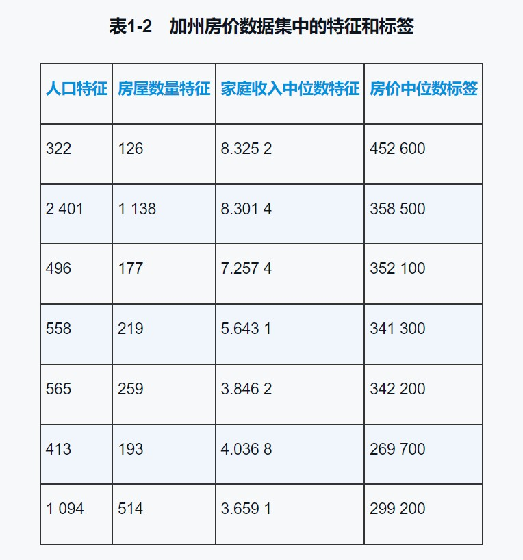

# 第一课 机器学习快速上手路径——唯有实战

## 1.1 机器学习的家族谱

**机器学习是AI的分支技术，而深度学习是机器学习的技术之一**。从人工智能到机器学习，再到深度学习，它们之间是一种包含和被包含的关系，如下图所示。


造成目前AI火热的原因主要包括有：**数据支撑**、**硬件支撑**以及技术良好的**可达性**。

可达性和实用性，才是机器学习和深度学习的真正价值所在。

### 1.1.2 机器学习就是从数据中发现规律

机器学习的关键内涵止一在于利用计算机的运算能力从大量的数据中发现一个“函数”或者“模型”，并通过它来模拟现实世界事物间的关系，从而实现预测或判断的功能。

即机器学习就是在已知数据集的基础上，通过反复**训练**（**train**），选择最贴切的**函数**（**function**），来描述数据集中自变量$x_1, x_2, x_3,...,x_n$（**特征，feature**）与因变量$y$（**标签，label**）之间的关系。

其中，机器学习数据集常分为：**训练数据集**（training dataset）和**测试数据集**（test dataset）。

机器学习的另外一个特质是**从错误中学习**。

### 1.1.3 机器学习的类别——监督学习及其他

机器学习常见分类方式为：**监督学习**（supervised learning）、**无监督学习**（unsupervised learning）和**半监督学习**（semi-supervised learning）。主要区别在于是否需要数据标签，监督学习的训练需要标签数据，而无监督学习不需要标签数据，半监督学习介于两者之间。


半监督学习是监督学习与无监督学习相结合的一种学习方式，当有时获取有标签数据成本过高时，半监督学习使用大量的无标签数据，同时使用部分有标签数据来进行建模。

### 1.1.4 机器学习的重要分支——深度学习

从另一角度出发，根据机器学习的模型或者训练机器时采用的算法，机器学习的另一个重要内容是**深度学习**（deep learning）。

深度学习所采用的机器学习模型不同之处在于：**神经网络**。人工神经网络（Aetificial Neural Network, ANN），是数据结构和算法形成的机器学习模型。

**通常将层数较多、结构比较复杂的神经网络的机器学习技术叫做深度学习。**


各种深度学习模型，如卷积神经网络（Convolutional Neural Network, CNN）、循环神经网络（Recurrent Neural Network, RNN），在计算机视觉、自然语言处理（Natural Language Processing, NLP）、音频识别等应用中得到了极好的效果。

深度学习的另一大好处是对数据特征的要求降低，自动实现非结构化数据的结构化，无须手工获取特征，减少特征工程（feature engineering）。其中，特征工程是指对数据特征的整理和优化工作，让其更容易被机器所学习。

    非结构化数据的结构化：有些数据人很容易理解，但是计算机很难识别。比如下图中一个32px×32px的图片，我们一看到就知道写的是8。然而计算机并不知道这图片8背后的逻辑，计算机比较容易读入Excel表格里面的数字8，因为它是存储在计算机文件系统或者数据库中的结构化数据。但是一张图片，在计算机里面存储的形式是数字矩阵，它很难把这个32px×32px的矩阵和数字8联系起来。

    通过深度学习就能够完成图片上这种从非结构化到结构化的转换，通过卷积神经网络的处理，图片‘8’变成了[0000000010]的编码，有利于计算机辨认。


深度学习的过程，也是一个“**数据提纯**”的过程，可以减少手工进行的特征工程任务。深度学习通过神经网络将特征提取和分类任务一并解决。


### 1.1.5 机器学习新热点——强化学习

**强化学习**（reinforcement learning）研究的目标是**智能体**（agent）**如何基于环境而做出行动反应，以取得最大化的累积奖励**。如下图所示，智能体通过所获得的奖励（或惩罚）、环境反馈回来的状态以及动作与环境互动。


强化学习和普通机器学习的差异在于：普通机器学习是在开放的环境中学习，如自动驾驶，每一次前进都会带给机器新的环境，新环境（新数据）永无止息；而强化学习的环境是封闭的，如AlphaGo下围棋，每落一子，棋盘就少一目，在这样的闭环中，更容易实现对机器学习所采取的策略进行奖惩。

强化学习和监督学习的差异在于：监督学习是从数据中学习，而强化学习是从环境给它的奖惩中学习。

除监督学习、无监督学习、半监督学习、深度学习、强化学习外，还有很多其他的机器学习方法，如集成学习（ensemble learning）、在线学习（online learning）、迁移学习（transfer learning）。

### 1.1.6 机器学习的两大应用场景——回归与分类

最常见的两类机器学习问题类型为：**回归**（regression）问题和**分类**（classification）问题。

- 回归问题通常用来预测一个值，其标签值是**连续**的。比较常见的回归算法是线性回归（linear regression）算法和深度学习中的神经网络等。

- 分类问题是将事物标记一个类别标签，结果为**离散**的。分类有二元分类和多元分类。常见的分类算法有：逻辑回归算法、决策树算法和深度学习中的神经网络等。


### 1.1.7 机器学习的其他应用场景

除回归和分类问题外，机器学习的应用场景还有很多，如无监督学习中最常见的**聚类**（clustering）问题是在没有标签的情况下，把数据按照其特征的行致分成不同的簇。还有一种无监督学习是**关联学习**，通过它可以找到特征之间的影响关系。


## 1.2 快捷的云实战学习模式

[Ex01_加州房价预测](https://github.com/Vuean/Zero-Basic-Machine-Learning/blob/main/Class1/Example/Ex01/C01_California%20Housing%20Price.ipynb)

## 1.3 基本机器学习术语


其中，最为重要的3个术语是：特征、标签和模型。

### 1.3.1 特征

特征是机器学习中的输入，原始的特征描述了数据的属性。它是有维度的。**特征的维度指的是特征的数目**（不是数据集里面样本的个数），不同的数据集中的数据特征的维度不同，有多有少。

例如，预测商品销量，把商品的类别、价格和推荐级别这3个属性定义为商品的特征，那么这个数据集就是三位特征数据集。其中一个样本的格式如下：$(x_1, x_2, x_3)$。

**维：主要指的是数据集中特征X的数目**

### 1.3.1 标签

标签，也就是机器学习要输出的结果，是我们试图预测的目标。实际上，机器学习要解决什么问题，标签就是什么。如一个有标签数据样本的格式为：$(x_1, x_2, x_3, y)$。



### 1.3.3 模型

模型将样本映射到预测标签y‘。其实模型就是函数，是执行预测的工具。函数由模型的内部参数定义，而这些内部参数通过从数据中学习规律得到。

在机器学习中，先确定模型的类型，比如线性回归模型，逻辑回归模型，神经网络模型；选定算法后，再确定模型参数。

## 1.4 Python和机器学习框架

### 1.4.2 机器学习和深度学习框架

Python的机器学习框架，也就是各种Python库，里面包含定义好的数据结构以及很多库函数、方法、模型等（即API）。我们只需要选择一个适合的框架，通过调用其中的APl，编写少量代码，就可以快速建立机器学习模型了。

良好的框架不仅易于理解，还支持并行化计算（即硬件加速），并能够自动计算微分、链式求导。机器学习中常用的库有8个，可分为3类：Pandas和NumPy提供数据结构，支持数学运算；Matplotlib和Seaborn用于数据可视化；其余4个提供算法，Scikit-learn是机器学习框架，TensorFlow、Keras和PyTorch则提供深度学习框架。

1. Pandas

    Pandas中的预置数据结构有以下几种：

    - Series：1D数组，与Numpy中的一维数组（array）类似。与python中的列表（list）类似。

    - TimeSeries：以时间为索引的Series。

    - DataFrame：2D的表格型数据结构，Series的容器。

    - Panel：3D的数组，DataFrame的容器。

2. Numpy

    NumPy是Python进行科学计算的基础库，有人称它为Python的数学扩展包。它提供了一个强大的多维数组对象array，还提供了大量API支持数组运算。**本课程中将重点使用的数据结构就是NumPy中的数组。**

3. Matplotlib

    Matplotlib是Python及其数学扩展包NumPy的可视化操作界面，通过应用程序接口（APl）向应用程序提供嵌入式绘图功能。其中还有面向其他图像处理库（如开放图形库OpenGL）的接口。

4. Seaborn

    Seaborn是在Matplotib基础上设计出的绘图库，因此是更高级的视觉化工具，可以画出特别酷炫的数学统计图形。

5. Scikit-learn

    简称Sklearn，是一个相当强大的Python机器学习库，也是简单有效的数据挖掘和数据分析工具。Sklearn基于NumPy、SciPy和Matplotib构建，其功能涵盖了从数据预处理到训练模型，再到性能评估的各个方面。

6. TensorFlow

    TensorFlow编程建立在“图”这个抽象概念上，入门难度高。

7. Keras

    Keras建立在TensorFlow、CNTK或Theano这些后端框架之上。这也就是说，Keras比TensorFlow更高级。在计算机领域，高级是“简单”的代名词。高级意味着易学易用。

8. PyTorch

    相对于TensorFlow而言，更为“优雅”的机器学习框架。

## 1.5 机器学习项目实战架构

机器学习项目的主要环节包括5个部分：问题定义；数据的收集和预处理；模型（算法）选择；选择机器学习模型；超参数调试和性能优化。


### 1.5.1 第1个环节：问题定义

第一个环节是对问题的构建和概念化。关注问题的痛点、现状和目标。

机器学习中常使用的数据集为**MNIST数据集**。包含有60000张训练图片和10000张测试图片，都是28px×28px的手写数字灰度图像。

*灰度图像与黑白图像不同，黑白图像只有黑、白两种颜色，对应像素值为0和1；而灰度图像在黑色和白色之间还有许多灰度级别，取值为0~255。*


### 1.5.2 第2个环节：数据的收集和预处理

1. 原始数据的准备

    自有数据；爬取数据；开源网站（ImageNet、Kaggle、Google Public Data Explorer等）。

2. 数据的预处理

    - **可视化**（visualization）

    - **数据向量化**（data vectorization）：将数据格式化，变得机器可以读取。

    - 处理**坏数据**和**缺失值**

    - **特征缩放**（feature scaling）：特征缩放方法包括很多，包括数据**标准化**（standardization）和**规范化**（normalization）。

        - 标准化，是对数据特征分布的转换，目标是使其标准正态分布。

        - 归一化，标准化的变体，将特征压缩到给定的最小值和最大值之间，多为0~1。归一化不会改变数据的分布状态。

        - 规范化，将样本缩放为具有单位范数的过程，消除数据中的离群值。

    数据预处理的原则：

    - 将数据转换成数字格式（向量、矩阵、3D、4D、5D）的数组（张量）；

    - 大范围数据进行压缩成较小值，分布不均的数据进行标准化；

    - 异质数据同质化（homogenous），即同一个特征的数据类型保持相同。

3. 特征工程和特征提取

    - 特征工程：使用数据的领域知识来创建机器学习算法起作用的特征的过程。

    - 特征提取（feature extraction）：通过子特征的选择来减少冗余特征，使初始测量数据更简洁，并保留有用信息。

4. 载入MNIST数据集

    shape方法显示X_train_image张量的形状。灰度图像数据集是3D张量，第一个维度是样本维（即图片张数，共60000张），后面两个是特征维（即图片的28px×28px的矩阵）。

    数据格式转换：

    ```python
        # 数据转换工作
        from keras.utils import to_categorical
        X_train = X_train_image.reshape(60000, 28, 28, 1)   # 给标签增加一个维度
        X_test = X_test_image.reshape(10000, 28, 28, 1)

        y_train = to_categorical(y_train_label, 10) # 特征转换为one-hot编码
        y_test = to_categorical(y_test_label, 10) # 特征转换为one-hot编码

        print("数据集张量形状：", X_train.shape)
        print("第一个数据标签：", y_train[0])

        >>> 数据集张量形状： (60000, 28, 28, 1)
        第一个数据标签： [0. 0. 0. 0. 0. 1. 0. 0. 0. 0.]
    ```

    数据格式转换原因在于：

    - Keras要求图像数据集导入卷积网络模型时为4阶张量，最后一节代表颜色深度，灰度图像只有一个颜色统导，可以设置为1

    - 在机器学习的分类问题中，标签[0. 0. 0. 0. 0. 1. 0. 0. 0. 0.]代表5。

### 1.5.3 第3个环节：选择机器学习模型

先选择机器学习模型的算法类型，再开始训练机器确定参数。

主要的算法模型类型包括有：

- 线性模型（线性回归，逻辑回归）

- 非线性模型（支持向量机，k最邻近分类）

- 基于树和集成的模型（决策树、随机森林、梯度提升树等）

- 神经网络（人工神经网络、卷积神经网络、长短期记忆网络等）

根据不同的问题，选择不同的算法，比如，随机森林很适合处理回归问题，而神经网络则适合处理特征量巨大的数据。

```python
    # MNIST数据集手写数字识别
    from keras import models
    from keras.layers import Dense, Dropout, Flatten, Conv2D, MaxPooling2D
    model = models.Sequential() # 用序贯方式建模
    model.add(Conv2D(32, (3,3), activation='relu',    # 添加Conv2D层
                                    input_shape=(28, 28, 1)))              # 指定输入数据样本张量的类型
    model.add(MaxPooling2D(pool_size=(2,2)))             # 添加MaxPooling2D层
    model.add(Conv2D(64, (3,3), activation='relu')) # 添加Conv2D层
    model.add(MaxPooling2D(pool_size=(2, 2)))           # 添加MaxPooling2D层
    model.add(Dropout(0.25))    # 添Dropout加层
    model.add(Flatten())            # 展平
    model.add(Dense(128, activation='relu'))    # 添加全连接层
    model.add(Dropout(0.5))
    model.add(Dense(10, activation='softmax')) # softmax分类激活，输出10维分类码
    # 编译模型
    model.compile(optimizer='rmsprop',  # 指定优化器
                                loss='categorical_crossentory', # 指定损失函数
                                metrics=['accuracy'])   # 指定验证过程中的评估指标
```

这段代码把数据集放入卷积神经网络进行处理。这个网络中包括两个Conv2D（二维卷积）层，两个MaxPooling2D（最大池化）层，两个Dropout层用于防止过拟合，还有Dense（全连接）层，最后通过Softmax分类器输出预测标签$y'$值，也就是所预测的分类值。这个$y'$，是一个one-hot格式的10维向量，通过与标签真实值$y$比较，以计算预测的准确率。


### 1.5.4 第4个环节：训练机器，确定参数

确定机器学习模型的算法类型后，进行机器的学习，训练机器以确定最佳的模型内部参数，使用模型对新数据集进行预测。除了确定模型**内部参数**，还有可能需要调整**超参数**。

- **内部参数**：机器学习模型的具体参数值，有**权重**（weight）和**偏置**（bias）。模型内参数在机器的训练过程中被确定。

- **超参数**（hyperparameter）：属于训练和调试过程中的参数。例如，迭代次数、迭代时模型参数改变的速率（学习率）、正则化参数等。

```python
    # fit拟合
    model.fit(X_train, y_train,             # 指定训练特征集和训练标签集
                        validation_split=0.3,   # 部分训练集数据拆分成验证集
                        epochs=5,               # 训练轮次为5轮
                        batch_size=128)

    >>> 
    Epoch 1/5
    329/329 [==============================] - 12s 37ms/step - loss: 1.6845 - accuracy: 0.8111 - val_loss: 0.1466 - val_accuracy: 0.9574
    Epoch 2/5
    329/329 [==============================] - 13s 38ms/step - loss: 0.2017 - accuracy: 0.9452 - val_loss: 0.0779 - val_accuracy: 0.9787
    Epoch 3/5
    329/329 [==============================] - 12s 37ms/step - loss: 0.1395 - accuracy: 0.9617 - val_loss: 0.0797 - val_accuracy: 0.9798
    Epoch 4/5
    329/329 [==============================] - 12s 36ms/step - loss: 0.1189 - accuracy: 0.9677 - val_loss: 0.0827 - val_accuracy: 0.9818
    Epoch 5/5
    329/329 [==============================] - 12s 36ms/step - loss: 0.1059 - accuracy: 0.9716 - val_loss: 0.0698 - val_accuracy: 0.9837
    <tensorflow.python.keras.callbacks.History at 0x266915a3610>
```

在上面的训练过程中，fit方法自动地将训练数据预留出30%作为验证集。

训练过程中，准确率逐步提高。

- accuracy：代表训练集上的预测准确率；

- val_accuracy：代表验证集上的预测准确率；

### 1.5.5 第5个环节：超参数调试和性能优化

机器学习**重在评估**，只有通过评估，才能知道当前模型的效率，才能在不同模型或同一模型的不同超参数之间进行比较。

主要评估点：

- 在机器训练过程中，对于模型内部参数的评估是通过**损失函数**进行的。比如回归问题的均方误差函数、分类问题的交叉熵函数。

- 机器训练结束后，还要进行**验证**。验证过程采用的评估方式包括有R2分数、均方误差函数、平均绝对误差函数、交叉熵函数等。

1. 训练集、验证集和测试集

    为了进行模型评估，常将数据分为3类集合：**训练集**（training set）、**验证集**（validation set）、**测试集**（test set）。在训练集上训练模型，在验证集上评估模型，完成训练后，在测试集上测试模型。

    模型训练过程中，常可能出现**过拟合**（overfit）现象，即**模型泛化能力弱**。在利用训练集和验证集优化模型时，也可能导致过拟合，这种现象称为**信息泄露**（information leak）。

2. K折验证

    当测试结果不够理想时，还需要继续调试和优化，那么就需要持续的大量的新数据进行支撑。为了解决新数据获取难，机器学习常通过**k折验证**方法，重用一个数据集进行多次验证方法。

    

    **K折验证**（K-fold validation）：将数据划分为大小相同的K个分区，对于每个分区，都在剩余的K-1个分区上训练模型，然后在留下的分区上评估模型。最终分数等于K个分数的平均值。

3. 模型的优化和泛化

    **优化**（optimization）和**泛化**（generalization）是机器学习的两个目标，是一种此消彼长的状态。

    - 如何成功地拟合已有数据，这是性能的**优化**；

    - 更为重要的是将当前模型**泛化**到其他数剧集。

4. 查看预测结果

    使用predict方法可获得模型的预测值。

## 1.6 本课内容小结


## 1.7 课后练习

1. 机器学习分类，并说明分类标准。

    