# 第二课 数学和Python基础知识

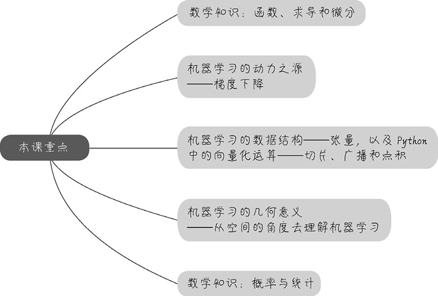

## 2.1 函数描述了事物间的关系

### 2.1.1 什么是函数

函数是把一个集里的每一个元素联系到另一个集里一个独一的值。函数反应了两个集合之间的对应关系。

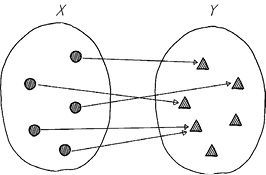

（1） 输入集的每一个元素X都需要被覆盖；

（2）函数的输出是**独一无二**的。

### 2.1.2 机器学习中的函数

机器学习基本上等价于寻找函数的过程，实现了从特征到结果的一个特定推断。在大数据时代的机器学习，不是注重特征到标签之间的**因果逻辑**，而是注重其间的**相关关系**。

**机器学习算法得到的函数，往往能够看到数据背后隐藏的、肉眼所不能发现的秘密**。

机器学习中常见的函数包括：

1. 线性函数

2. 二次函数和多次函数

3. 激活函数

    **激活函数**（activation function），在机器学习算法中实现非线性的、阶跃行致的变换。

    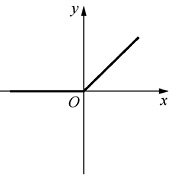

4. 对数函数

    对数是将数轴进行强力的缩放。

## 2.2 捕捉函数的变化趋势

机器学习所惯性的问题之一是捕捉函数的变化趋势。

### 2.2.1 连续性是求导的前提条件

连续性是函数的性质之一，它是可以对函数求导的前提条件。

### 2.2.2 通过求导发现y如何随x而变

**导数**（derivative）是定义在连续函数的基础之上的。导数是针对一个变量而言的函数变化趋向。

### 2.2.3 凸函数有一个全局最低点

凹凸性也是函数的特性之一，（其他特性包括：奇偶性、单调性、周期性等）。

凸函数：函数形状连续，函数平滑，只存在一个最低点，整个函数层碗状。

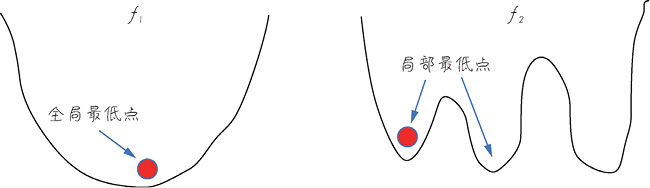

## 2.3 梯度下降是机器学习的动力之源

### 2.3.1 什么是梯度

**对多元函数的各参数求偏导数，然后把所求得的各个参数的偏导数以向量形式写出来，就是梯度。**

具体地，函数$f(x_1, x_2)$，对应着机器学习数据集中的两个特征，分别对$x_1$和$x_2$求偏导数，得到的梯度向量就是$(\partial f/\partial x_1, \partial f/\partial x_2)^T$，在数学上可表示为$\Delta f(x_1, x_2)$。

计算梯度的意义：几何意义上，梯度就是函数变化的方向，而且是变化最快的方向。

### 2.3.2 梯度下降：下山的隐喻

对于非凸函数梯度下降不一定总能找到全局最优解，有可能找到一个局部最优解。如果是凸函数，那么梯度下降法理论上就能得到全局最优解。

### 2.3.3 梯度下降有什么用

梯度下降作用需注意几点：

- 机器学习的本质是找到最优的函数

- 如何衡量函是否最优，其方法是尽量减小预测值和真实值间的误差

- 可以建立误差和模型参数之间的函数

- 梯度下降能够引导我们走到凸函数的全局最低点，也就是找到误差最小时的参数

## 2.4 机器学习的数据结构——张量

机器学习中，把用于存储数据的结构称为**张量**（tensor）。

### 2.4.1 张量的轴、阶和形状

张量是机器学习程序中的数字容器，本质上就是各种不同维度的数组，如下图所示。将张量的维度称为**轴**（axis），轴的个数称为**阶**（rank），NumPy中称为数组的秩。

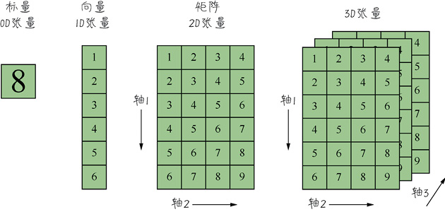

张量的**形状**（shape）就是张量的阶，加上每个阶的维度（每个阶的元素数目）。

### 2.4.2 标量——0D（阶）张量

仅包含一个数字的张量叫作**标量**（scalar），即0阶张量或0D张量。标量的功能主要在于程序流程控制、设置参数值等。

```python
    import numpy as np
    X = np.array(5) # 创建0D张量，也就是标量
    print("X的值：", X)
    print("X的阶：", X.ndim)
    print("X的数据类型：", X.dtype)
    print("X的形状：", X.shape)

    >>> X的值： 5
    X的阶： 0
    X的数据类型： int32
    X的形状： ()
```

标量的形状为()，即标量的阶为0。

### 2.4.3 向量——1D（阶）张量

由一组数字组成的数组叫作**向量**（vector），也就是一阶张量，1D张量。一阶张量只有一个轴。

```python
    X = np.array([5, 6, 7, 8, 9])
    print("X的值：", X)
    print("X的阶：", X.ndim)
    print("X的数据类型：", X.dtype)
    print("X的形状：", X.shape)

    >>> 
    X的值： [5 6 7 8 9]
    X的阶： 1
    X的数据类型： int32
    X的形状： (5,)
```

上述代码创建了一个包含5个元素的1D张量，需要强调的是，机器学习中**把5个元素的向量称为5维向量**。不要混淆**5维向量**和**5D张量**。

载入keras中的boston_housing数据：

```python
    from keras.datasets import boston_housing
    (X_train, y_train), (X_test, y_test) = boston_housing.load_data()
    print("X_train的形状：", X_train.shape)
    print("X_train中第一个样本的形状：", X_train[0].shape)
    print("y_train的形状：", y_train.shape)

    >>> 
    X_train的形状： (404, 13)
    X_train中第一个样本的形状： (13,)
    y_train的形状： (404,)
```

从结果中可以看出，X_train是一个2D矩阵，是404个样本数据的集合。y_train是一个典型的向量。

X_train[0]表示训练集X_train中的第一行数据，是一个13维向量（1D张量），即每行数据包含13个特征。

向量的点积运算法则：两个相同维度的向量对应元素先相乘后相加。向量的点积结果是一个标量，也就是一个值。

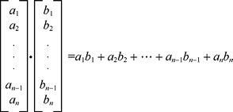

机器学习中最基础的线性回归方法就是根据线性函数去拟合特征和标签的关系，其中的参数$w
$是一个向量，$x$也是一个向量。$x$是特征向量，$w$是权重向量。通过将**特征向量（一个样本）和权重向量做点积，就得到针对该样本的预测目标值** $y‘$。公式如下：$y'=w_0x_0+w_1x_1+w_2x_2+...+w_nx_n$。

### 2.4.4 矩阵——2D（阶）张量

**矩阵**（matrix）是一组向量的集合，也就是2阶张量，2D张量，形状为（m, n）。机器学习中，矩阵形状维（样本，特征）。第一轴是**样本轴**，第二个轴是**特征轴**。

以keras中的boston_housing数据为例，这个矩阵的形状是（404, 13），也就是404个样本，13个特征。

矩阵的点积：第一个矩阵的行向量，和第二个矩阵的列向量进行点积，然后将结果标量放进新矩阵，作为结果矩阵中的一个元素。

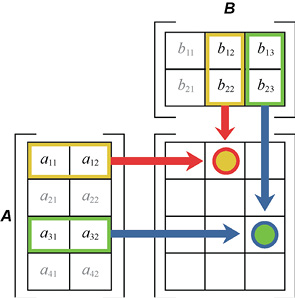

### 2.4.5 序列数据——3D（阶）张量

实际应用中，**序列数据集**才是机器学习中的3D张量。而**时间序列**（time series）是最常见的序列数据集，结构如下：

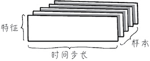


### 2.4.6 图像数据——4D（阶）张量

图像本身包括高度、宽度、颜色深度，再加上数据集大小，则图像数据集就形成了4D张量，其形状维（**样本，图像高度，图像宽度，颜色深度**），如MNIST特征数据集的形状为（60000, 28, 28, 1）。

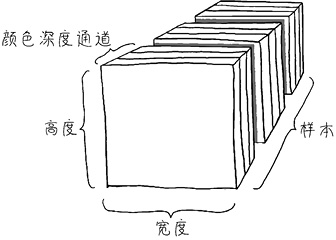

### 2.4.7 视频数据——5D（阶）张量

视频可以看作是由一帧一帧的彩色图像组成的数据集。

- 每一帧都保存在一个形状为（高度，宽度，颜色深度）的3D张量中。

- 一系列帧则保存在一个形状为（帧，高度，宽度，颜色深度）的4D张量中。

因此，视频数据集需要5D张量才放得下，其形状为（**样本，帧，高度，宽度，颜色深度**）。

### 2.4.8 数据的维度和空间的维度

## 2.5 Python的张量运算

### 2.5.1 机器学习中张量的创建

**机器学习中的张量大多是通过NumPy数组来实现的。**

当然，机器学习的数据集并不是在程序里面创建的，大多是**先从文本文件中把所有样本读取至Dataframe格式的数据，然后用array方法或其他方法把Dataframe格式的数据转换为NumPy数组，也就是张量，再进行后续操作**。

### 2.5.2 通过索引和切片访问张量中的数据

可以通过**索引**（indexing）访问数据集中某个具体数据和**切片**（slicing）访问一个范围内的数据。

### 2.5.3 张量的整体操作和逐元素运算

张量的算术运算，包括加、减、乘、除、乘方等，既可以整体进行，也可以逐元素进行。

### 2.5.4 张量的变形和转置

### 2.5.5 Python中的广播

python的**广播**（broadcasting）功能，是NumPy对形状不完全相同的数组间进行数值计算的方式，可以自动自发地把一个数变成一排的向量，把一个低维的数组变成高维的数组。

广播，就是跟着对应阶中维度较大，也就是较为复杂的张量进行填充。用图展示就更为清楚了，如下图所示。图中a的形状是(4, 3)，是二阶张量，b的形状是(1, 3)，也是二阶张量，那么结果就是把张量b的行进行复制，拉伸成一个形状为(4, 3)的张量，然后再与张量a相加。

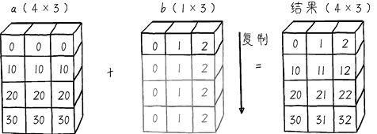

### 2.5.6 向量和矩阵的点积运算

1. 向量的点积运算

    对于向量$a=[a_1, a_2, ... , a_n]$和向量$b=[b_1, b_2, ... , b_n]$，点积运算规则如下：$a·b=a_1b_1+a_2b_2+...+a_nb_n$。

    点积运算过程中，需要向量a与向量b的维度相同，结果为标量。但是再Python中要求更为宽松：

    - 形状为(n,)和形状为(n,)的1D向量可以进行点积——结果是一个标量，即数字，且a·b=b·a。

    - 形状为(n,)的1D向量和形状为(1,n)的2D张量可以进行点积（其实(1,n)形状的张量已经是矩阵了，但因为矩阵中有一个阶的维度是1，广义上也可以看作向量）——结果是一个1D形状的数字。
   
    - 形状为(1,n)的2D张量和形状为(n,)的1D向量可以进行点积——结果是一个1D形状的数字。
    
    - 形状为(1,n)和形状为(n,1)的2D张量也可以进行点积—结果是一个1D形状的数字。
    
    - 形状为(1,n)和形状为(1,n)的2D张量不能进行点积——系统会报错shapes(1,n)and(1,n)not aligned:n（dim 1）！=1（dim0）。
    
    - 形状为(n,1)和形状为(n,1)的2D张量不能进行点积——系统会报错shapes(n,1)and(n,1)not aligned：1（dim1）！=n（dim0）。
    
    - 形状为(n,)、(n,1)、(1,n)的张量和形状为(1,)的向量或者标量也可以进行点积——Python对后面的向量或标量进行广播，但是结果会有所不同。

2. 矩阵的点积运算

    关于矩阵和矩阵之间的点积，大家就只需要牢记一个原则：**第一个矩阵的第1阶，一定要和第二个矩阵的第0阶维度相同。**即，形状为(a,b)和(b,c)的两个张量中相同的b维度值，是矩阵点积实现的关键，其点积结果矩阵的形状为(a,c)。

    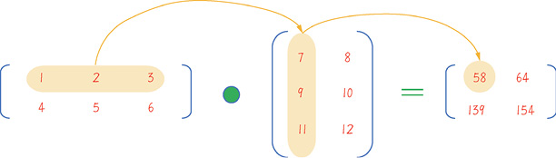

## 2.6 机器学习的几何意义

## 2.6.1 机器学习的向量空间

张量，可以理解为某种几何空间内点的坐标。这样，机器学习中特征向量就形成了**特征空间**。例如二维向量A=(0.5, 1)，可看作二维空间中的一个点：

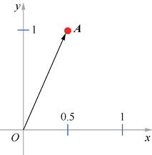

张量的运算都有几何意义，二维向量的加法如下图所示：


二维向量点积的几何意义则是两个向量之间的夹角，以及在向量上的投影：

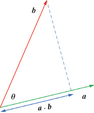

推而广之：**机器学习模型是在更高维度的几何空间中对特征向量进行操作、变形，计算其间的距离，并寻找从特征向量到标签之间的函数拟合——这就是从几何角度所阐述的机器学习本质**。

几种常见的机器学习模型都可以通过特征空间进行几何描述，如下图所示。

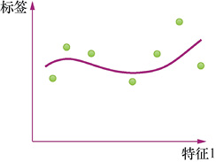

### 2.6.2 深度学习和数据流形

深度学习的过程，实际上也就是一个数据提纯的过程。其主要原因是数据特征维度过高，导致特征空间十分复杂，进而导致机器学习建模过程难度过大。有一种思路是通过**流形**（mainfold）学习将高维特征空间中的样本分布群“平铺”至一个低维空间，同时保存原高维空间中样本点之间的局部位置关系。

在传统的机器学习中，**流形学习主要用于特征提取和数据降维**，特征提取使特征变得更加友好，降维是因为高维数据通常有冗余。

而在深度学习出现之后，有一种说法认为神经网络能够自动自发地将复杂的特征数据流形展开，从而减少了特征提取的需要。从直观上，这个展开过程可以用一团揉皱了的纸来解释，如下图所示。

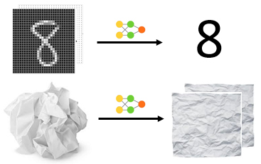

现代的**深度神经网络（Deep Neural Networks，DNN）通过参数学习，展开了高维数据的流形——这可以说是深度学习的几何意义**。

## 2.7 概率与统计研究了随机事件的规律

### 2.7.1 什么是概率

事件分为以下两种。

- 一种是**确定性事件**。确定性事件又分为以下两种。

    - **必然事件**：如太阳从东方升起，或者水在0℃会结冰。

    - **不可能事件**：如掷一个常规的六面骰子，得到的点数是7。

- 有大量事件在一定条件下能否发生，是无法确定的，它们是**随机事件**。


其中，最后一个公式$P(A|B)$，叫作条件概率，也叫后验概率。

### 2.7.2 正态分布

所谓分布就是一组概率的几何，是把一种常见的概率分布用连续的函数曲线显示出来的方式。

正态分布（normal distribution），也叫高斯分布（Gaussian distribution），是一个常见的连续概率分布。也叫做概率分布的钟形曲线（bell curve）。

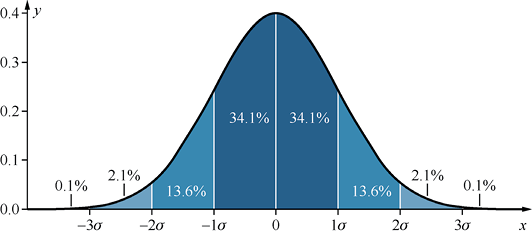

### 2.7.3 标准差和方差

正态分布中$\sigma$，代表**标准差**（Standard Devision, SD），也称为**均方差**（mean square error），反映研究总体内个体之间差异程度的一种统计指标。

标准差是方差的算术平方根。方差和标准差，描述的都是数据相对于其期望值的离散程度。

**方差**（variance）是一组资料中各实际数值与其算术平均数（即**均值**（mean），也叫期望值）的差值做平方结果相加之后，再除以总数而得。