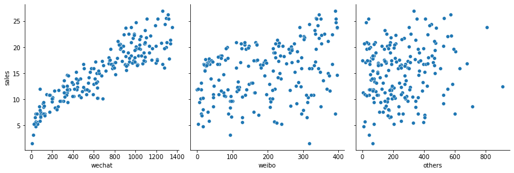

# 第三课 线性回归


1. 明确定义所要解决的问题——网店销售额的预测。

2. 在数据的收集和预处理环节分5个小节完成数据的预处理工作分别如下。

    - 收集数据——提供网店的相关记录。

    - 将收集到的数据可视化显示。

    - 做特征工程使数据更容易被机器处理。

    - 拆分数据集为训练集和测试集。

    - 做特征缩放把数据值压缩到比较小的区间。

3. 选择机器学习模型的环节其中有3个主要内容。

    - 确定机器学习的算法——这里即线性回归算法。

    - 确定线性回归算法的假设函数。

    - 确定线性回归算法的损失函数。

4. 通过梯度下降训练机器确定模型内部参数的过程。

5. 进行超参数调试和性能优化。

## 3.1 问题定义——网店广告该如何投放

问题定义：

1. 各种广告和商品销售额的相关度如何；

2. 各种广告和商品销售额之间体现出一种什么关系；

3. 哪一种广告对于商品销售额的影响最大；

4. 分配特定的广告投放金额预测出未来的商品销售额。

本课通过回归分析来寻找这个函数。所谓**回归分析**（regression analysis）是确定两种或两种以上变量间相互依赖的定量关系的一种统计分析方法，也就是研究当自变量x变化时因变量y以何种形式在变化。

在机器学习的线性回归分析中，如果只包括一个自变量特征x和一个因变量标签y且两者的关系可用一条直线近似表示这种回归分析就称为**一元线性回归分析**。如果回归分析中包括两个或两个以上的自变量且因变量和自变量之间是线性关系则称为**多元线性回归分析**。

## 3.2 数据的收集和预处理

### 3.2.1 收集网店销售额数据

数据集包含以下内容：

- 微信广告投入、微博广告投入、其他类型广告投入三个**特征**。

- **标签**：销售额

每一个类型广告的广告投放金额都是一个特征，因此这个数据集中含有3个特征。即该问题是一个多元回归问题。

### 3.2.2 数据读取和可视化

```python
    import numpy as np
    import pandas as pd
    # 用相对路径读取数据集的前提是：数据集与脚本不在同一个文件下，但同在上一级文件夹。
    df_ads = pd.read_csv('./dataset/advertising.csv')
    df_ads.head()
```

### 3.2.3  数据的相关分析

**相关性分析**（correlation analysis），可了解数据集中任意一对变量之间的相关性。相关性系数是一个-1~1之间的数值，正值表示正相关，负值表示负相关。

```python
    import matplotlib.pyplot as plt
    import seaborn as sns   # Seaborn – 统计学数据可视化工具库
    # 对所有的标签和特征两两显示其相关性的热力图(heatmap)
    sns.heatmap(df_ads.corr(), cmap='YlGnBu', annot=True)
    plt.show()
```


上图显示了3个特征、1个标签共4组变量之间的相关性系数，相关性越高对应的颜色越深。可以看出，将有限的资金投放微信广告是最合理的选择。

### 3.2.4 数据的散点图

下面通过散点图scatter plot两两一组显示商品销售额和各种广告投放金额之间的对应关系来将重点聚焦。散点图是回归分析中数据点在直角坐标系平面上的分布图它是相当有效的数据可视化工具。

```python
    # 显示销量和各种广告投放量的散点图
    sns.pairplot(df_ads, 
                                x_vars = ['wechat', 'weibo', 'others'],
                                y_vars = 'sales',
                                height =4, aspect=1, kind='scatter')
    plt.show()
```



### 3.2.5 数据清洗与规范化

通过观察相关性和散点图发现，在本案例的3个特征中微信广告投放金额和商品销售额的相关性比较高。因此为了简化模型，我们将暂时忽略微博广告和其他类型广告投放金额这两组特征只留下微信广告投放金额数据。这样就把多变量的回归分析简化为单变量的回归分析。

```python
    # 构建特征集，只含有微信广告一个特征
    X = np.array(df_ads.wechat)
    # 构建标签集
    y = np.array(df_ads.sales)

    print("张量X的阶：", X.ndim)
    print("张量X的形状：", X.shape)
    print("张量X的内容：", X)
```

对于回归问题的数值类型数据集，**机器学习模型所读入的规范格式应该是2D张量，也就是矩阵**，其形状为样本数标签数。其中，**行是数据；列是特征**。

```python
    # 通过reshape函数把向量转换为矩阵，len函数返回样本个数
    X = X.reshape(len(X), 1)
    y = y.reshape(len(y), 1)

    print("张量X的形状：", X.shape)
    print("张量X的内容：", X)
```

### 3.2.6 拆分数据集为训练集和测试集

将数据集进行80%训练集和20%测试集的分割：

```python
# 将数据集进行80%训练集和20%测试集的分割：
    from sklearn.model_selection import train_test_split
    X_train, X_test, y_train, y_test = train_test_split(X, y, test_size=0.2,  random_state=0)
```

Sklearn中的`train_test_split`函数是机器学习中拆分数据集的常用工具。

- `test_size=0.2`表示拆分出来的测试集占总样本量的20%。

- 因为`shuffle`参数默认值为True，所以数据集已进行随机排序。

- `random_state`参数则用于数据集拆分过程的随机化设定。如果指定了一个整数那么这个数叫作随机化种子每次设定固定的种子能够保证得到同样的训练集和测试集否则进行随机分割。

### 3.2.7 数据归一化

特征缩放的方法包括标准化、数据的压缩也叫归一化以及规范化等。


通过Sklearn库中`preprocessing`数据预处理工具中的`Min_Max_Scaler`可以实现数据的归一化。也可以自己定义函数：

```python
    def scaler(train, test):
        min = train.min(axis=0)
        max = train.max(axis=0)
        gap = max - min
        train -= min
        train /= gap
        test -= min
        test /= gap
        return train, test
```

需要注意的是：**不能使用测试集中的数据信息进行特征缩放中间步骤中任何值的计算**。

绘制特征压缩后，微信广告-销售额散点图：


## 3.3 机器学习模型选择

机器学习模型的确立过程中有两个主要环节。

1. 确定选用什么类型的模型。

2. 确定模型的具体参数。

### 3.3.1 确定线性回归模型

机器学习中：y=wx+b，其中，w代表权重，b代表偏置。

### 3.3.2 假设预测函数——hx

**假设函数**，hypothesis function，也被称为**预测函数**，predication function。

### 3.3.3 算是误差函数——Lwb

**损失是对糟糕预测的惩罚**。损失也就是误差，也称为成本或代价。样本的损失的大小从几何意义上基本上可以理解为y和y'之间的几何距离。平均距离越大说明误差越大模型越离谱。

**损失函数**就是用来计算平均损失的，是关于参数w和b的函数。**如果平均损失小参数就好，如果平均损失大模型或者参数就还要继续调整**。

常见损失函数：

- 用于回归的损失函数

    - 均方误差（Mean Square Error, MSE），也叫平方损失、L2损失函数。

    - 平均绝对误差（Mean Absolute Error, MAE），也叫L1损失函数。

    - 平均偏差误差（Mean Bias Error）

- 用于分类的损失函数

    - 交叉熵损失（cross-entropy loss）函数；

    - 多分类SVM损失函数

均方误差函数的计算公式：


```python
    def loss_function(X, y, weight, bias):
        y_hat = weight * X + bias
        loss = y_hat - y
        cost = np.sum(loss**2)
        return cost
```

**对于一个给定的训练样本集而言，L函数是权重w和偏置b的函数，它的大小随着w和b的变化而变**。

之所以还要平方是为了让Lwb形成相对于w和b而言的凸函数从而实现梯度下降。

## 3.4 通过梯度下降找到最佳参数

### 3.4.1 训练机器要有正确的方向

是对于线性回归来说有一种方法可以使猜测沿着正确的方向前进因此总能找到比起上一次猜测时误差更小的w和b组合。这种方法就是针对损失函数的**梯度下降**（gradient descent）。

### 3.4.2  凸函数确保有最小损失点

根据均方误差函数公式，可以看出平均损失L和w的对应关系如下图所示：


.jpg)

我们将这个函数图像称为**损失曲线**，这是一个凸函数。凸函数的图像会流畅、连续地形成相对于y轴的全局最低点，也就是说存在着**全局最小损失点**。**这也是此处选择MSE作为线性回归的损失函数的原因**。

### 3.4.3 梯度下降的实现

梯度下降的过程就是在程序中一点点变化参数w和b，使L也就是损失值逐渐趋近最低点也称为机器学习中的**最优解**。

程序中用梯度下降法通过求导来计算损失曲线在起点处的梯度。此时梯度就是损失曲线导数的矢量它可以让我们了解哪个方向距离目标“更近”或“更远”。

- 如果求导后梯度为正值，则说明L正在随着w增大而增大，应该减小w以得到更小的损失。

- 如果求导后梯度为负值，则说明L正在随着w增大而减小，应该增大w以得到更小的损失。

梯度具有以下两个特征：

- 方向也就是梯度的正负。

- 大小也就是切线倾斜的幅度。

这两个重要的特征，尤其是方向特征确保了梯度始终指向损失函数中增长最为迅猛的方向。**梯度下降法会沿着负梯度的方向走一步以降低损失**，如右图所示。


通过梯度下降法如果初始估计的w值落在最优值左边，那么梯度下降会将w增大以趋近最低值。如果初始估计的w值落在最优值右边，那么梯度下降会将w减小以趋近最低值。这个逐渐趋近于最优值的过程也叫作损失函数的**收敛**。


```python
    def gradient_descent(X, y, w, b, lr, iter):
        l_history = np.zeros(iter)
        w_history = np.zeros(iter)
        b_history = np.zeros(iter)
        for i in range(iter):
            y_hat = w*X + b
            loss = y_hat - y
            derivative_w = X.T.dot(loss) / len(X)
            derivative_b = sum(loss)*1 / len(X)
            w = w - lr * derivative_w
            b = b - lr * derivative_b
            l_history[i] = loss_function(X, y, w, b)
            w_history[i] = w
            b_history[i] = b
        return l_history, w_history, b_history
```

### 3.4.4 学习速率也很重要

**学习速率**（learning rate），记作α，学习速率乘以损失曲线求导之后的微分值就是一次梯度变化的**步长**（step size）。它控制着当前梯度下降的节奏，或快或慢，w将在每一次迭代过程中被更新、优化。

引入学习速率后，w随梯度更新的公式如下：


在实战中这些内容基本不需要编程人员自己写代码实现。而大多数机器学习从业者真正花费相当多的时间来调试的是像学习速率、迭代次数这样的参数，我们称这类位于模型外部的人工可调节的参数为**超参数**。

如果所选择的学习速率过小，机器就会花费很长的学习时间需要迭代很多次才能到达损失函数的最底点，如下面左图所示。相反如果学习速率过大，导致L的变化过大越过了损失曲线的最低点，则下一个点将永远在U形曲线的底部随意弹跳损失可能越来越大，如下面右图所示。


寻找最佳学习速率很考验经验和感觉。一个常见的策略是：在机器学习刚刚开始的时候，学习速率可以设置得大一些，快速几步达到靠近最佳权重的位置，当逐渐地接近最佳权重时可以减小学习速率，防止一下子越过最优值。

## 3.5 实现一元线性回归模型并调试超参数

### 3.5.6 用轮廓图描绘L、w和b的关系

**轮廓图**（contour plot），损失曲线描绘的是损失和迭代次数之间的关系，而轮廓图则描绘的是L、w和b这3者之间的关系，这样才能够清楚地知道损失值是怎样随着w和b的变化而逐步下降的。


## 3.6 实现多元线性回归模型

多元即多变量也就是特征是多维的。以本案例为例，涉及3个特征，则假设函数可描述为：$y'=h(x)=b+w_1x_1+w_2x_2+w_3x_3$。

### 3.6.1 向量化的点积运算

向量化表示：$y'=h(x)=b+w^Tx$。若将偏置b表示为$w_0x_0$，则公式可转变为：$y'=w^Tx$。


首先在构建特征数据集时保留所有字段，包括wechat、weibo、others，然后用NumPy的`delete`方法删除标签字段。

```python
    import numpy as np
    import pandas as pd
    df_ads = pd.read_csv('./dataset/advertising.csv')
    df_ads.head()

    X = np.array(df_ads)
    X = np.delete(X, [3], axis=1) # 删除标签
    y = np.array(df_ads.sales)
    print ("张量X的阶:",X.ndim)
    print ("张量X的形状:", X.shape)
    print (X)
```

是给X最前面加上一列，一个新的维度，这个维度所有数值全都是1，是一个哑特征然后把偏置看作w0。

```python
    x0_train = np.ones((len(X_train), 1))# 构造X_train长度的全1数组配合对Bias的点积
    X_train = np.append(x0_train, X_train, axis=1)#把X增加一系列的1
    x0_test = np.ones((len(X_test), 1))
    X_test = np.append(x0_test, X_test, axis=1)
    print ("张量X的形状:", X_train.shape)
    print (X_train)
```

### 3.6.2 多变量的损失函数和梯度下降

损失函数：

```python
    # 手工定义一个MSE均方误差函数,W此时是一个向量
    def loss_function(X, y, W):
        y_hat = X.dot(W.T)
        loss = y_hat.reshape((len(y_hat), 1)) - y
        cost = np.sum(loss**2) / (2*len(X))
        return cost
```

封装一个梯度下降函数：

```python
# 定义梯度下降函数
    def gradient_descent(X, y, W, alpha, iterations):
        l_history = np.zeros(iterations)
        W_history = np.zeros((iterations, len(W)))
        for iter in range(iterations):
            y_hat = X.dot(W)
            loss = y_hat.reshape((len(y_hat), 1)) - y   # 中间过程, y_hat和y真值的差
            derivative_W = X.T.dot(loss) / (2*len(X))   # 求出多项式的梯度向量
            derivative_W = derivative_W.reshape(len(W))
            W = W- alpha * derivative_W.reshape(len(W))
            l_history[iter] = loss_function(X, y, W)
            W_history[iter] = W
        return l_history, W_history
```

### 3.6.3 构建一个线性回归函数模型

在训练机器之前构建一个线性回归函数，把梯度下降和训练过程封装至一个函数。这可以通过调用线性回归模型来训练机器代码显得比较整齐。

```python
# 定义线性回归模型
    def linear_regression(X, y, weight, alpha, iterations):
        loss_history, weight_history = gradient_descent(X, y, 
                                                            weight, alpha, iterations)
        print("训练最终稿损失：", loss_history[-1])
        y_pred = X.dot(weight_history[-1])
        training_acc = 100 - np.mean(np.abs(y_pred-y))*100  # 计算准确率
        print("线性回归训练准确率：{:.2f}%".format(training_acc))
        return loss_history, weight_history
```

### 3.6.4 初始化权重并训练机器

确定初始参数：

```python
    # 首先确定参数的初始值
    iterations = 300
    alpha = 0.5
    weight = np.array([0.5, 1, 1, 1])
    print('当前损失：', loss_function(X_train, y_train, weight))
```

调用线性回归模型，训练机器，并给出最终损失以及基于训练集的预测准确率：

```python
    # 调用刚才定义的线性回归模型
    loss_history, weight_history = linear_regression(X_train, y_train, 
                             weight, alpha, iterations)
    
    print("权重历史记录：", weight_history[-1])
    print("损失历史记录：", loss_history[-1])
```

