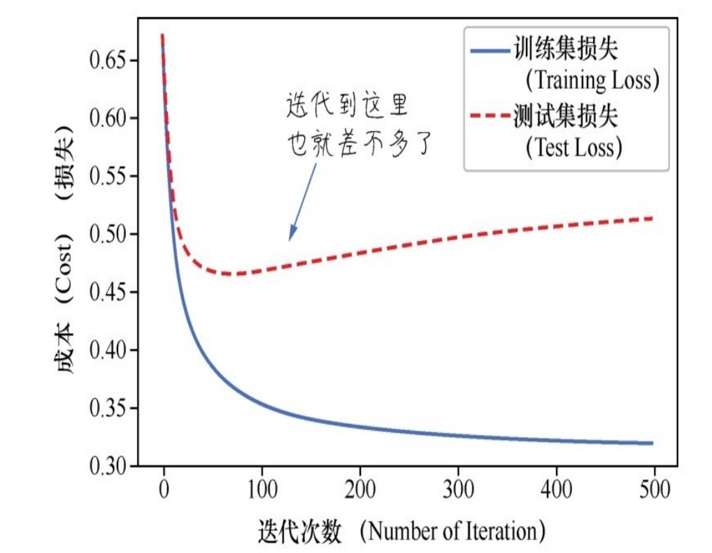

# 第4课 逻辑回归——给病患和鸢尾花分类

分类问题与回归问题是机器学习两大主要应用。

## 4.1 问题定义判断客户是否患病

数据详情：

|字段|描述|
|:---:|:---:|
|age|年龄|
|sex|性别|
|cp|胸痛类型|
|trestbps|休息时血压|
|chol|胆固醇|
|fbs|血糖|
|restecg|心电图|
|exang|运动会心绞痛|
|oldpeak|运动后ST段压低|
|slope|运动高峰期ST段的斜率|
|ca|主动脉荧光造影染色数|
|thal|缺陷种类|
|target|0代表无心脏病1代表有心脏病|

从数据特征中可以看出： 前面字段是特征字段；最后一个字段为标签字段。

## 4.2 从回归问题到分类问题

### 4.2.1 机器学习中的分类问题

逻辑回归的算法细节在输出明确的离散分类值之前，算法首先输出的其实是一个可能性，可理解为一个概率。

### 4.2.2 用线性回归+阶跃函数完成分类

### 4.2.3 通过Sigmiod函数进行转换

逻辑函数，logistic function，在机器学习中logistic function被广泛应用于逻辑回归分类和神经网络激活过程。还有另一类逻辑函数英文是logic function，就是我们也很熟悉的与、或、非等，它们是一类返回值为逻辑值true或逻辑值false的函数。logic function和logistic function不是同一回事儿。


Sigmoid函数，可视为线性函数和阶跃函数的结合，其公式为：


### 4.2.4 逻辑回归的假设函数

把线性回归和逻辑函数整合起来，形成逻辑回归的假设函数。

1. 首先通过线性回归模型求出一个中间值$zz=w_0x_1+w_1x_1+...+w_nx_n+b=W^TX$。它是一个连续值区间，并不在0~1之间，可能小于0或者大于1，范围从无穷小到无穷大。

2. 然后通过逻辑函数，把这个中间值z转化成0~1的概率值，以提高拟合效果。

3. 结合步骤1和步骤2，将新的函数表示为假设函数的形式：$h(x)=\frac{1}{1+e^{-(W^TX)}}$。


综上，逻辑回归所做的事情就是把线性回归输出的任意值，通过数学上的转换输出为0~1的结果，以体现二元分类的概率，严格来说为后验概率。

上述过程中的关键在于选择Sigmoid函数进行从线性回归到逻辑回归的转换。Sigmoid函数的优点如下。

- Sigmoid函数是连续函数，具有单调递增性类似于递增的线性函数。

- Sigmoid函数具有可微性可以进行微分也可以进行求导。

- 输出范围为0~1，结果可以表示为概率的形式，为分类输出做准备。

- 抑制分类的两边，对中间区域的细微变化敏感，这对分类结果拟合效果好。

### 4.2.5 逻辑回归的损失函数

把训练集中所有的预测所得概率和实际结果的差异求和并取平均值，就可以得到平均误差，这就是逻辑回归的损失函数：


在逻辑回归中不能再使用均方误差函数MSE作为损失函数，因为经过逻辑函数转换后，MSE对于参数w和b将不再是一个凸函数，这样将无法通过梯度下降找到全局最低点。为了避免陷入局部最低点，我们为逻辑回归选择了符合条件的新的损失函数公式如下：

$y=1, Loss(h(x),y)=-log(h(x))$

$y=0, Loss(h(x),y)=-log(1-h(x))$


- 如果真值是1，但假设函数预测概率接近于0，则得到的损失值将是巨大的；

-  如果真值是0，但假设函数预测概率接近于1，则得到的损失值将是巨大的；

整合起来，逻辑回归的损失函数公式如下：

$L(w,b)=-\frac{1}{N}\sum_{(x,y)\in {D}}[y*log(h(x))+(1-y)*log(1-h(x))]$

### 4.2.6 逻辑回归的梯度下降

所选择的损失函数经过Sigmoid变换之后是可微的，也就是说每一个点都可以求导，而且它是凸函数存在全局最低点。梯度下降的目的就是把w和b调整、再调整直至最低的损失点。

逻辑回归的梯度下降过程和线性回归一样，也是先进行微分然后把计算出来的导数乘以一个学习速率α，通过不断的迭代更新w和b直至收敛。其计算公式如下：


其结果为：

$梯度=\frac{1}{N}\sum_{i=1}^N(y^{(i)}-h(x^{(i)}))\cdot x^{(i)}$

传引入学习速率之后参数随梯度变化而更新的公式如下:

$w=w-\alpha \cdot \frac{\partial}{\partial w}L(w)$

即：

$w=w-\frac{\alpha}{N}\sum_{i=1}^N(y^{(i)}-(w\cdot x^{(i)}))\cdot x^{(i)}$

## 4.3 通过逻辑回归解决二元分类问题

上述心脏健康状况案例是一个二元分类问题——因为标签字段只有两种可能性：患病或健康。

### 4.3.1 数据的准备和分析

1. 数据读取

    ```python
        import numpy as np
        import pandas as pd
        df_heart = pd.read_csv('./dataset/heart.csv')
        df_heart.head()
    ```

    用`value_counts`方法输出数据集中患心脏病和没有患心脏病的人数：

    ```python
        df_heart.target.value_counts()
        >>> 
        1    165
        0    138
        Name: target, dtype: int64
    ```

    通过统计后，如果发现某一类别的比例特别低，例如不超过1%，那么这样的数据通过逻辑回归的方法分类将不太适宜。

    分析特征数据中“年龄/最大心率”与患病是否有关：

    ```python
        import matplotlib.pyplot as plt
        plt.scatter(x=df_heart.age[df_heart.target==1],
                                y=df_heart.thalach[(df_heart.target==1)], c='red')
        plt.scatter(x=df_heart.age[df_heart.target==0],
                                y=df_heart.thalach[(df_heart.target==0)], marker='^', c='blue')
        plt.legend(["Disease", "No Disease"])
        plt.xlabel("Age")
        plt.ylabel("Heart Rate")
        plt.show()
    ```

    

    输出结果显示出心率Heart Rate越高，患心脏病的可能性看起来越大。因为代表患病样本的圆点多集中在图的上方。

2. 构建特征集和标签集

    ```python
        # 构建特征集
        X = df_heart.drop(['target'], axis=1)
        y = df_heart.target.values
        y = y.reshape(-1, 1)
        print("张量X的形状：", X.shape)
        print("张量y的形状：", y.shape)

        >>> 
        张量X的形状： (303, 21)
        张量y的形状： (303, 1)
    ```

3. 拆分数据集

    ```python
        from sklearn.model_selection import train_test_split
            X_train, X_test, y_train, y_test = train_test_split(X, y, test_size=0.2)
    ```

4. 数据特征缩放

    使用Sklearn中内置的数据缩放器MinMaxScaler进行数据的归一化。

    ```python
        from sklearn.preprocessing import MinMaxScaler
        scaler = MinMaxScaler()
        X_train = scaler.fit_transform(X_train)
        X_test = scaler.transform(X_test)
    ```

    其中需要注意的地方是对数据缩放器要进行两次调用。针对`X_train`和`X_test`要使用不同的方法，一个是`fit_transform`先拟合再应用，一个是`transform`直接应用。这是因为所有的最大值、最小值、均值、标准差等数据缩放的中间值都要从训练集得来，然后同样的值应用到训练集和测试集。

### 4.3.2 建立逻辑回归模型

数据准备工作结束后下面构建逻辑回归模型。

1. 逻辑函数定义

    ```python
        # 首先定义一个Sigmoid函数，输入Z，返回y'
        def sigmoid(z):
            y_hat = 1 / (1+np.exp(-z))
            return y_hat
    ```

2. 损失函数的定义

    ```python
        # 然后定义损失函数
        def loss_function(X, y, w, b):
            y_hat = sigmoid(np.dot(X, w) + b)
            loss = -(y*np.log(y_hat) + (1-y)*np.log(1-y_hat))
            cost = np.sum(loss) / X.shape[0]
            return cost
    ```

3. 梯度下降的实现

    ```python
        # 然后构建梯度下降的函数
        def gradient_descent(X, y, w, b, alpha, iterations):
            l_history = np.zeros(iterations)
            w_history = np.zeros((iterations, w.shape[0], w.shape[1]))
            b_history = np.zeros(iterations)
            for i in range(iterations):
                y_hat = sigmoid(np.dot(X, w)+b)
                loss = -(y*np.log(y_hat) + (1-y)*np.log(1-y_hat))
                derivative_w = np.dot(X.T, ((y_hat-y))) / X.shape[0]
                derivative_b = np.sum(y_hat-y) / X.shape[0]
                w = w - alpha * derivative_w
                b = b - alpha * derivative_b
                l_history[i] = loss_function(X, y, w, b)
                print ("轮次", i+1 , "当前轮训练集损失：",l_history[i]) 
                w_history[i] = w # 梯度下降过程中权重的历史 请注意w_history和w的形状
                b_history[i] = b # 梯度下降过程中偏置的历史
            return l_history, w_history, b_history
    ```

    其中，`w_history`是 一个3D张量，因为w已经是一个2D张量了。因此语句`w_history[i] = w`就是把权重赋值给`w_history`的后两个轴。而`w_history`的第一个轴则是迭代次数轴。

4. 分类预测的实现

    梯度下降完成之后，就可以直接调用`gradient_descent`进行机器的训练返回损失、最终的参数值。

    ```python
        def predict(X, w, b):
            z = np.dot(X, w) + b
            y_hat = sigmoid(z)
            y_pred = np.zeros((y_hat.shape[0], 1))
            for i in range(y_hat.shape[0]):
                if y_hat[i, 0] < 0.5:
                    y_pred[i, 0] = 0
                else:
                    y_pred[i, 0] = 1
            return y_pred
    ```

### 4.3.3. 开始训练机器

封装一个逻辑回归模型：

```python
    def logistic_regression(X,y,w,b,lr,iter): # 定义逻辑回归模型
        l_history,w_history,b_history = gradient_descent(X,y,w,b,lr,iter)#梯度下降
        print("训练最终损失:", l_history[-1]) # 打印最终损失
        y_pred = predict(X,w_history[-1],b_history[-1]) # 进行预测
        traning_acc = 100 - np.mean(np.abs(y_pred - y_train))*100 # 计算准确率
        print("逻辑回归训练准确率: {:.2f}%".format(traning_acc))  # 打印准确率
        return l_history, w_history, b_history # 返回训练历史记录
```

其中，`traning_acc`为计算出来的分类**准确率**。在实现逻辑回归函数后，设置参数初始值。

```python
    #初始化参数
    dimension = X.shape[1] # 这里的维度 len(X)是矩阵的行的数，维度是列的数目
    weight = np.full((dimension,1),0.1) # 权重向量，向量一般是1D，但这里实际上创建了2D张量
    bias = 0 # 偏置值
    #初始化超参数
    alpha = 1 # 学习速率
    iterations = 500 # 迭代次数
```

调用逻辑回归模型训练机器：

```python
    # 用逻辑回归函数训练机器
    loss_history, weight_history, bias_history =  \
                logistic_regression(X_train,y_train,weight,bias,alpha,iterations)
```

### 4.3.4 测试分类结果

利用训练好的逻辑回归模型，对测试集进行分类预测：

```python
    y_pred = predict(X_test,weight_history[-1],bias_history[-1]) # 预测测试集
    testing_acc = 100 - np.mean(np.abs(y_pred - y_test))*100 # 计算准确率
    print("逻辑回归测试准确率: {:.2f}%".format(testing_acc))
    >>> 逻辑回归测试准确率: 85.25%
```

### 4.3.5 绘制损失曲线

绘制针对训练集和测试集的损失曲线：

```python
    loss_history_test = np.zeros(iterations) # 初始化历史损失
    for i in range(iterations): #求训练过程中不同参数带来的测试集损失
        loss_history_test[i] = loss_function(X_test,y_test,
                                            weight_history[i],bias_history[i])
    index = np.arange(0,iterations,1)
    plt.plot(index, loss_history,c='blue',linestyle='solid')
    plt.plot(index, loss_history_test,c='red',linestyle='dashed')
    plt.legend(["Training Loss", "Test Loss"])
    plt.xlabel("Number of Iteration")
    plt.ylabel("Cost")
    plt.show() # 同时显示显示训练集和测试集损失曲线
```



从图中可以看出，在迭代80~100次后，训练集的损失进一步下降越来越小，但是测试集的损失并没有跟着下降反而显示呈上升趋势。这是明显的**过拟合**的现象，因此迭代应该在100次之前结束。

### 4.3.6 直接调用sklearn库

```python
    from sklearn.linear_model import LogisticRegression #导入逻辑回归模型
    lr = LogisticRegression() # lr,就代表是逻辑回归模型
    lr.fit(X_train,y_train) # fit,就相当于是梯度下降
    print("SK-learn逻辑回归测试准确率{:.2f}%".format(lr.score(X_test,y_test)*100))
```

上述代码中的`fit`函数等效于自行编写的梯度下降代码。

### 4.3.7 哑特征的使用

重新观察数据可以发现，性别数据分别用0、1表示；'cp'、'thal'、'slope'等字段也均表示类别，其取值0、1、2、3等，与大小无关。

但是在计算机理解时，会理解为数值，认为3大于2大于1大于0，这种把”胸痛类型“的类别解读为”胸部大小“，这是不科学的。解决此类问题的方法是把**这种类别特征拆分为多个哑特征**。比如cp有0、1、2、3这4类，就拆分为cp_0、cp_1、cp_2、cp_3这四个特征，并将每一个特征还原成二元分类，Yes或No、1或0。

这个过程是把一个变量转换成多个**哑变量**（dummy variable），也叫虚拟变量、名义变量的过程。哑变量用以反映质的属性的一个人工变量，是量化了的质变量，通常取值为0或1。

```python
    # 把3个文本型变量转换为哑变量
    a = pd.get_dummies(df_heart['cp'], prefix = 'cp')
    b = pd.get_dummies(df_heart['thal'], prefix = 'thal')
    c = pd.get_dummies(df_heart['slope'], prefix = 'slope')
    # 把哑变量添加进dataframe
    frames = [df_heart, a, b, c]
    df_heart = pd.concat(frames, axis = 1)
    df_heart = df_heart.drop(columns = ['cp', 'thal', 'slope'])
    df_heart.head() # 显示新的dataframe
```

## 4.4 问题定义——确定鸢尾花的种类

确定鸢尾花的种类是一个经典机器学习教学案例，也是一个典型的多分类问题。在常用的数据集中，鸢尾花iris共分为3类，分别为山鸢尾iris-setosa、杂色鸢尾iris-versicolor和维吉尼亚鸢尾iris-virginica。整个数据集中共有150个数据，每类50个数据。其中有一类可以和其他两类进行线性分割，但另外两类无法根据特征线性分隔开。

鸢尾花数据集的特征和标签字段如下表所述：

|名称|备注|
|:---:|:---:|
|Id|序号|
|Sepal Length Cm|花萼长度|
|Sepal Width Cm|花萼宽度|
|Petal Length Cm|花瓣长度|
|Petal Width Cm|花瓣宽度|
|Species|标签|

## 4.5 从二元分类到多元分类

### 4.5.1 以一对多

用逻辑回归解决多元分类问题的思路是：以一对多，英文是one vs all或one vs rest。也就是说有多少类别就要训练多少二元分类器。每次选择一个类别作为正例标签为1，其他所有类别都视为负例标签为0，以此类推至所有的类别。训练好多个二元分类器之后，做预测时将所有的二元分类器都运行一遍，然后对每一个输入样本选择最高可能性的输出概率，即为该样本多元分类的类别。

即：$类别=i^{max}h^{(i)}(x)$


还有另外一种分类叫作“**多标签分类**”，指的是如果每种样本可以分配多个标签，就称为多标签分类。

### 4.5.2 多元分类的损失函数

多元分类的损失函数的选择和输出编码，与标签的格式有关。多元分类的标签有以下两种格式：

- one-hot格式的分类编码，比如数字09分类种的数字8格式为000 000 010

- 另一种是直接转换为类别数字，如1、2、3、4

因此，损失函数也可以有一下两种情况：

- 如果通过one-hot分类编码输出标签，则应使用**分类交叉熵**（categorical crossentropy）作为损失函数。

- 如果输出的标签编码为类别数字，则应使用**稀疏分类交叉熵**（sparse categorical crossentropy）作为损失函数。

## 4.6 正则化、欠拟合和过拟合

### 4.6.1 正则化

回顾：**规范化**：一般是把数据限定在需要的范围，比如[0~1]，从而消除了数据量纲对建模的影响。**标准化**：一般是指将数据正态分布，使平均值为0，标准差为1。它们都是针对数据做手脚，**消除过大的数值差异以及离群数据所带来的偏见**。

而正则化不同，**正则化**（Regularization）不是对数据操作。机器学习中的正则化是在损失函数里面加惩罚项，增加建模的模糊性，从而把捕捉到的趋势从局部细微趋势调整到整体大概趋势。虽然一定程度上地放宽了建模要求，但是能**有效防止过拟合**的问题增加模型准确性。**它影响的是模型的权重**。

### 4.6.2 欠拟合和过拟合

过拟合与欠拟合是机器学习模型调优，寻找最佳模型、最佳参数的主要阻碍。


可能对于训练集而言，过拟合的模型其在训练集上的损失会比较优越，但是模型好坏不能单单只关注训练集，还需要在测试集上验证。


从上图中可以看出，在训练一开始时模型“很烂”，在训练集和测试集上的误差都很大，这是**欠拟合**；随着模型优化，模型在训练集和测试集上的误差均有所下降，但训练集的误差要比测试集的低，因为根据训练集拟合的模型泛化到测试集上可能表现会稍弱一点；但是如果继续增加模型对训练集的拟合程度，会发现测试集上的误差将逐渐升高，这称为**过拟合**。

图11种的模型复杂度可以代表迭代次数的增加，内部参数的优化；也可以代表优化特征数量增多、函数复杂度的提高，比如从线性函数到二次、多次函数或者决策树的深度增加等等。

过拟合就是机器学习的模型过于依附于训练集的特征，因而模型**泛化能力降低**的体现。常用的降低过拟合的方法有：

- 增加数据集的数据个数。数据量太小时非常容易过拟合，因为小数据集很容易精确拟合。

- 找到模型优化时的平衡点。比如选择迭代次数或者选择相对简单的模型。

- **正则化**。为可能出现过拟合现象的模型增加正则项，通过降低模型在训练集上的精度，来提高其泛化能力这是非常重要的机器学习思想之一。

### 4.6.3 正则化参数

机器学习中的正则化通过引入模型参数λ来实现。加入了正则化参数之后的线性回归均方误差损失函数公式被更新如下：

$L(w,b)=MSE=\frac{1}{N}\sum_{(x,y)\in D}(y-h(x))^2+\frac{\lambda}{2N}\sum_{i=1}^n w_i ^2$

加入了正则化参数之后的逻辑回归均方误差损失函数公式被更新为：

$L(w,b)=-\frac{1}{N}\sum_{(x,y)\in D}[y*log(h(x))+(1-y)*log(1-h(x))]+\frac{\lambda}{2N}\sum_{j=1}^n w_j ^2$

现在的训练优化算法是一个由两项内容组成的函数。一个是损失项：用于衡量模型与数据的拟合度；另一个是正则化项：用于调解模型的复杂度。

从直观上不难看出，将正则化机制引入损失函数之后，当权重大的时候，损失被加大，λ值越大惩罚越大。这个公式引导着机器在进行拟合的时候不会随便增加权重。

正则化的目的是帮助我们减少过拟合的现象，而它的本质是**约束限制要优化的参数**。同时以最小化损失和复杂度为目标，这称为**结构风险最小化**。

正则化参数通常有L1正则化和L2正则化两种选择。

- L1正则化：根据权重的绝对值的总和来惩罚权重。

- L2正则化：根据权重的平方和来惩罚权重。L2 正则化有助于使离群值具有较大正值或较小负值的权重接近于0，但又不会正好为0。在线性模型中L2正则化比较常用，而且在任何情况下都能够起到增强泛化能力的目的。

上述给出的正则化公式实际上就是L2正则化，因为权重w正则化时做了平方。

应用L1正则化的回归又叫套索回归（Lasso Regression）；应用L2正则化的回归又叫岭回归（Ridge Regression）。

## 4.7 通过逻辑回归解决多元分类问题

### 4.7.1 数据的准备与分析

本案例暂且仅使用花萼长度和花萼宽度这两个特征来判断其分类：

```python
    import numpy as np
    import pandas as pd
    from sklearn import datasets
    iris = datasets.load_iris()
    X_sepal = iris.data[:,[0,1]]    # 花萼特征集：两个特征长和宽
    X_petal = iris.data[:,[2,3]]    # 花瓣特征集：两个特征长和宽
    y = iris.target
```

现在我们拥有两个独立的特征集：一个特征集包含花萼长度、花萼宽度；另一个包含花瓣长度、花瓣宽度。

根据花萼长度、花萼宽度这两个特征，将3种鸢尾花的分类可视化会，得到如下图所示的结果：


分割花萼数据集：

```python
    # 分割花萼数据集
    from sklearn.model_selection import train_test_split
    from sklearn.preprocessing import StandardScaler
    X_train_sepal, X_test_sepal, y_train_sepal, y_test_sepal = train_test_split(
        X_sepal, y, test_size = 0.3, random_state = 0)
    print("花瓣训练集样本数：", len(X_train_sepal))
    print("花瓣测试集样本数：", len(X_test_sepal))
    scaler = StandardScaler()
    X_train_sepal = scaler.fit_transform(X_train_sepal)   #  训练集数据标准化
    X_test_sepal = scaler.transform(X_test_sepal)
    # 合并特征集和标签集，留待以后数据展示之用
    X_combined_speal = np.vstack((X_train_sepal, X_test_sepal)) # 合并特征及
    Y_combined_sepal = np.hstack((y_train_sepal, y_test_sepal)) # 合并标签集
```

### 4.7.2 通过Sklearn实现逻辑回归的多元分类

通过Sklearn的`Logistic Regression`函数实现多元分类功能：

```python
    from sklearn.linear_model import LogisticRegression
    lr = LogisticRegression(penalty = 'l2', C = 0.1)    # 设定L2正则化和C参数
    lr.fit(X_train_sepal, y_train_sepal)
    score = lr.score(X_test_sepal, y_test_sepal)
    print("Sklearn逻辑回归测试准确率：{:.2f}%".format(score*100))
```

其中，上述提到的L2正则化通过`penalty`设置，描述了正则化的种类；而参数C则表示正则化的力度，它与λ刚好成反比，**C值越小正则化的力度越大**。

### 4.7.3 正则化参数——C值的选择

下面就用绘图的方式显示出采用不同的C值对于鸢尾花分类边界的具体影响。

```python
    import matplotlib.pyplot as plt
    from matplotlib.colors import ListedColormap
    def plot_decision_regions(X, y, classifier, test_idx=None, resolution=0.02):
        markers = ['o', 'x', 'v']
        colors = ['red', 'blue', 'lightgreen']
        # np.unique()：去除数组中的重复数字，并进行排序之后输出
        color_Map = ListedColormap(colors[:len(np.unique(y))])
        x1_min = X[:, 0].min() - 1
        x1_max = X[:, 0].max() + 1
        x2_min = X[:, 1].min() - 1
        x2_max = X[:, 1].max() + 1
        xx1, xx2 = np.meshgrid(np.arange(x1_min, x1_max, resolution),
                                                    np.arange(x2_min, x2_max, resolution))
        Z = classifier.predict(np.array([xx1.ravel(), xx2.ravel()]).T)
        Z = Z.reshape(xx1.shape)
        plt.contour(xx1, xx2, Z, alpha=0.4, cmap = color_Map)
        plt.xlim(xx1.min(), xx1.max())
        plt.ylim(xx2.min(), xx2.max())
        X_test, Y_test = X[test_idx,:], y[test_idx]
        for idx, cl in enumerate(np.unique(y)):
            plt.scatter(x = X[y==cl, 0], y = X[y==cl, 1],
                                    alpha = 0.8, c=color_Map(idx),
                                    marker = markers[idx], label=cl)
```

使用不同的C值进行逻辑回归分类并绘制分类结果：

```python
    from sklearn.metrics import accuracy_score
    C_param_range = [0.01, 0.1, 1, 10, 100, 1000]
    sepal_acc_table = pd.DataFrame(columns=['C_parameter', 'Accuracy'])
    sepal_acc_table['C_parameter'] = C_param_range
    plt.figure(figsize=(10, 10))
    j = 0
    for i in C_param_range:
        lr = LogisticRegression(penalty='l2', C = i, random_state=0)
        lr.fit(X_train_sepal, y_train_sepal)
        y_pred_sepal = lr.predict(X_test_sepal)
        sepal_acc_table.iloc[j, 1] = accuracy_score(y_test_sepal, y_pred_sepal)
        j += 1
        plt.subplot(3, 2, j)
        plt.subplots_adjust(hspace=0.4)
        plot_decision_regions(X = X_combined_sepal, y = Y_combined_sepal,
                                                    classifier= lr, test_idx = range(0, 150))
        plt.xlabel('Sepal length')
        plt.ylabel('Sepal width')
        plt.title('C = %s'%i)
```

运行上面的代码段绘制出各个不同C值情况下的分类边界如下图所示：


通过上图可以看出：

1. C值越大，分类精度越大。注意当C=1000时，图中左下方的圆点本来按照其特征空间的位置来说应该被放弃纳入圆点类，但是算法因为正则化的力度过小，过分追求训练集精度而将其划至山鸢尾集圆点类导致算法在这里过拟合。

2. 当C值取值过小时正则化的力度过大，为了追求泛化效果算法可能会失去区分度。

还可以绘制出测试精度随着C参数的不同取值而变化的学习曲线（learning curve）如下图所示。这样可以更清晰地看到C值是如何影响训练集以及测试集的精度的。


如何选择C值，有以下两点考量因素：

1. 是应该观察比较高的测试集准确率。

2. 训练集和测试集的准确率之差比较小，通常会暗示更强的泛化能力。

如果选择C值为10重做逻辑回归：

```python
    # 选择C值为10重做逻辑回归
    lr = LogisticRegression(penalty = 'l2', C = 10)
    lr.fit(X_train_sepal, y_train_sepal)
    score = lr.score(X_test_sepal, y_test_sepal)
    print("Sklearn逻辑回归测试准确率：{:.2f}".format(score*100))
    >>> Sklearn逻辑回归测试准确率：80.00
```