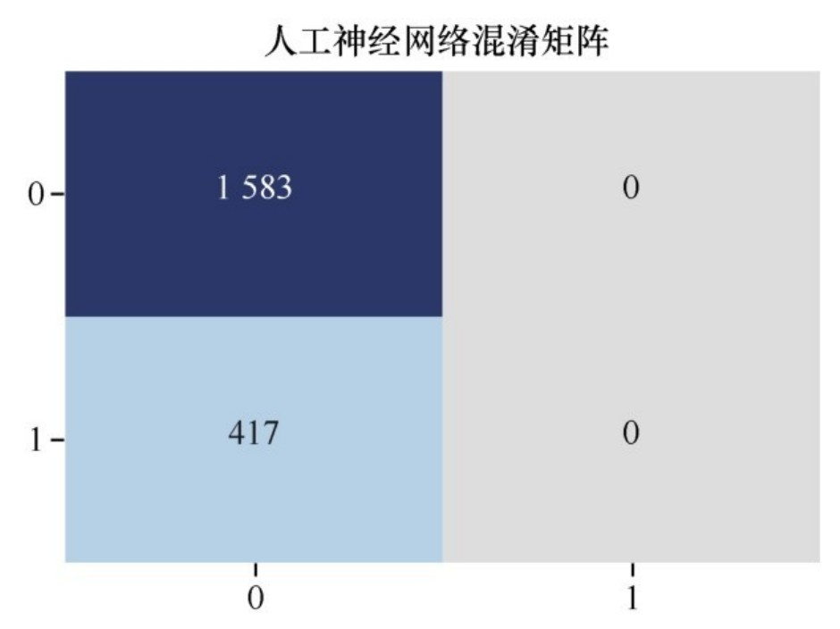
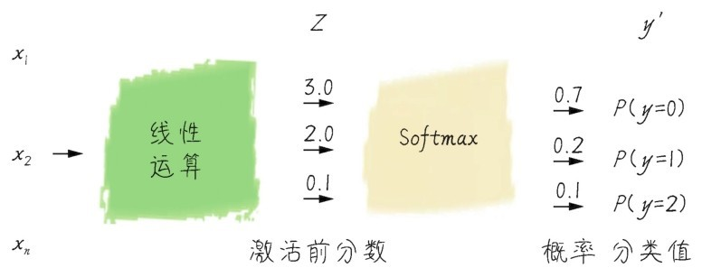

# 第5课 深度神经网络——找出可能流失的客户

## 5.1 问题定义——咖哥接手的金融项目

该项目的需求是根据已知的一批客户数据，来预测某个银行的客户是否会流失。

## 5.2 神经网络的原理

### 5.2.1 神经网络极简史


### 5.2.2 传统机器学习算法的局限性

对于非线性问题，那么就需要通过更复杂的函数模型，如高阶多项式去拟合。此时单纯线性回归明显无法满足需求，因而我们需要把特征重新组合变化出新的特征，如将特征$x_1$做平方变成$x_1^2$、甚至立方变成$x_1^3$、也可以与$x_2$组合变成$x_1x_2$等不断创造出新的特征，构造新的函数，直到把训练集的数据拟合好为止。

这种对特征的变换、升阶以及多个特征相互组合形成新特征的过程就是机器学习过程中既耗时又耗力的**特征工程**的一个例子。

**特征空间**：是数据特征所形成的空间，特征维度越高，特征空间越复杂。

**假设空间**：则是假设函数形成的空间，特征越多，特征和标签之间的对应的关系越难拟合，假设空间也就越复杂。

机器学习中有个术语叫“**维度灾难**”，即高维度带来了超高的复杂度和超巨大的特征空间。比如对于围棋来说特征维度是19×19但是它的有效状态数量超过了10^170。

而神经网络就是专门为了解决这类超高特征维度的感知类问题而生的。数学上已经证明浅层神经网络可以模拟任何连续函数。而深层神经网络更是可以用更少的参数来学到更好的拟合。特征数量越大神经网络优势越明显。

### 5.2.3 神经网络的优势

数据样本才是网络中每个投票器参数值的决定者，而不是作为网络设计者的人类。总结神经网络即深度学习的机理：它是用一串一串的函数也就是层，堆叠起来作用于输入数据进行**从原始数据到分类结果的过滤与提纯**。

这些层通过权重来参数化，通过损失函数来判断当前网络的效能，然后通过优化器来调整权重，寻找从输入到输出的最佳函数。注意以下两点。

- 学习就是为神经网络的每个层中的每个神经元寻找最佳的权重。

- 知识就是学到的权重

## 5.3 从感知器到单隐层网络

### 5.3.1  感知器是最基本的神经元

感知器是神经网络的雏形，最初的神经网络也就是只有一个神经元的感知器。


图中的圆圈就代表一个神经元，它可以接收输入，并根据输入提供一个输出。

如上图所示的感知器可以成为一个“与门”，其实现如下图所示：


通过调整权重，感知器可以从“与门”变成“或门”：


Sigmiod函数在逻辑回归中叫逻辑函数；在神经网络中则称为**激活函数**，用以类比人类神经系统中神经元的“激活”过程。

### 5.3.2 假设空间要能覆盖特征空间

单神经元也就是感知器，通过训练可以用作逻辑回归分类器，那么它是如何进化成更为复杂的多层神经网络呢？

对输入空间、输出空间、特征空间、假设空间进行如下的定义。

- 输入空间：x输入值的集合；

- 输出空间：y输出值的集合。通常输出空间会小于输入空间。

- 特征空间：每一个样本被称作一个实例，通常由特征向量表示，所有特征向量存在的空间称为特征空间。特征空间有时候与输入空间相同，有时候不同。因为有时候经过特征工程之后输入空间可通过某种映射生成新的特征空间。

- 假设空间：假设空间一般是对于学习到的模型（即函数）而言的。模型表达了输入到输出的一种映射集合，这个集合就是假设空间。假设空间代表着**模型学习过程中能够覆盖的最大范围**。

因为，模型本身就是对特征的一种函数化的表达，一个基本的原则是：**模型的假设空间一定要大到能覆盖特征空间**，否则模型就不可能精准地完成任务。

下面的示意图就描绘出函数的复杂度和其所能够覆盖的假设空间范围之间的关系，函数越复杂，假设空间的覆盖面越大拟合能力就越强。


### 5.3.3 单神经元特征空间的局限性

从拓扑结构来看，感知器（即神经网络中的单个神经元）所能够解决的问题是线性可分的。而对于非线性的空间，如负荷“同或XOR”逻辑的数据集，**无论我们如何调整感知器的权重和偏置，都无法拟合“同或”数据集从特征到标签的逻辑**。


### 5.3.4 分层加入一个网络隐层

针对上述问题，常见的解决思路有两种：

- 进行手工特征工程，就是对$x_1$、$x_2$进行各种各样的组合，变形形成新的特征，比如$x_3$、$x_4$。然后对新特征$x_3$、$x_4$做线性回归。这种特征工程本质上改变了数据集原本的特征空间，目标是降低其维度，使其线性回归算法可解。

- **将神经网络分层**。如果在感知器的激活函数后面再多加入一个新的神经网络层，以上一层神经元激活后的输出作为下一层神经元的输入，此时模型的假设空间就会被扩展神经网络，就会从线性模型跃迁至非线性模型，如下图所示。


相较于第一种思路，第二种思路省去了特征工程。因为特征的变换、特征之间的组合的逻辑都需要人工决定的，耗时耗力。所以对特征来巨大、特征见无明显关联的非结构化数据，做特征工程是不实际的。

神经网络隐层的出现，把**手工的特征工程工作丢给了神经网络**。下图展示的就是神经网络解决这个非线性的“同或”问题的具体过程。


在多层神经网络中，需要着重注意的是**神经网络的上下标符号规则**。例如：$w_{2.2}^{[1]}$，中括号里的上标数字代表第几层；下标中的第一个代表权重属于哪一个特征，即特征的维度；下标中第二个代表其连接到的下层神经元的维度。

**每层会有多个权重但每层只有1个偏置**。

对于数据集的特征x来说，有时候也会出现这样比较复杂的标号：$X_1^{(1)}$：下标1代表特征的维度1，就是第1个特征；圆括号里面的上标的数字代表的是样本的维度1，也就是第1个样本。

## 5.4 用Keras单隐层网络预测客户流失率

**层**是神经网络的基本元素。实际应用中，神经网络是通过不同类型的“层”来建构的，而这个建构过程不需要具体到每层内部的神经元。

### 5.4.1 数据的准备与分析

```python
    import numpy as np
    import pandas as pd
    df_bank = pd.read_csv('./dataset/BankCustomer.csv')
    df_bank.head()
```

数据包括的信息如下：

|字段|备注|
|:---:|:---:|
|Name|客户姓名|
|Gender|性别|
|Age|年龄|
|City|城市|
|Tenure|成为客户的年头|
|Products No|拥有的产品数量|
|Has Card|是否拥有信用卡|
|Active Member|是否为活跃用户|
|Credit|信用评级|
|Account Bal|银行存款余额|
|Salary|薪水|
|Exited|客户是否已经流失|

显示数据的分布情况：

```python
    # 显示数据的分布情况：
    import matplotlib.pyplot as plt
    import seaborn as sns
    features = ['City', 'Gender', 'Age', 'Tenure',
                        'ProductsNo', 'HasCard', 'ActiveMember', 'Exited']
    fig = plt.subplots(figsize=(15, 15))
    for i, j in enumerate(features):
        plt.subplot(4, 2, i + 1)
        plt.subplots_adjust(hspace=1.0)
        sns.countplot(x=j, data=df_bank)
        plt.title("No. of costumers")
```


从上图中可以看出，北京的客户最多；男女客户比例大概一致；年龄和客户数量呈现正态分布钟形曲线中间高两边低。

对数据进行清理工作：

1. 性别：这是一个二元类别特征，需要转换为0/1代码格式进行读取，处理机器学习中的文本格式数据都要转换为数字代码。

2. 城市：这是一个多元类别特征应把它转换为多个二元类别哑变量。

3. 姓名：这个字段对于客户流失与否的预测应该是完全不相关的，可以在进一步处理之前忽略。

```python
    # 数据清理：
    # 把二元类别文本数字化
    df_bank['Gender'].replace("Female", 0, inplace = True)
    df_bank['Gender'].replace("Male", 1, inplace = True)
    # 显示数字类别
    print("Gender unique values", df_bank['Gender'].unique())

    # 把多元类别转换成多个二元哑变量，然后贴回原始数据集
    d_city = pd.get_dummies(df_bank['City'], prefix="City")
    df_bank = [df_bank, d_city]
    df_bank = pd.concat(df_bank, axis=1)

    # 构建特征和标签集合
    y = df_bank['Exited']
    X = df_bank.drop(['Name', 'Exited', 'City'], axis=1)
    X.head()
```

用标准方法拆分数据集为测试集和训练集

```python
    from sklearn.model_selection import train_test_split
    X_train, X_test, y_train, y_test = train_test_split(X, y, test_size=0.2, random_state=0)
```

### 5.4.2 先尝试逻辑回归算法

在没有进行任何特征工程的情况下，先使用逻辑回归直接进行机器学习，看看训练之后的模型会带来什么样的结果。

```python
    from sklearn.linear_model import LogisticRegression
    lr = LogisticRegression()
    history = lr.fit(X_train, y_train)
    print("逻辑回归测试集准确率 {:.2f}%".format(lr.score(X_test,y_test)*100))
    >>> 逻辑回归测试集准确率 78.35%
```

### 5.4.3 单隐层神经网络的Keras实现

Keras的特点是用户友好注重用户体验。它提供一致且简单的API，并力求减少常见案例所需的用户操作步骤，同时提供清晰和可操作的反馈。

1. 用序贯模型构建网络

    单隐层神经网络的实现代码如下：

    ```python
        import keras
        from keras.models import Sequential
        from keras.layers import Dense
        ann = Sequential()
        ann.add(Dense(units=12, input_dim=12, activation='relu')) # 添加输入层
        ann.add(Dense(units=24,  activation='relu'))    # 添加隐层
        ann.add(Dense(units=1, activation='sigmoid'))   # 添加输出层
        ann.summary()
        >>> 
        Model: "sequential"
        ____________________________________________________________
        Layer (type)                 Output Shape              Param #   
        ============================================================
        dense (Dense)                (None, 12)                156       
        ____________________________________________________________
        dense_1 (Dense)              (None, 24)                312       
        ____________________________________________________________
        dense_2 (Dense)              (None, 1)                 25        
        ============================================================
        Total params: 493
        Trainable params: 493
        Non-trainable params: 0
        ____________________________________________________________
    ```

    - **序贯（Sequential）模型**：也叫作**顺序模型**，是最常用的深度网络，层和层间的架构也就是一个层接着一个层顺序地堆叠。

    - **密集（Dense）层**：常用的深度网络，层的类型也称为**全连接层**，即当前层和其下一层的所有神经元之间全有连接。

    上述**summary**方法显示了神经网络的结构，包括每个层的类型、输出张量的形状、参数数量以及整个网络的参数数量。上述网络只有3层，493个参数。

    展示出神经网络的形状结构：

    ```python
        from Ipython.display import SVG
        from keras.utils.vis_utils import model_to_dot
        SVG(model_to_dot(ann,show_shapes = True ).create(prog='dot', format='svg'))
    ```

    

    1. 上述代码中`ann=Sequential()`创建了一个序贯神经网络模型，其实就是一个Python的类。在Keras中绝大多数的神经网络都是通过序贯神经网络模型所创建的。与之对应的还有另外一种模型，成为**函数式API**，可以创建更为复杂的网络结构。

    2. 输入层通过`add`方法，可开始神经网络层的堆叠序贯模型，也就是一层一层的顺序堆叠。

    3. Dense是层的类型，代表密集层网络，是神经网络层中最基本的层，也叫全连接层。

        后续还会进一步接触到CNN中的Conv2D层和LSTM层等等。针对Dense层参数：

        1. `input_dim`是输入维度，**输入维度必须与特征维度相同**。该例中指定的网络能接收的输入维度是12。如果和实际输入网络的特征维度不匹配，python将会报错。

        2. `units`是输出维度，也可以写成`output_dim`，该例中units设置为12，这个值目前是随意选择的，代表了经过线性变化和激活之后的家和空间维度，也就是神经元个数。维度越大，则模型的覆盖面也越大，单模型也越复杂，需要的计算量也多。

        3. `activation`是激活函数，这是每一层都需要设置的参数。该例中激活函数选的是relu函数，其是神经网络中常用的激活函数。

    4. 隐层也是通过`add`方法。在输入层之后的所有层都不需要重新指定输入维度，因为网络能够通过上一层的输出自动地调整。该案例中，这一隐层的类型同样是全连接层。随着网络层级的加深，逐步地增大特征空间，这是密集连接型网络的常见做法但不是必需的做法。

    5. 输出层的输出维度是1，也是一个全连接层。因为对于二分类问题而言，输出维度必须是1。激活函数使用的是Sigmoid激活函数。对于多分类问题有多少个类别维度就是多少。激活函数方面最后一层中使用的是熟悉的Sigmiod激活函数。**对于二分类问题的输出层Sigmoid是固定的选择**。如果是**用神经网络解决回归问题的话那么输出层不用指定任何激活函数**。

    编译神经网络：

    ```python
        # 编译神经网络，指定优化器，损失函数，以及评估标准
        ann.compile(optimizer='adam',       # 优化器
                            loss = 'binary_crossentropy',# 损失函数
                            metrics = ['acc'])   # 评估指标
    ```

    用`Sequential`模型的`compile`方法对整个网络进行编译时，需要指定以下几个关键参数。

    1. 优化器`optimizer`：一般情况下`adam`或者`rmsprop`都是很好的优化器选项，但也有其他可选的优化器。

    2. 损失函数`loss`：对于二分类问题，通常选二元交叉熵函数（binary_crossentropy）；对于神经网络解决线性的回归问题，常选均方误差函数。

    3. 评价指标`metrics`：本案例中采用的是预测准确率（acc）。准确率即正确地预测占全部数据的比重，是最为常用的分类评估指标。

2. 全连接层

    **全连接层（Dense层）是最常见的神经网络层**，用于处理最普通的机器学习向量数据集，即形状为样本标签的2D张量数据集。其实现的就是一个逻辑回归功能：Output = Activation dot input kernel + bias。

    公式中的kernel就是权重。因为网络是多节点的，所以它从向量升级为矩阵，把输入和权重矩阵做点积，然后加上一个属于该层的偏置bias，激活之后就得到了全连接层往下一层的输出了。另外偏置在神经网络层中是可有可无的不是必需项。

    每层最基本、必须设置的参数只有两个：

    - units：输出维度；

    - activation：激活函数

    对于输入层还要多指定一个输入维度。对于后面的隐层和输出层则连输入维度也可以省略了。

    那么在每一个全连接层中，还有一些参数用于初始化权重和偏置以及正则化设定。

    ```python
        # Dense层中可设置的参数
        keras.layers.Dense(units=12,
                                activation=None,
                                use_bias=True,
                                kernel_initializer='glorot_uniform',
                                bias_initializer='zeros',
                                kernel_regularizer=None,
                                bias_regularizer=None,
                                activity_regularizer=None,
                                kernek_constraint=None,
                                bias_constraint=None)
    ```

3. 神经网络中其他类型的层

    **全连接层适用于2D张量数据集**，其他类型的层则负责处理其他不同维度的数据集，解决不同类型的问题。

    - 循环层：如Keras的LSTM层，用于处理保存在形状为样本时戳标签的3D张量中的序列数据；

    - 二维卷积层：如Keras的Conv2D层，用于处理保存在形状为样本帧数、图像高度、图像宽度、颜色深度的4D张量中的图像数据。

### 5.4.4 训练单隐层神经网络

和其他传统机器学习算法一样神经网络的拟合过程也是通过fit方法实现的。本案例中，通过`history`变量把训练过程中的信息保存下来，留待以后分析：

```python
    # 编译神经网络，指定优化器，损失函数，以及评估标准
    history = ann.fit(X_train, y_train,       # 指定训练集
                            epochs=30,       # 指定训练轮次
                            batch_size=64,   # 指定数据批量
                            validation_data=(X_test, y_test))   # 指定验证集,这里为了简化模型，直接用测试集数据进行验证
```

上述训练代码中，唯一需要指定的参数是训练集和训练的轮次`epochs`。其余参数还有：

- `batch_size`：指定数据批量，即每一次梯度下降更新参数时所同时训练的样本数量。

- `validation_data`：指定验证集。这样就可以一边用训练集训练网络，一边验证某评估网络的效果。本案例中进行了简化，直接使用了测试集，因此本案例中X_test，y_test也就成了验证集。

### 5.4.5 训练过程的图形化显示

训练过程中输出的信息包括每轮训练的损失值、准确率等。但是这个输出信息有30轮的数据很冗长、看起来特别费力。因此可以通过定义一个函数，显示基于训练集和验证集的损失函数及准确率随迭代次数变化的曲线。

```python
     # 显示训练过程中的学习曲线
    def show_history(history):
        loss = history.history['loss']
        val_loss = history.history['val_loss']
        epochs = range(1, len(loss)+1)
        plt.figure(figsize=(12, 4))
        plt.subplot(1, 2, 1)
        plt.plot(epochs, loss, 'bo', label='Training loss')
        plt.plot(epochs, val_loss, 'b', label = 'Validation loss')
        plt.title('Training and validation loss')
        plt.xlabel('Epochs')
        plt.ylabel('Loss')
        plt.legend()

        acc = history.history['acc']
        val_acc = history.history['val_acc']
        plt.subplot(1, 2, 2)
        plt.plot(epochs, acc, 'bo', label='Training acc')
        plt.plot(epochs, val_acc, 'b', label = 'Validation acc')
        plt.title('Training and validation accuracy')
        plt.xlabel('Epochs')
        plt.ylabel('Accuracy')
        plt.legend()
        plt.show()
        
    show_history(history)
```


## 5.5 分类数据不平衡问题只看准确率够用吗

### 5.5.1 混淆矩阵、精确率、召回率和F1分数

假设一手机厂商每天生产1000部手机，某一天出现2部劣质品。目前通过机器学习来分析数据特征来鉴定劣质品。其中数据集真值和机器学习模型预测值如下图所示：


数据显示，其中机器学习模型的预测结果有999个合格品和1个劣质品，则其准确率为99.9%，即预测命中的个数/数据总数=999/1000。1000个样本中只猜错了一个。

但是根据本例而言，该模型是为了检测劣质产品，**劣质品即标签值为1的阳性正样本**，一共2个，只发现了1个，因此有50%的正样本没有被测准。因此这个模型是失败的。在针对这种正样本和负样本比例极度不平衡的样本集，**需要引进新的评估指标**。

为此需要引入一个预测值和真值组成的矩阵，其四个象限从上到下，从左到右分别为：

- 真负：真值为负；预测值为负；即True Negative，TN；

- 假正：真值为负；预测值为正；即False Positive，FP；

- 假负：真值为正；预测值为负，即False Negative，FN；

- 真正：真值为正；预测值为正，即True Positive，TP；


或者：

- TP(True Positive): 真实为0，预测也为0

- FN(False Negative): 真实为0，预测为1

- FP(False Positive): 真实为1，预测为0

- TN(True Negative): 真实为1，预测也为1

上面这种矩阵，在机器学习中也是一种对模型的可视化评估工具，在监督学习中叫作**混淆矩阵（confusion matrix）**，如下图所示：


从混淆矩阵出发，又可以形成一些新的评估指标：

1. **精确率**，也叫**查准率**。其公式是：“被模型预测为正的正样本”除以“被模型预测为正的正样本”与“被模型预测为负的正样本”的和，$Precision =\frac{TP}{TP+FP} = \frac{TP}{Total Predicted Postived}$。


对于上述例子而言：

- 真正：被模型判断为劣质品的劣质品，样本数为1；

- 假正：被模型判断为劣质品的合格品，样本数为0；

- 假负：被模型判断为合格品的劣质品，样本数为1；

- 真负：被模型判断为合格品的合格品，样本数为998。

因此，该案例中精确率是对“假正”的测量，为1/(1+0) = 100%

2. **召回率**，也叫**查全率**。召回即劣质品蒙混过了质检，出厂后得召回销毁。其计算公式如下：$Recall = \frac{TP}{TP+FP} = \frac{TP}{Total True Positive}$。


召回率是针对“假负”得衡量，本例中召回率为1/(1+1) = 50%。

将精确率和召回率结合起来，得到**F1分数**。其是一个可以同时体现上面两个评估效果的标准。数学上定义为：**精确率和召回率的调和均值**。也是评估样本分类数据不平衡问题时的关键指标：$F1 = 2 \cdot \frac{Precision\cdot Recall}{Precision+Recall}$


### 5.5.2 使用分类报告和混淆矩阵

了解了这类数据集的评估指标之后，现在就继续用神经网络模型的`predict`方法预测测试集的分类标签，然后把真值和预测值做比较并利用Sklearn中的分类报告`classification report`功能来计算上面这几种标准。

```python
    y_pred = ann.predict(X_test,batch_size=10) # 预测测试集的标签
    y_pred = np.round(y_pred) # 四舍五入，将分类概率值转换成0/1整数值

    from sklearn.metrics import classification_report 
    def show_report(X_test, y_test, y_pred):
        if y_test.shape != (2000, 1):
            y_test = y_test.values  # 把Panda series转换成Numpy array
            y_test = y_test.reshape(len(y_test), 1) # 转换成与y_pred相同的形状 
        print(classification_report(y_test, y_pred, labels=[0, 1]))

    show_report(X_test, y_test, y_pred)
    >>> 
                  precision    recall  f1-score   support

            0       0.79        1.00            0.88        1583
            1       0.00        0.00            0.00        417

        accuracy                           0.79      2000
    macro avg       0.40      0.50      0.44      2000
    weighted avg       0.63      0.79      0.70      2000
```

其中需要注意的有：

- 神经网络模型的`predict`方法给出的预测结果也是一个概率，需要基于0.5的阈值进行转换舍入成0、1整数值。

- y_test一直都是一个Pandas的Series格式数据，并没有被转换为NumPy数组。神经网络模型是可以接收Series和Dataframe格式的数据的，但是此时为了和y_pred进行比较需要用values方法进行格式转换。

- y_test转换成NumPy数组后，需要再转换为与y_pred形状一致的张量，才输入classification_ report函数进行评估。

绘制混淆矩阵：

```python
    from sklearn.metrics import confusion_matrix
    def show_matrix(y_test, y_pred):
        cm = confusion_matrix(y_test, y_pred)
        plt.title("ANN Confusion Matrix")
        sns.heatmap(cm, annot=True, cmap="Blues", fmt="d", cbar=False)
        plt.show()
```



混淆矩阵显示417个客户流失，而正样本竟然一例都没测中。这样的神经网络尽管准确率为79%，但实际上是训练完全失败了。

### 5.5.3 特征缩放的魔力

**对于神经网络而言特征缩放（feature scaling）极为重要**。神经网络不喜欢大的取
值范围，因此需要将输入神经网络的数据标准化，把数据约束在较小的区间，这样可消除离群样本对函数形状的影响。

前面讲过特征缩放有多种形式。这里对数据进行**标准化**。其步骤是对于输入数据的每个特征，也就是输入数据矩阵中的一整列减去特征平均值，再除以标准差之后得到的特征平均值为0，标准差为1。

公式如下：$X'=\frac{X-mean(X)}{std(X)}$


```python
    # 直接使用StandardScaler工具
    from sklearn.preprocessing import StandardScaler
    sc = StandardScaler()
    X_train = sc.fit(X_train)
    X_test = sc.transform(X_test)
```

注意：均值和标准差都是在训练数据上计算而得的，然后**将同样的均值和标准差应用于训练集和测试集**。

测试集除了进行测试不能做其他用处，即使是计算均值和标准差。

进行特征缩放之后，再来比较逻辑回归和单隐层神经网络模型效果有何不同。

逻辑回归：

```python
    from sklearn.linear_model import LogisticRegression
    lr = LogisticRegression() # 逻辑回归模型
    history = lr.fit(X_train, y_train)
    print("逻辑回归测试集准确率：{:.2f}%".format(lr.score(X_test, y_test)*100))
    >>> 逻辑回归测试集准确率：80.50%
```

单隐层神经网络：

```python
    # 特征工程后重新调用神经网络
    # 单隐层神经网络：
    history = ann.fit(X_train, y_train,
                                    epochs = 30,
                                    batch_size = 64,
                                    validation_data = (X_test, y_test))
    y_pred = ann.predict(X_test, batch_size = 10)   # 预测测试集的标签
    y_pred = np.round(y_pred)   # 将分类概率值转换成0/1整数值
    >>> 单隐层神经网络预测准确率: 85.80%
```

再观察损失曲线和准确率曲线：


不仅准确率上升，同时精确率、召回率和F1分数也大幅提升。

```python
    show_report(X_test, y_test, y_pred)
    show_matrix(y_test, y_pred)
    >>>
                precision    recall  f1-score   support

           0       0.87          0.97       0.92            1583
           1       0.79          0.44       0.56            417

        accuracy                           0.86      2000
    macro avg       0.83      0.70      0.74      2000
    weighted avg       0.85      0.86      0.84      2000
```

混淆矩阵如下图所示，其中大概180个即将流失的客户被贴上“阳性”的标签，那么银行的工作人员就可以采取一些相应的措施去挽留他们。而400多人中，还有200多个要离开的客户没有被预测出来，因此模型还有进步的空间。


### 5.5.4 阈值调整、欠采样和过采样

之所以分类数据不平衡会影响机器学习模型的预测结果，是因为许多模型的输出类别是基于阈值的，如逻辑回归中小于0.5的为反例、大于等于0.5的则为正例。因此在数据不平衡时，默认的阈值会导致模型输出倾向于数据多的类别。

在面对数据极度不平衡的时候，可以采用以下方法：

- 首先**选择合适的评估指标**。除了F1分数，还有ROC/AUC以及G-mean等标准

- **调整分类阈值**，如将阈值从0.5调至接近于0。

- **采样（sampling）法**：分为**欠采样（under sampling）法**和**过采样（over sampling）法**。

    -  过采样：人为地重复类别较少的数据，使数据集中各种类别的数据大致数目相同。

    - 欠采样：人为地丢弃大量类别较多的数据，使数据集中各种类别的数据大致数目相同。

这种方法看起来简单有效，但是实际上容易产生**模型过拟合的问题**。因为少数类样本的特定信息实际上是被放大了，过分强调它们模型容易因此特别化而不够泛化，所以应搭配正则化模型使用。

对过采样法的一种改进方案是**数据合成**。常见的数据合成方法是SMOTE（Synthetic Minority Oversampling Technique）。其基本思路是基于少数类样本进行数据的构造，在临近的特征空间内生成与之类似的少数类新样本，并添加到数据集构成均衡数据集。

## 5.6 从单隐层神经网络到深度神经网络

浅层神经网络就可以模拟任何函数，但是需要巨大的数据量去训练它。深层神经网络解决了这个问题。相比浅层神经网络，深层神经网络可以用更少的数据量来学到更好的模型。


### 5.6.1 梯度下降正向传播和反向传播

全连接层构建起来的神经网络，每层和下一层之间的全部节点是全部连通的，每一层的输出就是下一层的输入特征。

深度神经网络也是通过**损失函数**来衡量该输出与预测值之间的差距，并以此作为反馈信号微调权重以降低损失值。

深度神经网络的梯度下降和参数优化过程是通过**优化器**实现的。其中包括**正向传播（forward propagation）算法**以及一个更为核心的深度学习算法——**反向传播（Back Propagation, BP）算法**。

1. 正向传播

    正向传播或称前向传播，其实就是从数据的输入一层一层进行输入和输出的传递，直到得到最后一层的预测结果，然后计算损失值的过程。简而言之，神经网络**正向传播的过程就是计算损失的过程**。

    1. 从输入层开始，线性处理权重和偏置后，再经过一个激活函数处理得到中间隐层1的输出。

    2. 将隐层1的输出作为隐层2的输入，继续线性处理权重和偏置，再经过一个激活函数处理得到隐层2的输出。

    3. 以此类推至隐层n。

    4. 通过输出处理得到输出层的分类输出，就是样本值也称为预测值。

    5. 在输出层通过指定损失函数，不同类型的问题对应不同的损失函数，得到一个损失值。

2. 反向传播

    反向传播，就是反向计算偏微分，信息会从神经网络的高层向底层反向传播，并在这个过程中根据输出来调整权重。反向传播的思路是拿到损失函数给出的值，从结果开始顺藤摸瓜逐步求导偏微分，逐步地发现每一个参数应该往哪个方向调整才能够减小损失。简而言之，神经网络**反向传播的过程是参数优化的过程**。

    反向传播从最终损失值开始并从反向作用至输入层，是利用**链式求导法则（chain rule）**计算每个参数对损失值的贡献大小。

    因为神经网络的运算是逐层进行的，有许多连接在一起的张量运算，所以形成了一层层的函数链。那么在微积分中可以给出下面的恒等式对这种函数链进行求导：$f(g(x))' = f'(g(x))\cdot g'(x)$。

    将链式求导法则应用于神经网络梯度值的计算得到的算法就是叫作反向传播，也叫反式微分（reverse-mode differential）。如果层中有激活函数对激活函数也要求导。

下面总结一下正向和反向传播的过程。

1. 在训练集中抽取一批样本X和对应标签y；

2. 运行神经网络模型得到这批样本X的预测值y‘；

3. 计算y-y'的均方，即预测值与真值的误差；

4. 计算损失函数相对于网络参数的梯度，也就是一次反向传播；

5. 沿着梯度的反方向更新参数，即$w=w-a \times 梯度$，这样这批数据的损失就少一点点；

6. 重复运行，直至结果满意。

### 5.6.2 深度神经网络中的一些可调超参数

通过正向传播和反向传播神经网络实现了内部参数的调整。而神经网络中的可调超参数具体包括以下几个。

- 优化器。
- 激活函数。
- 损失函数。
- 评估指标。

### 5.6.3 梯度下降优化器

与线性回归和逻辑回归不同，在神经网络中梯度下降过程是会有局部最低点出现的。也就是说损失函数对于整个神经网络的参数来说并不总是凸函数，而是非常复杂的函数。

而且神经网络中不仅存在局部最低点还存在鞍点。鞍点在神经网络中比局部最低点更为“凶险”在鞍点函数的导数也为0。在局部最低点和鞍点上导数没有任何方向感参数也不知道应该往哪里“走”。


1. 神经网络权重参数随机初始化

    如果每次训练网络都进行**权重的随机初始化**，那么神经网络总能够找到一个相对不错的结果。

    参数随机初始化的任务，在添加层的时候就已经完成：`ann.add(Dense(64, kernel_initializer='random_uniform), bias_initializer='zeros')`。有两个参数`kernel_initializer`和`bias_initializer`。其默认设定已采用了对`weight`也就是kernel的随机初始化机制，而`bias`则初始化为0值。

2. 批量梯度下降

   **批量梯度下降（Batch Gradient Descent，BGD）**，同时对m个样本进行训练的过程。深度学习模型不会同时处理整个数据集，而是将数据拆分成小批量通过向量化计算方式进行处理。如果没有批量概念，那么网络一个个数据节点训练起来速度将非常慢。

    因此通过批量梯度下降可以提高对CPU尤其是GPU的利用率。

    如代码中：`history = model.fit(X_train, y_train, epochs=30, batch_size=128, validation_data=(X_test, y_test))`，其中`batch_size=128`即将批量大小设置为128，也就是同时训练128个样本。

3. 随机梯度下降

    BGD提升了效率但并没有解决局部最低点的问题。而**随机梯度下降（Stochastic Gradient Descent，SGD）**，其中随机的含义在于：是每次只随机选择一个样本来更新模型参数。因此，这种方法每轮次的学习速度非常快但是所需更新的轮次也特别多。

    随机梯度下降中参数更新的方向不如批量梯度下降精确，每次也并不一定是向着最低点进行。但这种波动反而有一个好处，在有很多局部最低点的盆地区域中，随机地波动可能会使得优化的方向从当前的局部最低点，跳到另一个更好的局部最低点，最终收敛于一个较好的点甚至是全局最低点。

    在编译网络时可以指定SGD优化器：`ann.compile(loss=keras.losses.categorical_crossentropy, optimizer=keras.optimizer.SGD())`。

4. 小批量随机梯度下降

    由批量梯度下降和随机梯度下降折中，带来了**小批量随机梯度下降（Mini-Batch Gradient Descent, MBGD）**。这种方法综合了BGD与SGD，在更新速度与更新轮次中间取得了一个平衡，即每次参数更新时从训练集中随机选择m个样本进行学习。选择合理的批量大小后，MBGD既可以通过随机扰动产生跳出局部最低点的效果，又比SGD性能稳定。

    但仍存在以下问题：

    首先，**选择一个合理的学习速率很难**。如果学习速率过小，则会导致收敛速度很慢；如果学习速率过大，则会阻碍收敛即在极值点附近振荡。通常，可以在更新过程中进行学习速率的调整。

    在Keras的SGD优化器中，可以通过设定学习速率和衰减率实现MBGD：`keras.optimizers.SGD(lr=0.02, decay=0.1)`。

    其次，在MBGD中卡在局部最低点和鞍点的问题，通过小批量随机化有所改善，但并没有完全被解决。

5. 动量SGD

    动量SGD的思路很容易理解，想象一个小球从山坡上滑下来，如果滑到最后速度很慢就会卡在局部最低点。此时向左移动和向右移动都会导致损失值增大。如果使用的SGD的学习速率很小，就冲不出这个局部最低点；如果其学习速率很大，就可能越过局部最低点进入下一个下坡的轨道。如下图所示：

    

    为了在局部最低点或鞍点延续向前冲的势头，在梯度下降过程中每一步都移动小球，**更新参数w时不仅要考虑当前的梯度，当前的加速度，还要考虑上一次的参数更新，当前的速度来自之前的加速度。**

    在Keras的SGD优化器中可以通过`momentum`选项设定动量：`optimizer = keras.optimizers.SGD(lr=0.01, momentum=0.9)`。

    动量解决了SGD的收敛速度慢和局部最低点这两个问题，因此在很多优化算法中动量都有应用。

6. 上坡时减少动量——NAG

    延续动量的思路：小球越过局部最低点后，顺着斜坡往上冲到坡顶寻找下一个最低点的时候，从斜坡往下滚的球会盲目地选择方向。因此，更好的方式应该是在谷底加速之后、上坡之时，重新放慢速度。**涅斯捷罗夫梯度加速（Nesterov Accelerated Gradient, NAG）**的思路就是在下坡时、增加动量之后，在越过局部最低点后的上坡过程中计算参数的梯度时又减去了动量项。

    在Keras的SGD优化器中可以通过`nesterov`选项设定涅斯捷罗夫梯度加速：`optimizer = keras.optimizers.SGD(lr=0.01, momentum=0.9, nesterov = True)`。

7. 各参数的不同学习速率——Adagrad

    Adagrad也是一种基于梯度的优化算法，叫作**自适应梯度（adaptive gradient）**，即不同的参数可以拥有不同的学习速率。它根据前几轮迭代时的历史梯度值来调整学习速率。对于数据集中的稀疏特征，速率较大，梯度下降步幅将较大；对非稀疏特征则使用较小的速率更新。因此这个优化算法适合处理**含稀疏特征**的数据集。比如在文本处理的词向量word embedding训练过程中，对频繁出现的单词赋予较小的更新；对不经常出现的单词则赋予较大的更新。

    `keras.optimizers.adagrad() # 学习速率自适应`

    Adagrad有一个类似的变体叫Ada Delta，也是在每次迭代时利用梯度值实时地构造参数的更新值。

8. 加权平均值计算二阶动量——RMSProp

    **均方根前向梯度下降（Root Mean Square Propogation, RMSProp)**解决的是Adagrad中学习速率有时会急剧下降的问题。RMSProp抑制衰减的方法不同于普通的动量。它是采用窗口滑动加权平均值计算二阶动量，同时它也有保存Adagrad中每个参数自适应不同的学习速率的优点。

    `keras.optimizers.RMSprop() # RMSprop优化器`

9. 多种优化思路的集大成者——Adam

    Adam全称为**Adaptive Moment Estimation**相当于Adaptive+Momentum。它集成了SGD的一阶动量和RMSProp的二阶动量，而且也是一种不同参数自适应不同学习速率的方法与Ada Delta和RMSProp的区别在于：它计算历史梯度衰减的方式类似动量而不是使用平方衰减。

    ```python
        keras.optimizers.Adam(learning_rate=0.001, 
            beat_1=0.9, #  一阶动量指数衰减速
            beta_2=0.999, #二阶动量指数衰减速率，对于于稀疏矩阵值应接近1
            amsgrad=False)
    ```

10. 涅斯捷罗夫Adam加速—Nadam

    最后还有一种优化器叫作Nadam，全称为**Nesterov Adam optimizer**。这种方法则是Adam优化器和Nesterov momentum涅斯捷罗夫动量的集成。

    ```python
        keras.optimizers.Nadam(lr=0.002,# 学习速率 
            beat_1=0.9, #  一阶动量指数衰减速
            beta_2=0.999, #二阶动量指数衰减速率，对于于稀疏矩阵值应接近1
            epslion=None,
            schedule_decay=0.004)
    ```

### 5.6.4 激活函数从Sigmoid到ReLU

在逻辑回归中输入的特征通过加权、求和后，还将通过一个Sigmoid逻辑函数将线性回归值压缩至0-1区间以体现分类概率值。该逻辑函数在神经网络中被称为**激活函数**。在神经网络中不仅最后的分类输出层需要激活函数，而且每一层都需要进行激活然后向下一层输入被激活之后的值。

每一层都需要进行激活的原因在于：如果没有激活函数，每一层的输出都是上层输入的线性
变换结果。神经网络中将只包含两个线性运算——点积和加法。这样无论神经网络有多少层，堆叠后的输出都仍然是输入的线性组合。神经网络的假设空间并不会有任何的扩展。为了得到更丰富的假设空间，从而充分利用多层表示的优势，就需要使用激活函数给每个神经元引入非线性因素，使得神经网络可以任意逼近任何非线性函数形成拟合能力更强的各种非线性模型。因此所谓“激活”，可以将其简单理解成神经网络**从线性变换到非线性变换**的过程如下图所示。


最初Sigmiod函数是唯一的激活函数，但是后来人们逐渐地发现了其他一些更适合神经网络的激活函数ReLU、PReLU、eLU等。

1. Sigmoid函数和梯度消失

    Sigmoid函数数可以将连续实数映射到0-1区间用来体现二分类概率。在逻辑回归中，在特征比较复杂时也具有较好的效果。

    $f(z)=sigmoid(z)=\frac{1}{1+e^{-z}}$

    

    Sigmoid函数应用于深度神经网络中最致命的缺点是出现**梯度消失（gradient vanishing）**的情况，可简单理解为：反向传播求误差时，需要对激活函数进行求导，将来自输出损失的反馈信号传播到更远的层。如果需要经过很多层，那么信号可能会变得非常微弱，甚至完全丢失网络，最终变得无法训练。

2. Tanh函数

    与sigmoid函数类似，Tanh函数也是非线性函数，可以将连续实数映射到-1~1区间。

    $f(z)=tanh(z)=\frac{e^z-e^{-z}}{e^z+e^{-z}}$

    

    Tanh函数是一个以0为中心的分布函数，它的速度比Sigmoid函数快，然而并没有解决梯度消失问题。

3. ReLU函数

    ReLU（Rectified Linear Unit）函数特点是：单侧抑制，输入信号小于等于0时，输出是0；输入信号大于0时，输出等于输入。
    
    ReLU对于随机梯度下降的收敛很迅速，因为相较于Sigmoid和Tanh在求导时的指数运算，对ReLU求导几乎不存在任何计算量。

    $f(z) = max(0, z)$

    

    ReLU既能够进行神经网络的激活，收敛速度快，又不存在梯度消失现象。因此，目前的神经网络中已经很少有人在使用Sigmoid函数，ReLU基本上算是主流。
    
    但是ReLU函数也有缺点：它训练的时候比较脆弱，容易“死掉”，而且不可逆。所以用ReLU的时候，**学习速率绝对不能设得太大**，因为那样会“杀死”网络中的很多神经元。

4. Leaky ReLU函数和PReLU

    ReLU函数进一步发展就出现了Leaky ReLU函数，用以解决神经元被“杀死”的问题。

    $f(x) = max(\epsilon z, z)$

    

    ε是很小的负数梯度值，比如-0.01。这样做的目的是使负轴信息不会全部丢失，解决了ReLU神经元“死掉”的问题。因为它不会出现零斜率部分，而且它的训练速度更快。

    Leaky ReLU有一种变体叫作PReLU。PReLU把ε当作每个神经元中的一个参数，是可以动态随着梯度下降变化的。但是Leaky ReLU有一个问题就是：在接收很大负值的情况下Leaky ReLU会导致神经元饱和，从而基本上处于非活动状态。

5. eLu函数

    eLU函数形状与Leaky ReLU相似，但它的负值部分是对数曲线而不是直线。它兼具ReLU和Leaky ReLU的优点。

    $f(z) = z, z\geq 0$

    $f(z) = \epsilon (e^z-1), z < 0$

    

    总而言之，目前ReLU是现代神经网络中神经元激活的主流。

6. Sigmoid和Softmax函数用于分类输出

    上述激活函数都是针对神经网络内部的神经元而言的，目的是将线性变换转换为层与层之间的非线性变换。

    但是神经网络中的最后一层也就是分类输出层的作用又不一样。这一层的主要目的是**输出分类的概率而不是为了非线性激活**。因此，对于二分类问题来说仍然使用Sigmoid作为逻辑函数进行分类而且必须用它。

    对于多分类问题，神经网络的输出层使用Softmax函数进行输出分类，实际上它就是Sigmoid的扩展版其公式如下：

    $f(z)=\frac{e^z j}{\sum_{k=1}^k e^z k}$

    

    Softmax函数**专用于神经网络多分类输出**。对于一个输入，做Softmax之后的输出的各种概率和为1。而当类别数等于2时，Softmax回归就退化为Logistic回归与Sigmoid函数的作用完全相同了。

### 5.6.5 损失函数的选择

**激活函数是属于层的参数**，每一层都可以指定自己的激活函数。而**损失函数是属于整个神经网络的参数**。

神经网络中损失函数的选择是**根据问题类型而定的**，指导原则如下。

1. 对于**连续值向量的回归问题**，使用**均方误差损失函数**：

    ```python
        # 对于连续值向量的回归问题
        ann.compile(optimizer='adam',
                                loss='mse') # 均方误差损失函数
    ```

2. 对于**二分类问题**，使用**二元交叉熵损失函数**：

    ```python
        # 对于二分类问题
        ann.compile(optimizer='adam',
                                loss='binary_crossentropy', # 二元交叉熵损失函数
                                metrics=['accuracy']) 
    ```

3. 对于**多分类问题如果输出是one-hot编码**，则使用**分类交叉熵损失函数**：

    ```python
        # 对于多分类问题
        ann.compile(optimizer='adam',
                                loss='categorical_crossentropy',# 分类交叉熵损失函数
                                 metrics=['accuracy']) 
    ```

4. 对于**多分类问题如果输出是整数数值**，则使用**稀疏分类交叉熵损失函数**：


    ```python
        # 对于多分类问题
        ann.compile(optimizer='adam',
                                loss='sparse_categorical_crossentropy',# 分类交叉熵损失函数
                                 metrics=['accuracy']) 
    ```

5. 对于**序列问题**如语音识别等，则可以用时序分类（Connectionist Temporal Classification,CTC）等损失函数。

### 5.6.6 评估指标的选择

神经网络的评估指标，作为神经网络的超参数，也就是评估网络模型好不好的标准，也叫目标函数。评估指标和损失函数有点相似，都是追求真值和预测值之间的最小误差，其差别在于**损失函数作用于训练集**，用以训练机器为梯度下降提供方向；而**评估指标作用于验证集和测试集**，用来评估模型。

对于一个机器学习模型来说有的时候评估指标可以采用与损失函数相同的函数。

比如，对于线性回归模型，损失函数一般选择均方误差函数，评估指标也可以选择均方误差函数。也可以选择MAE即平均绝对误差函数作为目标函数。因为评估过程无须梯度下降，取误差绝对值做平均，即可无须加以平方。当然MAE相对于权重不是凸函数，因此只能用作评估模型不能用作损失函数。

而对于分类问题，模型神经网络默认采用准确率作为评估指标也就是比较测准的样本数占总样本的比例。

还可以自主开发评估指标。下面是一个Keras文档中自带的小例子用代码自定义了一个目标函数：

```python
    # 自定义评估指标
    import keras.backend as K
    def mean_pred(y_true, y_pred):
        return K.mean(y_pred)
    ann.complie(optimizer='rmsprop', # 优化器
                loss='binary_crossentropy', # 损失函数
                metrics=['accuracy', mean_pred]) # 自定义的评估指标
```

综上神经网络中的评估指标的选择有以下两种情况。

- 对于回归问题神经网络中使用MAE作为评估指标是常见的。

- 对于普通分类问题神经网络中使用准确率作为评估指标也是常见的。但是对于类别分布不平衡的情况应辅以精确率、召回率、F1分数等其他评估指标。

损失函数和评估指标有相似之处但意义和作用又不尽相同。

## 5.7 用Keras深度圣经网络预测客户流失率

### 5.7.1 构建深度神经网络

搭建多层的神经网络还是使用序贯模型。下面随意地添加几层看一看效果：

```python
    ann = Sequential() # 创建一个序贯ANN模型
    ann.add(Dense(units=12, input_dim=12, activation = 'relu')) # 添加输入层
    ann.add(Dense(units=24, activation = 'relu')) # 添加隐层
    ann.add(Dense(units=48, activation = 'relu')) # 添加隐层
    ann.add(Dense(units=96, activation = 'relu')) # 添加隐层
    ann.add(Dense(units=192, activation = 'relu')) # 添加隐层
    ann.add(Dense(units=1, activation = 'sigmoid')) # 添加输出层
    # 编译神经网络，指定优化器，损失函数，以及评估指标
    ann.compile(optimizer = 'RMSprop', # 优化器
                loss = 'binary_crossentropy', # 损失函数
                metrics = ['acc']) # 评估指标
    history = ann.fit(X_train, y_train, # 指定训练集
                    epochs=30,        # 指定训练的轮次
                    batch_size=64,    # 指定数据批量
                    validation_data=(X_test, y_test)) # 指定验证集
    y_pred = ann.predict(X_test,batch_size=10) # 预测测试集的标签
    y_pred = np.round(y_pred) # 将分类概率值转换成0/1整数值
```

查看网络效果：

```python
    history = ann.fit(X_train, y_train, # 指定训练集
                    epochs=30,        # 指定训练的轮次
                    batch_size=64,    # 指定数据批量
                    validation_data=(X_test, y_test)) # 指定验证集
    show_history(history)
```

观察训练及预测结果之后发现：

第一，较深的神经网络训练效率要高于小型网络，一两个轮次之后准确率迅速提升到0.84以上，而单隐层神经网络需要好几轮才能达到这个准确率。

第二，从准确率上看没有什么提升，而从F1分数上看目前这个比较深的神经网络反而不如简单的单隐层神经网络从0.58下降到0.55。

第三，从损失函数图像上看，如下图所示，深度神经网络在几轮之后就开始出现过拟合的问题，而且验证集上损失的波动也很大。因为随着轮次的增加，训练集的误差值逐渐减小，但是验证集的误差反而越来越大了。也就是说网络的参数逐渐地对训练集的数据形成了过高的适应性。这对于较大网络来说的确是常见情况。


### 5.7.2更换优化器

首先尝试将优化器从RMSProp换成Adam：`ann.compile(optimizer = 'adam', loss = 'binary_crossentropy', metrics = ['acc'])`。

更换优化器之后重新训练、测试网络。发现最为关心的F1分数有所上升，上升至0.56。如下输出结果所示。但这仍然低于单隐层神经网络的0.58。


### 5.7.3 神经网络正则化添加Dropout层

在神经网络中最常用的对抗过拟合的工具就是Dropout。在Keras中Dropout也是神经网络中的层组件之一，其真正目的是**实现网络正则化，避免过拟合**。其原理在于：在某一层之后添加Dropout层意思就是随机将该层的一部分神经元的输出特征丢掉，设为0相当于随机消灭一部分神经元。


假设在训练过程中，某一层对特定数据样本输出一个中间向量。例如，使用Dropout之前中间向量为[0.5, 0.2, 3.12, 5.94]，则使用Dropout之后中间向量变为[0.50, 0.2,5.90]。

Dropout比率就是被设为0的输出特征所占的比例，通常为0.2、0.5。注意Dropout只是对训练集起作用，在测试时没有神经元被丢掉。

```python
    from keras.layers import Dropout # 导入Dropout
    ann = Sequential()    # 创建一个序贯ANN模型
    ann.add(Dense(units=12, input_dim=12, activation='relu'))   # 添加输入层
    ann.add(Dense(units=24, activation='relu'))   # 添加隐层
    ann.add(Dropout(0.5))   # 添加Dropout
    ann.add(Dense(units=48, activation='relu'))   # 添加隐层
    ann.add(Dropout(0.5))   # 添加Dropout
    ann.add(Dense(units=96, activation='relu'))   # 添加隐层
    ann.add(Dropout(0.5))   # 添加Dropout
    ann.add(Dense(units=192, activation='relu'))   # 添加隐层
    ann.add(Dropout(0.5))   # 添加Dropout
    ann.add(Dense(units=1, activation = 'sigmoid')) # 添加输出层
    ann.compile(optimizer = 'adam', # 优化器
                            loss = 'binary_crossentropy',    # 损失函数
                            metrics=['acc']) # 评估指标
    history = ann.fit(X_train, y_train, epochs=30, batch_size=64, validation_data=(X_test, y_test))
    y_pred = ann.predict(X_test, batch_size=10)  # 预测测试集的标签
    y_pred = np.round(y_pred) #将分类概率值转换成0/1整数值
```


现在针对客户流失样本的F1分数上升到了0.62，如下输出结果所示。对于难以预测的客户流失现象来说这是一个相当棒的成绩。这样说明对于这个问题加深网络同时辅以Dropout正则化的策略比用单隐层神经网络更好。


## 5.8 深度神经网络的调试及性能优化

### 5.8.1 使用回调功能

在神经网络的训练过程中，梯度下降是有可能陷入局部最低点或者鞍点的，它们也称为训练过程中的高原区。此时，验证集上损失值的改善会停止，同样的损失值每轮重复出现。数据集没有做特征缩放时就经常出现这种情况。一种有效的想法就是：在出现这种情况时，调整学习速率，因为此时增大或减小学习速率，都是跳出高原区的有效策略。

类似的，运行时动态控制可以通过回调callback功能来实现。所谓回调就是**在训练进行过程中，根据一些预设的指示对训练进行控制**。常见的回调函数如下：

- Model Checkpoint：在训练过程中的不同时间点保存模型，也就是保存当前网络的所有权重。

- Early Stopping：如果验证损失不再改善则中断训练。这个回调函数常与Model Checkpoint结合使用以保存最佳模型。

- Reduce LROn Plateau：在训练过程中动态调节某些参数值，比如优化器的学习速率从而跳出训练过程中的高原区。

- TensorBoard：将模型训练过程可视化。

```python
    # 导入回调功能
    from keras.callbacks import ModelCheckpoint
    from keras.callbacks import EarlyStopping
    from keras.callbacks import ReduceLROnPlateau
    # 设定要回调的功能
    earlystop = EarlyStopping(monitor='val_acc', patience=20,
                                        verbose=1,
                                        restore_best_weights=True)
    reducelr = ReduceLROnPlateau(monitor='val_acc', factor=0.5,
                                        patience=3,
                                        verbose=1, min_lr=1e-7)
    modelckpt = ModelCheckpoint(filepath='ann.h5', 
                                        monitor='val_acc',
                                        verbose=1,
                                        save_best_only=True,
                                        mode='max')
    callbacks = [earlystop, reducelr, modelckpt] # 设定回调
    history = ann.fit(X_train, y_train, # 指定训练集
                    batch_size=128, # 指定批量大小
                    validation_data = (X_test, y_test), # 指定验证集
                    epochs=100, # 指定轮次
                    callbacks=callbacks) # 指定回调功能
```

### 5.8.2 使用TensorBoard

TensorBoard是一个内置于Tensor Flow的可视化工具，用以帮助我们在训练过程中监控模型内部发生的信息。具体包括以下功能。

- 在训练过程中监控指标。

- 将模型的架构可视化。

- 显示激活和梯度的直方图。

- 以三维的形式显示词嵌入。

```python
    # 导入并激活TensorBoard
    %load_ext tensorboard
    %tensorboard --logdir logs
```

然后在Keras中通过在回调中指定TensorBoard就可以调用它显示训练过程中的信息，如下段代码所示。

```python
    # 创建机器学习模型
    import tensorflow as tf
    mnist = tf.keras.datasets.mnist
    ((x_train, y_train), (x_test, y_test)) = mnist.load_data()
    (x_train, x_test) = (x_train / 255.0, x_test / 255.0)
    model = tf.keras.models.Sequential([
    tf.keras.layers.Flatten(input_shape=(28, 28)),
    tf.keras.layers.Dense(512, activation=tf.nn.relu),
    tf.keras.layers.Dropout(0.2),
    tf.keras.layers.Dense(10, activation=tf.nn.softmax)
    ])
    model.compile(
    optimizer='adam',
    loss='sparse_categorical_crossentropy',
    metrics=['accuracy'],
    )
```

### 5.8.3 神经网络中的过拟合

过拟合问题在所有机器学习模型，包括神经网络中，都是性能优化过程中最为关键的问题。

在损失函数图像上，当训练集上的损失越来越低，但是验证集或测试集上的损失到了一个点后显著上升或者振荡，这就表示出现了过拟合的现象。

解决过拟合问题的基本思路主要有以下几种。

1. 首先根据奥卡姆剃刀定律，在使用非常深的网络之前应三思，因为网络越大越容易过拟合。如果能够用较简单的小型网络解决问题，就不要强迫自己使用大网络。

2. 一种思路是在训练大型网络之前使用少量数据训练一个较小的模型。小模型的泛化好再去训练更深、更大的网络。不然的话费了很多精力直接训练一个大网络，最后发现结果不好就白费力气了。

3. 另外最常见且有效地降低神经网络过拟合的方法就是**在全连接层之间添加一些Dropout层**。这是很好用的标准做法，不过Dropout层会对训练速度稍有影响。

4. 最后**使用较低的学习速率配合神经元的权重正则化**，可能是解决过拟合问题的手段之一。

### 5.8.4 梯度消失和梯度爆炸

网络层数的叠加对于大数据集来说可以带来更优的效果，但是单纯的叠加层数确不一定获得更好的网络。其中最主要的原因就是，梯度反向传播过程中的**梯度消失**，也称**梯度弥散**，从而导致后面的训练困难，随着层数的增加网络最终变得无法训练。

神经网络梯度下降的原理是**将来自输出损失的反馈信号反向传播到更底部的层**。如果这个反馈信号的传播需要经过很多层，那么信号可能会变得非常微弱，甚至完全丢失梯度，无法传到的层就好比没有经过训练一样。这就是梯度消失。

而梯度爆炸则是指**神经元权重过大时，网络中较前面层的梯度通过训练变大，而后面层的梯度呈指数级增大**。

梯度爆炸和梯度消失问题都是因为网络太深、网络权重更新不稳定造成的，本质上都是梯度反向传播中的连锁效应。

常用的解决方案如下：

1. **选择合适的激活函数**

    选择合适的激活函数是最直接的方法。因为，如果激活函数的导数为1那么每层的网络都可以得到相同的更新速度。我们已经介绍过的ReLU、Leaky ReLU、eLU等新型激活函数都是可用选择。

2. **权重正则化**

    对神经网络各层的神经元的权重进行正则化，不仅对过拟合有效还能抑制梯度爆炸。

    Keras中的权重正则化包括以下选项：

    - keras.regularizers.l1：L1正则化，加入神经元权重的绝对值作为惩罚项。

    - keras.regularizers.l2：L2正则化，加入神经元权重的平方作为惩罚项。

    - keras.regularizers.l1_l2：同时加入L1和L2作为惩罚项。

3. **批标准化**

    批标准化（batch normalization），有时称为批归一化，意思就是将数据标准化的思想应用于神经网络层的内部，使神经网络各层之间的中间特征的输入也符合均值为0、标准差为1的正态分布。

    批标准化使网络中间层的输入数据分布变得均衡，因此可以得到更为稳定的网络训练效果同时加速网络的收敛减少训练次数。

4. **残差连接**

    通过上面的种种方法如选择合适的激活函数、权重正则化和批标准化深度神经网络的性能有所改善，但是仍然没有从根本上解决梯度消失的问题，则可以使用是**残差连接（residual connection）**结构。

    它的基本思想是在大型深度网络中至少10层以上，让前面某层的输出跨越多层直接输入至较靠后的层形成神经网络中的捷径shortcut。这样就不必担心过大的网络中梯度逐渐消失的问题了。残差连接结构在最新的深度神经网络结构中几乎都有出现，因为它对解决梯度消失问题非常有效。
