# 第6课 卷积神经网络——识别狗狗的图像

卷积神经网络简称为卷积网络，与普通神经网络的区别是：它的卷积层内的神经元只覆盖输入特征局部范围的单元，具有稀疏连接（sparseconnectivity）和权重共享（weight shared）的特点，而且其中的过滤器可以做到对图像关键特征的抽取。因为这一特点卷积神经网络在图像识别方面能够给出更好的结果。

## 6.2 卷积网络的结构

复习一下该程序的完整代码并通过`model.summary`方法显示网络的结构：

```python
    from keras import models    # 导入Keras模型和各种神经网络的层
    from keras import Dense, Dropout, Flatten, Conv2D, MaxPooling2D
    model = models.Sequential() # 序贯模型
    model.add(Conv2D(filters=32, # 添加Conv2D层, 指定过滤器的个数,即通道数
                    kernel_size=(3, 3), # 指定卷积核的大小
                    activation='relu', # 指定激活函数
                    input_shape=(28, 28, 1))) # 指定输入数据样本张量的类型
    model.add(MaxPooling2D(pool_size=(2, 2)))   # 添加MaxPooling2D层
    model.add(Dropout(0.25)) # 添加Dropout层
    model.add(Flatten())        # 添加展平层
    model.add(Dense(128, activation='relu')) # 添加全连接层
    model.add(Dropout(0.5)) # 添加Dropout层
    model.add(Dense(10, activation='softmax')) # Softmax分类激活, 输出
    10维分类码
    model.compile(optimizer='rmsprop', # 指定优化器
                        loss='categorical_crossentropy', # 指定损失函数
                        metrics=['accuracy']) # 指定评估指标
    model.summary() # 显示网络模型
```

还可以用下页图形的方式显示出这个有225034个参数、用序贯方式生成的卷积网络的形状:

```python
    from IPython.display import SVG
    from keras.utils.vis_utils import model_to_dot
    SVG(model_to_dot(ann,  show_shapes  =  True  ).create(prog='dot',
    format='svg'))
```

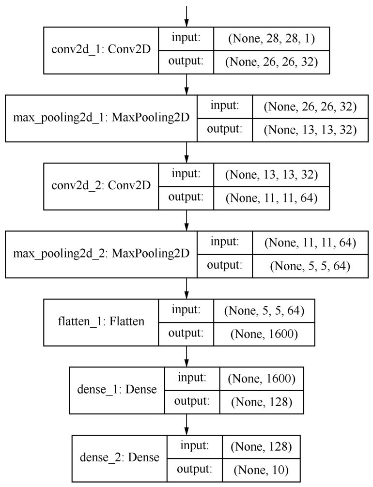

卷积网络的典型架构：它实现了一个图像分类功能，输入的是图像，输出的是图像的类别标签。

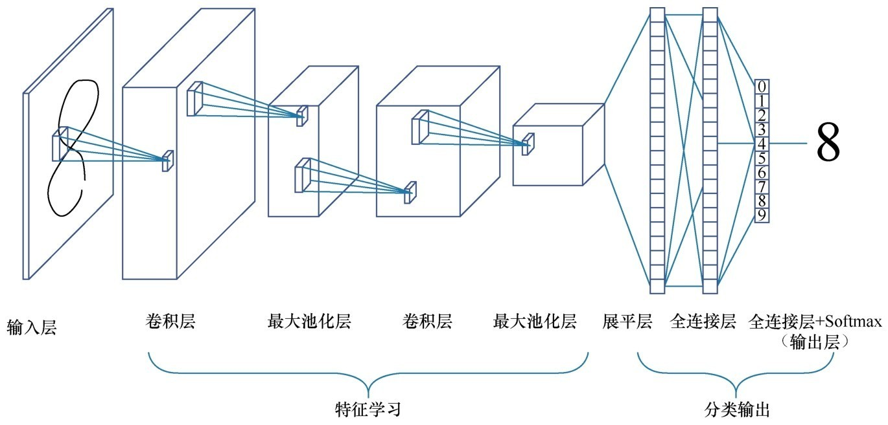

卷积网络也是多层的神经网络，但是层内和层间神经元的类型和连接方式与普通神经网络不同。卷积神经网络由**输入层、一个或多个卷积层和输出层的全连接层组成**。

1. 网络左边仍然是数据输入部分，对数据做一些初始化处理和标准化、图片压缩、降维等工作，最后输入数据集形状为样本图像高度、图像宽度、颜色深度。

2. 中间是卷积层，这一层中也有激活函数。

3. 一般卷积层之后接一个池化层，池化层包括区域平均池化或最大池化。

4. 通常卷积+池化的架构会重复几次形成深度卷积网络。在这个过程中，图片特征张量的尺寸通常会逐渐减小而深度将逐渐加深。如上一张图所示特征图从一张扁扁的纸片形状变成了胖胖的矩形。

5. 之后是一个展平层用于将网络展平。

6. 展平之后接一个普通的全连接层。

7. 最右边的输出层也是全连接层用Softmax进行激活分类输出层，这与普通神经网络的做法一致。

8. 在编译网络时使用了Adam优化器，以分类交叉熵作为损失函数，采用了准确率作为评估指标。

卷积网络的核心特点就是**卷积+池化的架构**，要注意到“卷积层”中的参数其实是远少于全连接层的。本例中两个卷积层中的参数加起来不到2万个，而全连接层则贡献了其他20多万个参数。这是因为卷积网络中各层的神经元之间，包括输入层的特征和卷积层之间不是彼此全部连接的，而是以卷积的方式有选择性的局部连接如下图所示。这种结构除了能大大减少参数的数量之外，还有其他一些特殊优势。

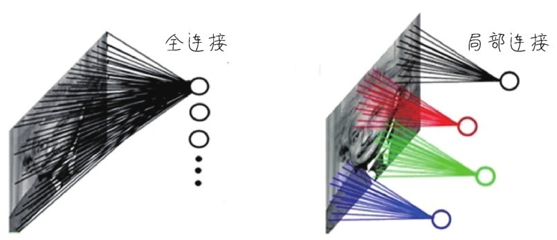

## 6.3 卷积层的原理

卷积网络是通过卷积层Conv2D层中的**过滤器（filter）**，用卷积计算对图像核心特征进行抽取，从而提高图像处理的效率和准确率。

### 6.3.1 机器通过“模式”进行图像识别

机器是通过**模式（pattern）**进行图像的识别。举例来说有一个字母X，这个X由一堆像素组成，可以把X想象成一个个小模式的组合，如下图所示。X的形状好像上面有两只手，下面长了两只脚，中间是躯干部分。如果机器发现一个像下面左图这样中规中矩的X就能识别出来。但是无论是手写数字，还是照片扫描进计算机的时候都可能出现噪声*（noise）。那么这个X可能变样了，手脚都变了位置好像手舞足蹈的样子如下面右图所示。但是肉眼一看还是X。

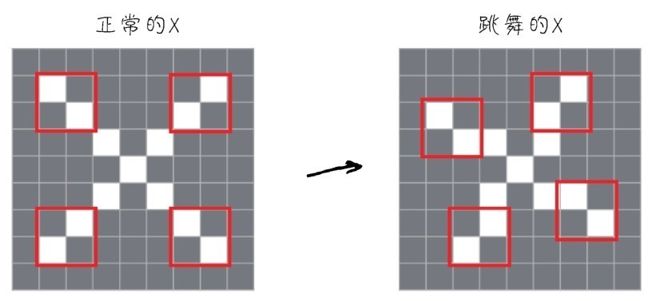

上面这个模式识别原理就是卷积网络最基本的思路。它的好处是不仅使模式识别变得更加准确了，而且通过对这些“模式特征组”的**权重共享**减少了很多所需要调节的神经元的参数数量，因而大幅度减少了计算量。

### 6.3.2 平移不变的模式识别

这种“小模式”识别的另一个优越性是**平移不变性（translation  invariance）**，意思是一旦卷积神经网络在图像中学习到某个模式，它就可以在任何地方识别这个模式不管模式是出现在左上角、中间还是右下角。

因此卷积网络在处理图像时和人脑的策略很相似，智能度更高，可以高效利用数据。它通过训练较少的样本，就可以学到更具有泛化能力的数据表示，而且模式学到的结果还可以保存把知识迁移至其他应用。

### 6.3.3 用滑动窗口抽取局部特征

卷积操作是通过**滑动窗口**，一帧一帧地抽取局部特征，也就是一块一块地抠图实现的。直观地说，这个分解过程就像是人眼在对物体进行从左到右、从上到下的审视。

所谓图像，对计算机来说就是一个巨大的数字矩阵，里面的值都代表它的颜色或灰度值。下图所示，在卷积网络的神经元中一张图像将被以3px×3px或者5px×5px的帧进行一个片段一个片段的特征抽取处理。

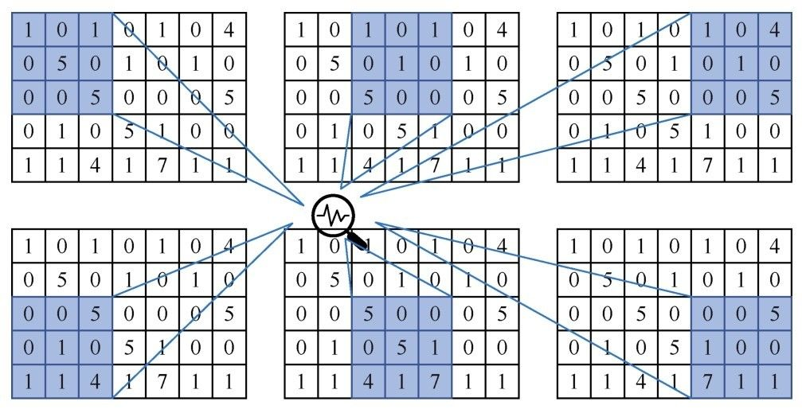

这个过程就是**模式的寻找**，分析局部的模式找出其特征特点，留下有用的信息。

### 6.3.4 过滤器和响应通道

抽取局部特征的过程也即要与过滤器进行卷积计算，进行图像特征的提取，也就是模式的识别。在MNIST图像数据集的示例代码中，参数`filters=32`即指定了该卷积层中有32个过滤器；参数`kernel_size=(3, 3)`表示每一个过滤器的大小均为3px×3px；

```python
    model.add(Conv2D(filters=32, # 添加Conv2D层, 指定过滤器的个数，即通道数
                            kernel_size=(3, 3), # 指定卷积核的大小
                            acctivation = 'relu', # 指定激活函数
                            input_shape = (28, 28, 1)))     # 指定输入数据样本张量的类型
```

卷积网络中的过滤器也叫**卷积核（convolution  kernel）**，是卷积层中带着一组组固定权重的神经元，可以将其想象成眼睛。刚才抽取的，同样的特征局部图像会被不同权重的过滤器进行放大操作，有的过滤器像火眼金睛一般能发现这个模式背后有特别的含义。

下图所示左边是输入图像，中间有两个过滤器卷积之后产生不同的输出，也许有的侧重颜色深浅有的则侧重轮廓。这样就有利于提取图像的不同类型的特征，也有利于进一步的类别判断。

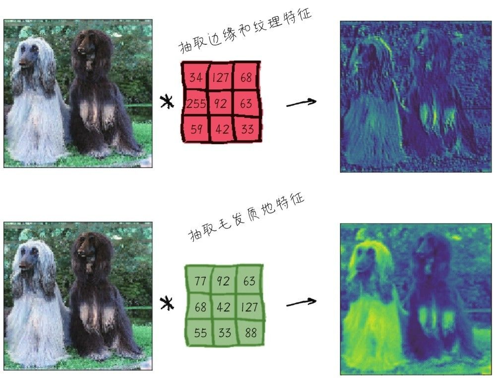

对于MNIST来说，第一个卷积层接收的是形状为(28, 28, 1)的**输入特征图feature  map）**，并输出一个大小为(26, 26, 32)的特征图如下图所示。也就是说这个卷积层有32个过滤器，形成了32个输出通道。这32个通道中每个通道都包含一个26×26。它们都是过滤器对输入的**响应图（response  map）**，表示这个过滤器对输入中不同位置抠取下来的每一帧的响应，其实也就是提取出来的特征，即**输出特征图**。

32个输入特征图中，每一个特征图都有自己负责的模式，各有不同功能，未来整合在一起后就会实现分类任务。


经过两层卷积之后的输出形状为(11, 11, 64)，也就是形成了64个输出特征图，如下图所示。因此随着卷积过程的进行，图像数字矩阵的大小逐渐缩小，这是池化的效果，但是深度逐渐增加，也就是特征图的数目越来越多了。

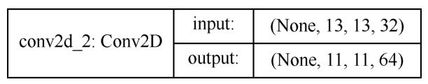

### 6.3.5 对特征图进行卷积运算

在过滤器对输入特征进行卷积运算，从而提取出输出特征图的过程中有两个关键参数：

- 卷积核的大小，定义了从输入中所提取的图块尺寸；

- 输出特征图的深度，也就是本层的过滤器数量。

具体运算规则就是：卷积核与抠下来的数据窗口子区域的对应元素相乘后求和，求得两个矩阵的内积，如下图所示：

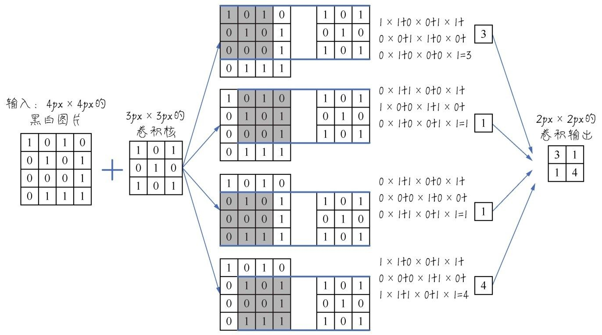

在输入特征图上，滑动这个3×3的窗口，每个可能的位置会形成特征图块形状为(3, 3, 1)。然后这些图块与同一个权重矩阵，也就是卷积核，进行卷积运算转换成形状为1的1D张量。最后按照原始空间位置对这些张量进行组合，形成形状为（高，宽，特征图深度）的3D输出特征图。

那么如果不是深度为1的黑白或灰度图像，而是深度为3的RGB图像，则卷积之后的1D向量形状为3，经过组合之后的输出特征图形状仍为（高，宽，特征图深度），如下图所示。

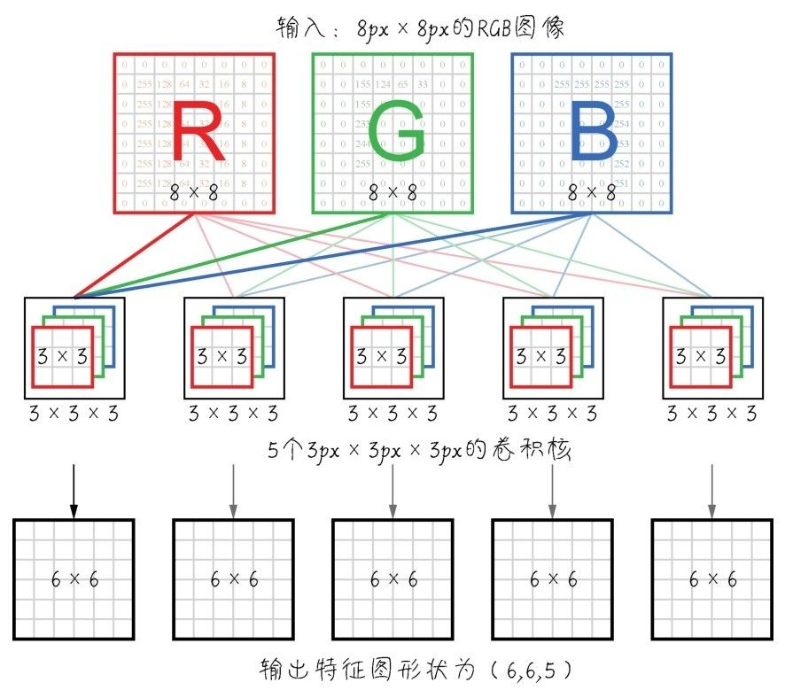

### 6.3.6 模式层级结构的形成

经过这样的卷积过程，卷积神经网络就可以逐渐学到模式的**空间层级结构**。举例来说第一个卷积层可能是学习较小的局部模式，比如图像的纹理；第二个卷积层将学习由第一层输出的各特征图所组成的更大的模式以此类推。

层数越深特征图将越来越抽象，无关的信息越来越少，而关于目标的信息则越来越多。这样卷积神经网络就可以有效地学习到越来越抽象、越来越复杂的视觉概念。特征组合由浅入深彼此叠加产生良好的模式识别效果。

这种将视觉输入抽象化，并将其转换为更高层的视觉概念的思路和人脑对影像的识别判断过程是有相似之处的。所以卷积神经网络就是这样实现了对原始数据信息的提纯。

### 6.3.7 卷积过程中的填充和步幅

1. 边界效应和填充

    填充并不一定存在于每一个卷积网络中，它是一个可选操作。

    在不进行填充的情况下，卷积操作之后输出特征图的维度中，高度和宽度将各减少2维。原本是4px×4px的黑白图像，卷积之后特征图就变成2px×2px。如果初始输入的特征是28×28不包括深度维，卷积之后就变成26×26。这个现象叫作卷积过程中的**边界效应**，如下图所示。

    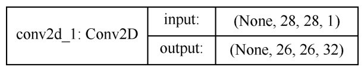

    如果必须要输出特征图的空间维度与输入的相同，就可以使用**填充（padding）**操作。填充就是在输入特征图的边缘添加适当数目的空白行和空白列，使得每个输入块都能作为卷积窗口的中心，然后卷积运算之后输出特征图的维度将会与输入维度保持一致。

    - 对于3×3的窗口在左右各添加一列，在上下各添加一行。

    - 对于5×5的窗口则各添加两行和两列。

    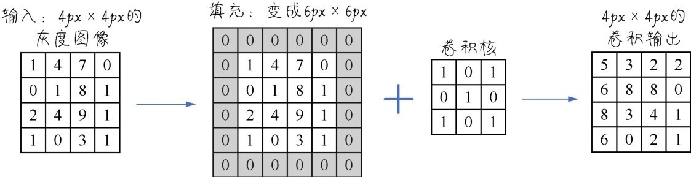

    填充操作并不是一个必需选项。如果需要可以通过Conv2D层的padding参数设置：

    ```python
        model.add(Conv2D(filters=32, #过滤器
                                    kernel_size=(3, 3), # 卷积核大小
                                    strides=(1, 1), # 步幅
                                    padding='valid')) # 填充
    ```

2. 卷积的步幅

    影响输出尺寸的另一个因素是卷积操作过程中窗口滑动抽取特征时候的**步幅（stride）**。以刚才的滑动窗口示意为例，步幅的大小为2，如下图所示，它指的就是两个连续窗口之间的距离。

    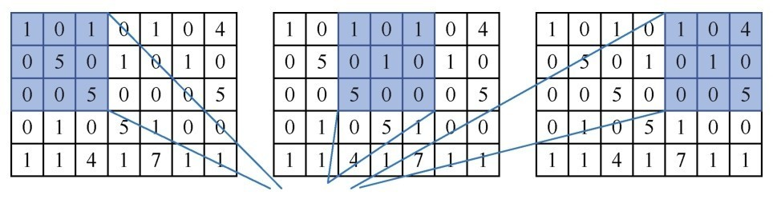

    步幅大于1的卷积叫作**步进卷积（strided  convolution）**，其作用是使输出特征图的高度和宽度都减半。这个效果叫作特征的**下采样（subsampling）**，能使特征抽取的效率加快。然而在实践中步进卷积很少使用在卷积层中，大多数情况下的步幅为默认值1。

## 6.4 池化层的功能

下采样的效果是通过**最大池化（max  pooling）层**来实现的，在最大池化之后特征维度的尺寸基本上都会减半。

下采样功能主要有以下两点。

1. 卷积过程中张量深度特征通道数量逐渐增多，因此特征的数量越来越多。但仍然需要让特征图的整体尺寸保持在合理范围内，不然可能会出现过拟合的问题。

2. 输入特征图的高度和宽度越小，后面的卷积层越能够看到相对更大的空间范围。

最大池化的原理和卷积有些类似，也是从输入特征图中提取窗口。但是最大池化使用固定的张量运算对局部图块进行变换，输出每个通道的最大值，而不是像卷积核那样权重是通过学习而得到的。

在实践中最常见的卷积+池化有以下两种组合。

1. 使用3×3的窗口的卷积核的卷积层步幅为1。

2. 使用2×2的窗口的最大池化层步幅为2。

```python
    model.add(Conv2D(64, kernel_size=(3, 3), activation='relu')) # 添加卷积层
    model.add(Max Pooling2D(pool_size=(2, 2))) # 添加最大池化层
```

通过把多个这样的组合堆叠起来特征图高、宽度逐渐减小，深度逐渐增加，就形成了空间过滤器的层级结构，形成越来越多、越来越细化而且有利于分类的特征通道。

## 6.5 用卷积网络进行分类

### 6.5.1 图像数据的读入

将数据整理进python特征张量数组中，并乱序排列。本案例中，输入结构应该是4D张量，形状为样本、图像高度、图像宽度、颜色深度。

对应地也要把目录名整理到一个同样长度的1D标签张量中，次序与特征张量一致。

1. 数据的读入

    ```python
        import numpy as np
        import pandas as pd
        import os
        print(os.listdir("./dataset/images/Images"))

        dir = './dataset/images/Images/'
        chihuahua_dir = dir + 'n02085620-Chihuahua' # 吉娃娃
        japanese_spaniel_dir = dir + 'n02085782-Japanese_spaniel' # 日本狆
        maltese_dir = dir+'n02085936-Maltese_dog' #马尔济斯犬
        pekinese_dir = dir+'n02086079-Pekinese' #北京狮子狗
        shitzu_dir = dir+'n02086240-Shih-Tzu' #西施犬
        blenheim_spaniel_dir = dir+'n02086646-Blenheim_spaniel' #英国可卡犬
        papillon_dir = dir+'n02086910-papillon' #蝴蝶犬
        toy_terrier_dir = dir+'n02087046-toy_terrier' #玩具猎狐梗
        afghan_hound_dir = dir+'n02088094-Afghan_hound' #阿富汗猎犬
        basset_dir = dir+'n02088238-basset' #巴吉度猎犬

        import cv2  # 导入Open CV工具箱
        X = []
        y_label = []
        imgsize = 150
        # 定义一个函数读入狗的图片
        def training_data(label, data_dir):
            print("正在读入：", data_dir)
            for img in os.listdir(data_dir):
                path = os.path.join(data_dir, img)
                img = cv2.imread(path, cv2.IMREAD_COLOR)
                img = cv2.resize(img, (imgsize, imgsize))
                X.append(np.array(img))
                y_label.append(str(label))

        # 读入10个目录中的狗狗图片
        training_data('chihuahua',chihuahua_dir)
        training_data('japanese_spaniel',japanese_spaniel_dir)
        training_data('maltese',maltese_dir)
        training_data('pekinese',pekinese_dir)
        training_data('shitzu',shitzu_dir)
        training_data('blenheim_spaniel',blenheim_spaniel_dir)
        training_data('papillon',papillon_dir)
        training_data('toy_terrier',toy_terrier_dir)
        training_data('afghan_hound',afghan_hound_dir)
        training_data('basset',basset_dir)
    ```

    使用了Open CV库中的图像文件读取和resize函数把全部图像转换成大小为150px×  150px的标准格式。

    Open CV的全称是Open Source Computer Vision Library，是一个跨平台的计算机视觉库。Open CV是由英特尔公司发起并参与开发，以BSD许可证授权发行可以在商业和研究领域中免费使用。Open CV可用于开发实时的图像处理、计算机视觉以及模式识别程序。
    
    此时X和y仍是Python列表而不是NumPy数组。

2. 构建X、y张量

    构建X、y张量，并将标签从文本转换为One-hot格式的分类编码。

    ```python
        from sklearn.preprocessing import LabelEncoder  # 导入标签编码工具
        from keras.utils.np_utils import to_categorical # 导入One-hot编码工具
        label_encoder = LabelEncoder()
        y = label_encoder.fit_transform(y_label)    # 标签编码
        y = to_categorical(y, 10) # 将标签转换为One-hot编码
        X = np.array(X) # 将X从列表转换为张量数组
        X = X/255 # 将X张量归一化
    ```

   ` y  =  label_encoder.fit_transformy_label`和`y  =  to_categoricaly10`这两个语句将狗狗目录名称转换成了One-hot编码。

    np.array方法将X从列表转换为张量数组。

    X  =  X/255这个语句很有意思，相当于是手工将图像的像素值进行简单的压缩，也就是将X张量进行归一化，以利于神经网络处理它。

3. 显示向量化之后的图像

    输出一下X张量的形状和内容：

    ```python
        print('X张量的形状：', X.shape)
        print('X张量的第一个数据：', X[1])
    ```

    输出y_train的形状和内容：

    ```python
        print ('y张量的形状：', y.shape)
        print ('y张量的第一个数据：', y[1])
    ```

    也可以将已经缩放至01区间之后的张量，重新以图像的形式显示出来：

     ```python
        import matplotlib.pyplot as plt
        import random as rdm    # 导入随机数工具
        # 随机显示几张图片
        fig, ax = plt.subplots(5, 2)
        fig.set_size_inches(15, 15)
        for i in range(5):
            for j in range(2):
                r = rdm.randint(0, len(X))
                ax[i, j].imshow(X[r])
                ax[i, j].set_title('Dog: '+ y_label[r])
        plt.tight_layout()
    ```
4. 拆分数据集

    随机地乱序并拆分训练集和测试集

    ```python
        #  随机地乱序并拆分训练集和测试集
        from sklearn.model_selection import train_test_split
        X_train, X_test, y_train, y_test = train_test_split(X, y, test_size =0.2, random_state =0)
    ```

### 6.5.2 构建简单的卷积网络

构建简单的卷积网络：

```python
    from keras import layers # 导入所有层
    from keras import models # 导入所有模型
    cnn = models.Sequential() # 序贯模型
    cnn.add(layers.Conv2D(32, (3, 3), activation='relu', # 卷积层
                                                input_shape=(150, 150, 3)))
    cnn.add(layers.MaxPooling2D((2, 2)))    # 最大池化
    cnn.add(layers.Conv2D(64, (3, 3), activation='relu'))   # 卷积层
    cnn.add(layers.MaxPooling2D((2, 2)))    # 最大池化
    cnn.add(layers.Conv2D(128, (3, 3), activation='relu'))   # 卷积层
    cnn.add(layers.MaxPooling2D((2, 2)))    # 最大池化
    cnn.add(layers.Conv2D(128, (3, 3), activation='relu'))   # 卷积层
    cnn.add(layers.MaxPooling2D((2, 2)))    # 最大池化
    cnn.add(layers.Flatten()) # 展平
    cnn.add(layers.Dense(512, activation='relu')) # 全连接
    cnn.add(layers.Dense(10, activation='softmax')) # 分类输出
    cnn.compile(loss='categorical_crossentropy', # 损失函数
                optimizer='RMSprop', # 优化器
                metrics=['acc']) # 评估指标
```

卷积网络结构如下图所示。

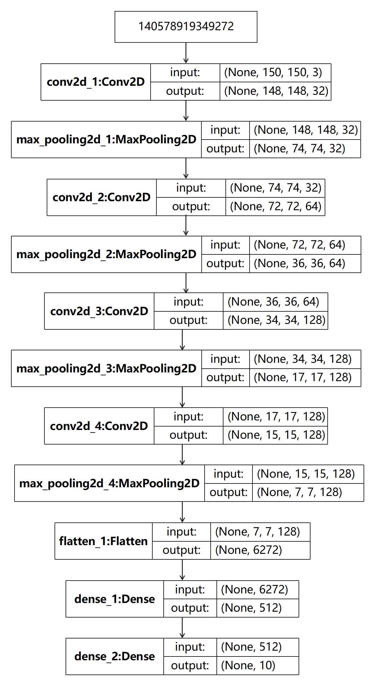

从上图中可以看出，卷积网络中特征图的深度在逐渐增加，从32增大到128，而特征图的大小却逐渐减小，从150px×150px减小到7px×7px。这是构建卷积神经网络的常见模式。

简单地介绍本例卷积网络中用到的各个层和超参数：

-  Conv2D是2D卷积层，对平面图像进行卷积。卷积层的参数`(32, (3, 3), activation='relu', input_shape=(150, 150, 3)))`，其中32是深度即该层的卷积核个数，也就是通道数；(3, 3)代表卷积窗口大小。`input_shape=(150, 150, 3)`，表示指定输入特征图的形状。

全部的卷积层都通过Re LU函数激活。

- MaxPooling2D是最大池化层，一般紧随卷积层出现，通常采用2×2的窗口，默认步幅为2。这是将特征图进行2倍下采样也就是高宽特征减半。

上面这种卷积+池化的架构一般要重复几次，同时逐渐增加特征的深度。

- Flatten是展平层，将卷积操作的特征图展平后才能够输入全连接层进一步处理。

- 最后两个Dense是全连接层。

    - 第一个是普通的层，用于计算权重确定分类用，ReLU函数激活。

    - 第二个则只负责输出分类结果，因为是多分类，所以用Softmax函数激活。

- 在网络编译时需要选择合适的超参数。

    - 损失函数选择的是categorical_crossentropy，即分类交叉熵。适用于多元分类问题，以衡量两个概率分布之间的距离，使之最小化，让输出结构尽可能接近真实值。

    - 优化器选择RMSProp。

    - 评估指标为准确率acc等价于accucary。

### 6.5.3 训练网络并显示误差和准确率

对网络进行训练，为了简化模型直接使用训练集数据进行验证：

```python
    history = cnn.fit(X_train, y_train, # 指定训练集
                                epochs=50, # 指定轮次
                                batch_size=256, # 指定批次大小
                                validation_data=(X_test, y_test)) # 指定验证集
```

然后绘制训练集和验证集上的损失曲线和准确率曲线，如下图所示。

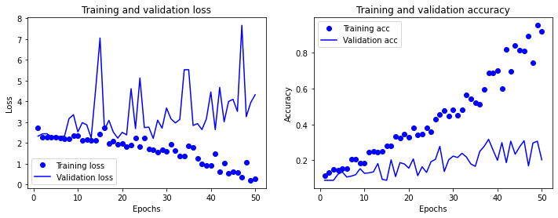

从结果可以看出，训练效果很差。虽然在训练集上的损失逐渐减小，准确率逐渐经过几轮之后提升到了99%以上。然而，从验证集的损失和准确率来看，网络根本就没有训练起来。验证集的准确率徘徊在20%。对于一个有10个类别的多分类问题，这个准确率只比随机猜测好一点点因为随机猜测的准确率是10%。

## 6.6 卷积网络性能优化

### 6.6.1 更新优化器并设置学习速率

从最简单的修改开始，暂时不改变网络结构。先考虑一下优化器的调整，并尝试使用不同的学习速率进行梯度下降。因为很多时候神经网络完全没有训练起来是学习速率设定得不好。

```python
    from keras import optimizers    # 导入优化器
    cnn = models.Sequential() # 序贯模型
    cnn.add(layers.Conv2D(32, (3, 3), activation='relu', # 卷积层
                                                input_shape=(150, 150, 3)))
    cnn.add(layers.MaxPooling2D((2, 2)))    # 最大池化
    cnn.add(layers.Conv2D(64, (3, 3), activation='relu'))   # 卷积层
    cnn.add(layers.MaxPooling2D((2, 2)))    # 最大池化
    cnn.add(layers.Conv2D(128, (3, 3), activation='relu'))   # 卷积层
    cnn.add(layers.MaxPooling2D((2, 2)))    # 最大池化
    cnn.add(layers.Conv2D(256, (3, 3), activation='relu'))   # 卷积层
    cnn.add(layers.MaxPooling2D((2, 2)))    # 最大池化
    cnn.add(layers.Flatten()) # 展平
    cnn.add(layers.Dense(512, activation='relu')) # 全连接
    cnn.add(layers.Dense(10, activation='sigmoid')) # 分类输出
    cnn.compile(loss='categorical_crossentropy', # 损失函数
                optimizer=optimizers.Adam(lr=1e-4), # 更新优化器并设定学习速率
                metrics=['acc']) # 评估指标

    history = cnn.fit(X_train, y_train, # 指定训练集
                                    epochs=50, # 指定轮次
                                    batch_size=256, # 指定批次大小
                                    validation_data=(X_test, y_test)) # 指定验证集
```

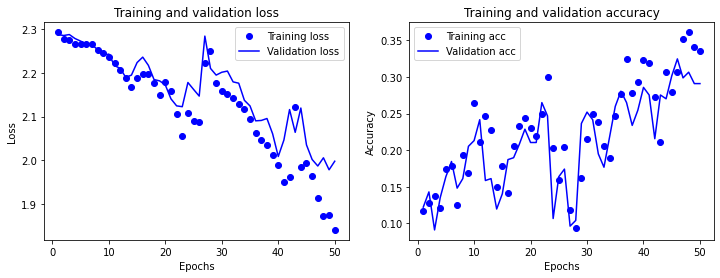

从上图可以看出，通过更换优化器并设定学习速率后，再次训练网络发现准确率提升至了0.3左右。

### 6.6.2 添加Dropout层

通过Dropout层降低过拟合风险：

```python
    from keras import optimizers    # 导入优化器
    cnn = models.Sequential() # 序贯模型
    cnn.add(layers.Conv2D(32, (3, 3), activation='relu', # 卷积层
                                                input_shape=(150, 150, 3)))
    cnn.add(layers.MaxPooling2D((2, 2)))    # 最大池化
    cnn.add(layers.Conv2D(64, (3, 3), activation='relu'))   # 卷积层
    cnn.add(layers.MaxPooling2D((2, 2)))    # 最大池化
    cnn.add(layers.Conv2D(128, (3, 3), activation='relu'))   # 卷积层
    cnn.add(layers.MaxPooling2D((2, 2)))    # 最大池化
    cnn.add(layers.Conv2D(256, (3, 3), activation='relu'))   # 卷积层
    cnn.add(layers.MaxPooling2D((2, 2)))    # 最大池化
    cnn.add(layers.Flatten()) # 展平
    cnn.add(layers.Dropout(0.5)) # Dropout
    cnn.add(layers.Dense(512, activation='relu')) # 全连接
    cnn.add(layers.Dense(10, activation='sigmoid')) # 分类输出
    cnn.compile(loss='categorical_crossentropy', # 损失函数
                optimizer=optimizers.Adam(lr=1e-4), # 更新优化器并设定学习速率
                metrics=['acc']) # 评估指标

    history = cnn.fit(X_train, y_train, # 指定训练集
                                    epochs=50, # 指定轮次
                                    batch_size=256, # 指定批次大小
                                    validation_data=(X_test, y_test)) # 指定验证集
```

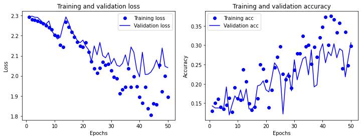

从上图可以看出，添加了Dropout层防止过拟合后，损失曲线显得更平滑，不再出现在验证集上飙升的现象。但是准确率的提升不大还是30%左右。而且训练集和验证集之间的准确率仍然是天壤之别。

### 6.6.3 数据增强

**数据增强（data augmentation）**，这种方法肯定能够进一步提高计算机视觉问题的
准确率，同时降低过拟合。

机器学习看重的是数据量，而数据增强能把一张图像当成7张、8张甚至10张、100张来用，也就是从现有的样本中生成更多的训练数据。

而具体做法是通过对图像的平移、颠倒、倾斜、虚化、增加噪声等多种手段。这是利用能够生成**可信图像的随机变换**，来增加样本数如下图所示。这样训练集就被大幅地增强了，无论是图像的数目还是多样性。因此模型在训练后能够观察到数据的更多内容从而具有更好的准确率和泛化能力。

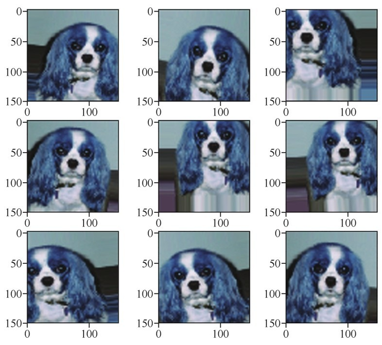

在Keras中可以用Image Data-Generator工具来定义一个数据增强器：

```python
    # 定义一个数据增强器，并设定各种增强选项
    from keras.preprocessing.image import ImageDataGenerator
    augs_gen = ImageDataGenerator(
                featurewise_center = False,
                samplewise_center = False,
                featurewise_std_normalization = False,
                samplewise_std_normalization = False,
                zca_whitening = False,
                rotation_range = 10,
                zoom_range = 0.1,
                width_shift_range = 0.2,
                height_shift_range = 0.2,
                horizontal_flip = True,
                vertical_flip = False
    )
    augs_gen.fit(X_train) # 针对训练集拟合数据增强器
```

网络还是用回相同的网络，唯一的区别是在训练时需要通过fit_generator方法动态生成被增强后的训练集：

```python
    # 通过fit_generator方法动态生成被增强后的训练集
    history = cnn.fit_generator(# 使用fit_generator
        augs_gen.flow(X_train, y_train, batch_size=16), # 增强后的训练集
        validation_data = (X_test, y_test), # 指定验证步长
        steps_per_epoch = 100, # 指定每轮步长
        epochs = 50, # 指定轮次
        verbose = 1) # 指定是否显示训练过程中的信息
```

训练集和验证集上的损失曲线和准确率曲线如下图所示：

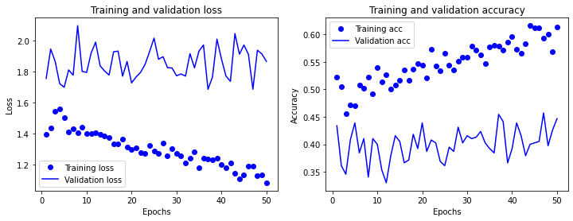

下面的代码可以将神经网络模型包括训练好的权重等所有参数保存到一个文件中并随时可以读取：

```python
    from keras.models import load_model # 导入模型保存工具
    cnn.save('../my_dog_cnn.h5')  # 创建一个HDF5格式的文件'my_dog_cnn.h5'
    del cnn  # 删除当前模型
    cnn = load_model('../my_dog_cnn.h5') # 重新载入已经保存的模型
```

除上述方法外，神经网络的性能优化方向还包括以下几种：

- 增加或减少网络层数。

- 尝试不同的优化器和正则化方法。

- 尝试不同的激活函数和损失函数。

## 6.7 卷积网络中特征通道的可视化

为了方便查看卷积网络的内部结构，可通过**中间激活**的方法来查看卷积过程中特征图的“特征通道”：

```python
    from keras.models import load_model # 导入模型保存工具
    import matplotlib.pyplot as plt # 导入matplotlib
    model = load_model('../my_dog_cnn.h5')# 载入刚才保存的模型
    # 绘制特征通道
    layer_outputs = [layer.output for layer in model.layers[:16]]
    image = X_train[0]
    image = image.reshape(1, 150, 150, 3)
    activation_model = models.Model(inputs=model.input, outputs=layer_outputs)
    activations = activation_model.predict(image)
    first_layer_activation = activations[0]
    plt.matshow(first_layer_activation[0, :, :, 2], cmap='viridis')
    plt.matshow(first_layer_activation[0, :, :, 3], cmap='viridis')
```

通过观察这些特征通道的中间激活图，就能发现卷积网络中的各个通道并不是漫无目地进行特征提取，而是各负其责忽略不相关的噪声信息，专门聚焦于自己所负责的那部分，特征激活各个特征点。这些特征点也就是小模式进行组合就实现了高效率的图像识别。

## 6.8 各种大型卷积网络模型

各种大型卷积网络在不同大小的图像数据集上的准确率。

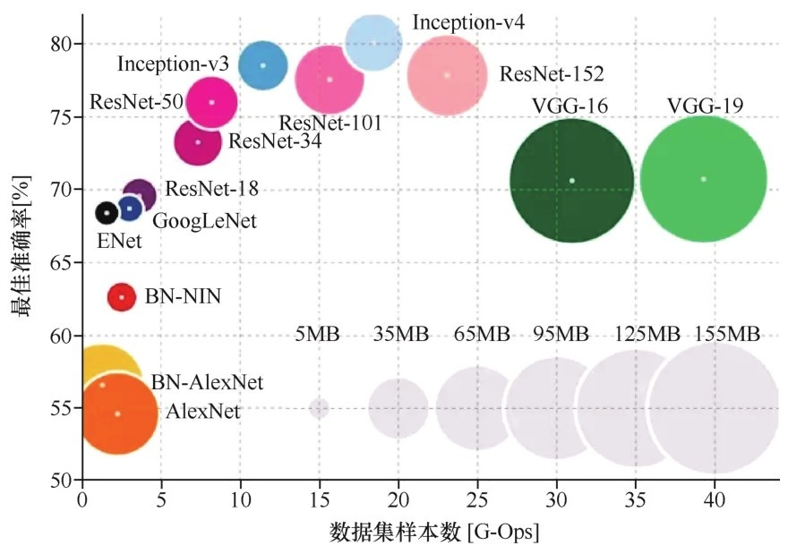

### 6.8.1 经典的VGGNet

VGGNet探索了卷积神经网络的深度与其性能之间的关系，成功地构建了1619层深的卷积神经网络，证明了增加网络的深度能够在一定程度上影响网络最终的性能，使错误率大幅下降。同时它的拓展性很强，迁移到其他图像数据上的泛化性也非常好。到目前为止 VGGNet仍然被用来提取图像特征。

VGGNet可以看成是加深版本的Alex Net，都是由卷积层、全连接层两大部分构成，其架构如下图所示。

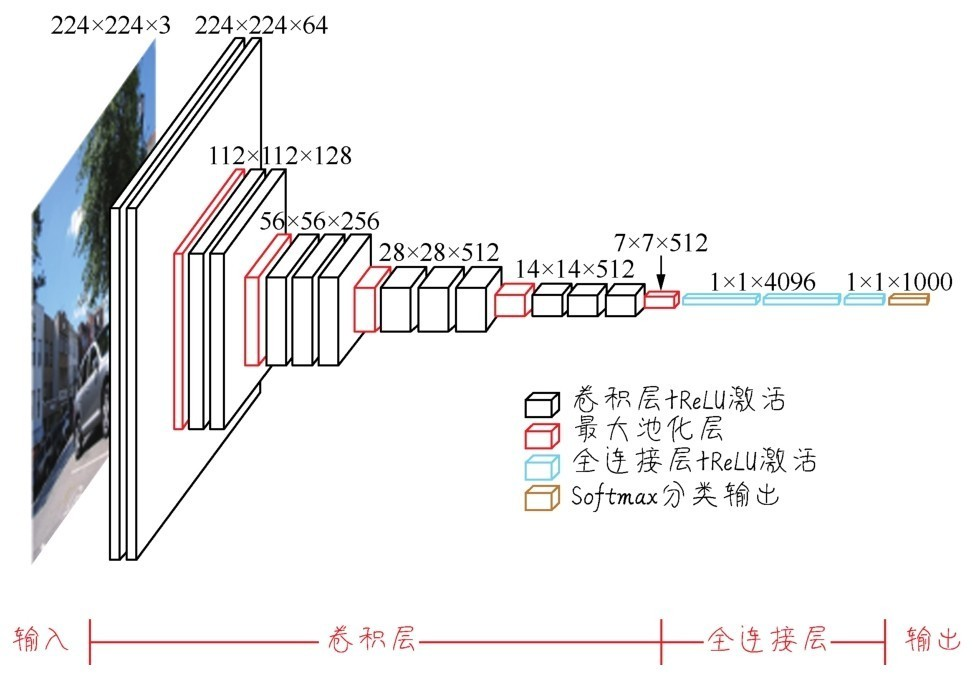

这个经典的卷积网络架构包括以下特点。

1. 结构简洁。VGGNet由5层卷积层、3层全连接层、1层Softmax输出层构成，层与层之间使用最大化池层分开，所有隐层的激活单元都采用ReLU函数。

2. 小卷积核和多卷积子层。VGGNet使用多个较小卷积核，3x3的卷积层代替一个较大卷积核的卷积层，一方面可以减少参数，另一方面相当于进行了更多的非线性映射，可以增加网络的拟合能力。

3. 小池化核。相比Alex Net的3×3的池化核，VGGNet全部采用2×2的池化核。

4. 通道数多。VGGNet第一层的通道数为64，后面每层都进行了翻倍，最多达到了512个通道。通道数的增加使得更多的信息可以被提取出来。

5. 层数更深、特征图更宽。由于卷积核专注于扩大通道数、池化核专注于缩小宽度和高度，使得模型架构上更深、更宽的同时控制了计算量的增加规模。

### 6.8.2 采用Inception结构的GoogleNet

GoogLeNet采用的就是Inception结构，是2014年Christian  Szegedy提出的一种新的深度学习结构。

之前的Alex Net、VGGNet等结构都是通过单纯增加网络的深度、层数，来提高准确率由此带来的副作用包括过拟合、梯度消失、梯度爆炸等。Inception通过模块串联来更高效地利用计
算资源，在相同的计算量下能提取到更多的特征从而提升训练结果。

Inception模块的基本架构如下图所示。而整个Inception结构就是由多个这样的Inception模块串联起来的。Inception结构的主要贡献有两个：一是使用1×1的卷积来进行升降维；二是增加了广度，即用不同尺寸的卷积核同时进行卷积再聚合。

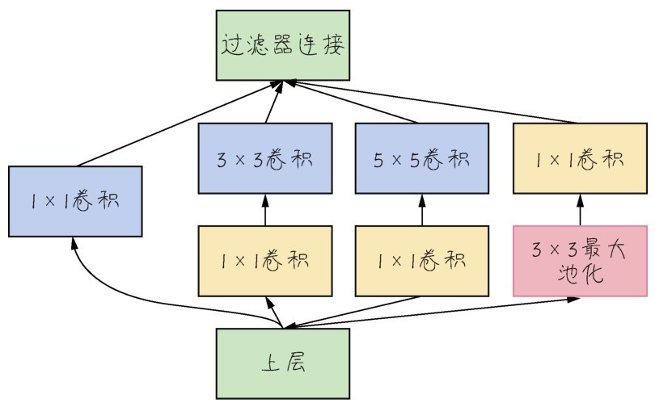

### 6.8.3 残差网络ResNet

VGGNet和GoogLeNet都说明了一个道理：足够的深度是神经网络模型表现得更良好的前提，但是在网络达到一定深度之后简单地堆叠网络反而使效果变差了，这是由于**梯度消失**和**过拟合**造成的。

进一步的解决方案就是以前提过的**残差连接结构**，通过创建较前面层和较后面层之间的捷径解决了深度网络中的梯度消失问题。在构建卷积网络过程中，残差连接构造出来的ResNet可进一步提高图像处理的准确率。

残差网络增加了一个**恒等映射（identity  mapping）**，把当前输出直接传输给下一层网络，相当于走了一个捷径，跳过了本层运算。同时，在反向传播过程中也是将下一层网络的梯度直接传递给上一层网络，这样就解决了深层网络的梯度消失问题。

这些大型卷积网络还有一个非常大的优点在于：它学到的知识是可迁移的。也就是说一个训练好的大型卷积网络可以迁移到我们自己的新模型上来解决我们的问题。
