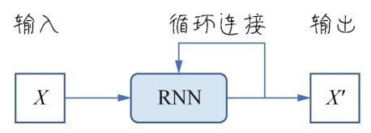

# 第7课 循环神经网络——鉴定留言及探索系外行星

应用卷积网络处理图形图像效果很好。无论是普通的深度神经网络，还是卷积网络对样本特征的处理都是整体进行的，是**次序无关**的。在卷积网络中，虽然有一个通过滑动窗口抠取图块与卷积核进行卷积操作的过程，但对于每张图像来说仍然是一个整体操作。也就是说先处理左侧的特征图，还是先处理右侧的特征图，神经网络所得到的结果是完全相同的，预测值与操作特征的次序无关。

然而，在面对语言文字的时候特征之间的“次序”突然变得重要起来。本课中要讲的另一个重要神经网络模型——**循环神经网络**，就是专门用于处理语言、文字、时序这类特征之间存在“次序”的问题。这是一种循环的、带“记忆”功能的神经网络，这种网络针对序列性问题有其优势。

## 7.1 问题定义——鉴定评论文本的情感属性

文件中的Rating字段可视为评论文字属性的标签，即针对所购商品和本次采购行为的情感属性如下所示。

- Rating  5评价非常正面非常满意。

- Rating  4评价正面较为满意。

- Rating  3评价一般。

- Rating  2评价负面较不满意。

- Rating  1评价非常负面很不满意。

显而易见，如果机器习得了鉴别文字情感属性的能力，那么可以过滤垃圾留言和不文明的评论。有的时候针对某些网络留言可进行相关的预警工作，通过采取预防措施甚至能避免极端事件的发生。

## 7.2 循环神经网络的原理和结构

### 7.2.1 什么是序列数据

序列数据是其特征的先后顺序对于数据的解释和处理十分重要的数据。语音数据、文本数据都是序列数据。

文本数据集的形状为3D张量：**(样本,序号,字编码)**。

时间序列数据也有这种特点。这类数据是按时间顺序收集的，用于描述现象随时间变化的情况。如果不记录时戳，这些数字本身就没有意义。

时序数据集的形状为3D张量，(样本,时戳,标签)。

这些序列数据具体包括以下应用场景。

- 文档分类：比如识别新闻的主题或书的类型、作者。

- 文档或时间序列对比：比如估测两个文档或两支股票的相关程度。

- 文字情感分析比：如将评论、留言的情感划分为正面或负面。

- 时间序列预测：比如根据某地天气的历史数据来预测未来天气。

- 序列到序列的学习：比如两种语言之间的翻译。

### 7.2.2 前馈神经网络处理序列数据的局限性

普通人工神经网络和卷积神经网络可以称为**前馈神经网络（feedforward  neural  network）**，各神经元分层排列。每个神经元只与前一层的神经元相连，接收前一层的输出并输出给下一层，各层间没有反馈。每一层内部的神经元之间也没有任何反馈机制。

前馈神经网络也可以处理序列数据，但它是对数据整体读取、整体处理。比如一段文本需要整体输入神经网络，然后一次性地进行解释。每个单词处理过程中的权重是无差别的。网络并没有对相临近的两个单词进行特别的对待。

### 7.2.3 循环神经网络处理序列问题的策略

循环神经网络是一种具有**记忆功能**的神经网络，其特点是能够把刚刚处理过的信息放进神经网络的内存中。这样离目标近的特征单词的影响会比较大。

### 7.2.4 循环神经网络的结构

循环神经网络的结构与普通的前馈神经网络差异不大，其实最关键的地方有以下两处。

1. 以一段文字的处理为例，如果是普通的神经网络一段文字是整体读入网络处理——只处理一次，而循环神经网络则是每一个神经节点随着序列的发展处理N次，第一次处理一个字、第二次处理两个字直到处理完为止。

2. 循环神经网络的每个神经节点增加了一个对当前状态的记忆功能，也就是除了权重w和偏置b之外，循环神经网络的神经元中还多出一个当前状态的权重w。这个记录当前状态的w在网络学习的过程中就全权负责了对刚才所读的文字记忆的功能。


普通的神经网络中的神经元一次性读入全部特征作为其输入。

而循环神经网络的神经元需要沿着时间轴线，也就是向量X的“时戳”或“序号”特征维循环很多遍，因此也称RNN是带环的网络。这个“带环”指的是神经元，也就是网络节点自身带环，如下图所示。



多个循环神经网络的神经元在循环神经网络中组合的示意如下图所示。


如果把这个循环过程按序列进行展开，假设时间轴上有4个点，也就是4个序列特征，那么对于一个网络节点就要循环4次。这里引入隐状态h，并且需要多一个参数向量U用于实现网络的记忆功能。第一次读入特征时间点1时的状态如下图所示。


下一个时间点继续读入特征$x_2$，此时的状态已经变为$h_{t1}$，这个状态记忆着刚才读入$x_1$时的一些信息如下图所示。把这个状态与U进行点积运算。


持续进行时间轴上其他序列数据的处理，反复更新状态更新输出值。这里要强调的是，目前进行的只是一个神经元的操作，此处的W和U分别是一个向量。


时间轴上的节点遍历完成之后，循环就结束了。循环神经元向下一层网络输出$x'$。不难发现$x'$受最近的状态和最新的特征$x_4$的影响最大。

## 7.3 原始文本如何转换成向量数据

### 7.3.1 文本的向量化——分词

文本的向量化是机器学习进行进一步数据分析、理解、处理的基础。它的作用是令文本的内容尽可能地结构化。

不同类型的文本需要用到不同的处理方式。具体来说分为以下几种处理方式。

- 单字符的向量表达。

- 词语的向量表达。

- 短文本：如评论、留言等的向量表达。

- 长文本：如莎士比亚戏剧集的向量表达

最常见的情况是以“词语”为单位把文本进行向量化的表达。向量化这个过程也可以叫作**分词或切词（tokenization）**。

 ### 7.3.2 通过One-hot编码分词

 分词的最常见的方式是One-hot编码。One-hot编码很简单，就是是弄一个长长的单词表，也就是词典。每一个单词或字符、词组通过唯一整数索引i对应着词典里面的一个条目，然后将这个整数索引i转换为长度为N的二进制向量，N是词表大小。这个向量中只有第i个元素是1其余元素都为0。

下图给出了5部影片所形成的词典索引，当然就是1~5再转换为机器可读的One-hot编码，就是10000、01000等。在Keras中使用Tokenizer类就可以轻松完成文本分词的功能。


```python
    from keras.preprocessing.text import Tokenizer # 导入Tokenizer工具
    words = ['Lao Wang has a Wechat account.', 'He is not a nice person.', 'Be careful.']
    tokenizer = Tokenizer(num_words=30) # 词典大小只设定30个词(因为句子数量少)
    tokenizer.fit_on_texts(words) # 根据3个句子编辑词典
    sequences = tokenizer.texts_to_sequences(words) # 为3个句子根据词典里面的索引进行序号编码
    one_hot_matrix = tokenizer.texts_to_matrix(words, mode='binary') # 进行ont-hot编码
    word_index = tokenizer.word_index   # 词典中的单词索引总数
    print('找到了%s个词'%len(word_index))
    print('这3句话(单词)的序号编码' , sequences)
    print('这3句话单词的One-hot编码', one_hot_matrix)

    >>>
    找到了13个词
    这3句话(单词)的序号编码 [[2, 3, 4, 1, 5, 6], [7, 8, 9, 1, 10, 11], [12, 13]]
    这3句话单词的One-hot编码 [[0. 1. 1. 1. 1. 1. 1. 0. 0. 0. 0. 0. 0. 0. 0. 0. 0. 0. 0. 0. 0. 0. 0. 0. 0. 0. 0. 0. 0. 0.]
    [0. 1. 0. 0. 0. 0. 0. 1. 1. 1. 1. 1. 0. 0. 0. 0. 0. 0. 0. 0. 0. 0. 0. 0. 0. 0. 0. 0. 0. 0.]
    [0. 0. 0. 0. 0. 0. 0. 0. 0. 0. 0. 0. 1. 1. 0. 0. 0. 0. 0. 0. 0. 0. 0. 0. 0. 0. 0. 0. 0. 0.]]
```

上述代码段的操作流程如下。

1. 根据文本生成词典——一共14个单词的文本，其中有1个重复的词“a”，所以经过训练词典总共收集13个词。

2. 词典的大小需要预先设定——本例中设为30个词，在实际情况中当然不可能这么小了。

3. 然后就可以把原始文本转换成词典索引编码和One-hot编码。

这种One-hot编码所带来的问题主要有两个：一个是**维度灾难**。字典中有多少个词，就必须预先创建多少维的向量——实际字典中词的个数成千上万甚至几十万，这个向量空间太大了。

降低One-hot编码数量的一种方法是**One-hot散列技巧（one-hot hashing  trick**。为了降低维度，并没有为每个单词预分配一个固定的字典编码，而是在程序中通过散列函数动态编码。这种方法中编码表的长度也就是散列空间大小是预先设定的。但是这种方法也有缺点就是可能出现**散列冲突（hash  collision）**，即如果预设长度不够，文本序列中两个不同的单词可能会共享相同的散列值，那么机器学习模型就无法区分它们所对应的单词到底是什么。

如何解决散列冲突的问题呢？如果我们把散列空间的维度设定得远远大于所需要标记的个数散列冲突的可能性当然就会减小。可是这样就又回到维度灾难。

### 7.3.3 词嵌入

**词嵌入（word  embedding**的方法通过把One-hot编码压缩成密集矩阵来降低其维度。而且每一个维度上的值不再是二维的0-1值，而是一个有意义的数字如59、68、0.73等这样的值，包含的信息量大。同时在词嵌入的各个维度的组合过程中，还会包含词和词之间的语义关系信息，也可以视为特征向量空间的关系。

词嵌入张量需要机器在对很多文本的处理过程中学习而得，是机器学习的产物。学习过程中一开始产生的都是随机的词向量，然后通过对这些词向量进行学习，词嵌入张量被不断地完善。这个学习方式与学习神经网络的权重相同，因此词嵌入过程本身就可以视为一个深度学习项目。


在实践中有以下两种词嵌入方案。

- 可以在完成主任务，比如文档分类或情感预测的同时，学习词嵌入，生成属于自己这批训练文档的词嵌入张量。

- 也可以直接使用别人已经训练好的词嵌入张量。

下图可更直观地理解训练好的词嵌入张量：


将上述5部影片进行词嵌入在一个二维空间内展示，可推断出《绝命海拔》和《垂直极限》这两部影片的距离是非常接近的，而《建国大业》和《我和我的祖国》是非常接近的。《攀登者》的位置在向量空间中的位置离上述两组词向量都比较接近。因此还可以大胆推测这个向量空间的两个轴可能一个是“探险轴”，另一个是“爱国轴”。而《攀登者》这部影片则的确兼有两个特点——既有爱国情怀又有探险精神。

## 7.4 用SimpleRNN鉴定评论文本

先把文本向量化，然后用Keras中最简单的循环网络神经结构——SimpleRNN层构建循环神经网络，鉴定一下哪些客户的留言是好评哪些是差评。

### 7.4.1 用Tokenizer给文本分词

读入这个评论文本数据集：

```python
    # 读入这个评论文本数据集：
    import numpy as np
    import pandas as pd
    dir = 'dataset/'
    dir_train = dir + 'Clothing Reviews.csv'
    df_train = pd.read_csv(dir_train)
    df_train.head()
```


然后对数据集进行分词工作。词典的大小设定为2万。

```python
    from keras.preprocessing import Tokenizer
    X_train_lst = df_train["Review Text"].values # 将评论读入张量(训练集)
    y_train = df_train["Rating"].values # 构建标签集
    dictionary_size = 20000 # 设定词典的大小
    tokenizer = Tokenizer(num_words=dictionary_size) # 初始化词典
    tokenizer.fit_on_texts(X_train_lst) # 使用训练集创建词典索引
    # 为所有的单词分配索引值，完成分词工作
    X_train_tokenized_lst = tokenizer.texts_to_sequences(X_train_lst)
```

分词之后随机显示X_train_tokenized_lst的几个数据，会看到完成了以下两个目标。

- 评论句子已经被分解为单词。

- 每个单词已经被分配一个唯一的词典索引。

X_train_tokenized_lst目前是列表类型的数据。

再通过直方图显示各条评论中单词个数的分布情况，为词嵌入做准备：

```python
    import matplotlib.pyplot as plt # 导入matplotlib
    word_per_comment = [len(comment) for comment in X_train_tokenized_lst]
    plt.hist(word_per_comment, bins = np.arange(0, 500, 10)) # 显示评论长度分布
    plt.show()
```


上图中的评论长度分布情况表明多数评论的词数在100以内，所以只需要处理前100个词就能够判定绝大多数评论的类型。如果这个数目太大，那么将来构造出的词嵌入张量就达不到密集矩阵的效果。而且词数太长的序列，SimpleRNN处理起来效果也不好。

再通过pad_sequences方法把数据截取成相同的长度。如果长度大于120将被截断，如果长度小于120将填充无意义的0值。

```python
    from keras.preprocessing.sequence import pad_sequences
    max_comment_length = 100 # 设定评论输入长度为100，并填充默认值(如字数少于100)
    X_train = pad_sequences(X_train_tokenized_lst, maxlen=max_comment_length)
```

至此分词工作就完成了。此时尚未做词嵌入的工作，因为词嵌入是要和神经网络的训练过程中一并进行的。

### 7.4.2 构建包含词嵌入的SimpleRNN

现在通过Keras来构建一个含有词嵌入的Simple RNN

```python
    from keras.models import Sequential # 导入贯序模型
    from keras.layers.embeddings import Embedding #导入词嵌入层
    from keras.layers import Dense #导入全连接层
    from keras.layers import SimpleRNN #导入SimpleRNN层
    embedding_vecor_length = 60 # 设定词嵌入向量长度为60
    rnn = Sequential() # 贯序模型
    rnn.add(Embedding(dictionary_size, embedding_vecor_length, 
            input_length=max_comment_length)) # 加入词嵌入层
    rnn.add(SimpleRNN(100)) # 加入SimpleRNN层
    rnn.add(Dense(10, activation='relu')) # 加入全连接层
    rnn.add(Dense(6, activation='softmax')) # 加入分类输出层
    rnn.compile(loss='sparse_categorical_crossentropy', #损失函数
                optimizer='adam', # 优化器
                metrics=['acc']) # 评估指标
    print(rnn.summary()) #打印网络模型   
```

构建流程如下：

- 先通过Embedding层进行词嵌入的工作，词嵌入之后学到的向量长度为60(密集矩阵)，其维度远远小于词典的大小20000(稀疏矩阵)。

- 加一个含有100个神经元的SimpleRNN层。

- 再加一个含有10个神经元的全连接层。

- 最后一个全连接层负责输出分类结果。使用Softmax函数激活的原因是，试图实现的是一个从0到5的多元分类。

- 编译网络时损失函数选择的是sparse_categorical_crossentropy，第一次使用这个损失函数，因为这个训练集的标签是1、2、3、4、5这样的整数，而不是one-hot编码。优化器的选择是adam评估指标还是选择acc。

网络结构如下：


### 7.4.3 训练网络并查看验证准备率

网络构建完成后开始训练网络：

```python
    history = rnn.fit(X_train, y_train,
                                    validation_split = 0.3,
                                    epochs = 10,
                                    batch_size = 64)
```

训练结果显示10轮之后的验证准确率为0.5606。

## 7.5 从SimpleRNN到LSTM

SimpleRNN不是唯一的循环神经网络类型，它只是其中一种最简单的实现。

### 7.5.1 SimpleRNN的局限性

SimpleRNN有一定的局限性，它可以看作瞬时记忆，它对近期序列的内容记得最清晰，根本原因在于**梯度消失**。梯度消失广泛存在于深度网络。循环神经网络通过短记忆机制，梯度消失有所改善，但是不能完全幸免。其实也就是$Uh_t$这一项随着时间轴越来越往后延伸的过程中，前面的状态对后面权重的影响越来越弱了。

### 7.5.2 LSTM网络的记忆传送带

LSTM网络是SimpleRNN的一个变体，也是目前更加通用的循环神经网络结构，全称为Long Short-Term  Memory，翻译成中文叫作“长‘短记忆’”网络。本质上它还是短记忆网络，只是用某种方法把“短记忆”尽可能延长了一些。

简而言之，LSTM就是携带一条记忆轨道的循环神经网络，是专门针对梯度消失问题所做的改进。它增加的记忆轨道是一种携带信息跨越多个时间步的方法。可以先想象有一条平行于时间序列，处理过程的传送带序列中的信息，可以在任意位置“跳”上传送带，然后被传送到更晚的时间步，并在需要时原封不动地“跳”过去接受处理。

这个思路和残差连接非常相似，其区别在于残差连接解决的是层与层之间的梯度消失问题，而LSTM解决的是循环层与神经元层内循环处理过程中的信息消失问题。

简单来说，$C$轨道将携带着跨越时间步的信息。它在不同的时间步的值为$C_t$，这些信息将与输入连接和循环连接进行运算，即与权重矩阵进行点积，然后加上一个偏置以及加一个激活过程，从而影响传递到下一个时间步的状态，如右图所示。


运算规则如下：

$Output_t = activation dot state_t U + dot input_t W + dot C_t V + b$

不过LSTM实际上的架构要比这里所解释的复杂得多，涉及3种不同权重矩阵的变换，有的书中将这些变换规则解释为遗忘门、记忆门等。但目前所需要了解的是LSTM增添了一条记忆携带轨道，用以保证较前时间点读入的信息没有被完全遗忘继续影响后续处理过程，从而解决梯度消失问题。

## 7.6 用LSTM鉴定评论文本

下面回到前面的评论文本鉴定问题，不改变任何其他网络参数仅是使用LSTM层替换SimpleRNN层，然后看看效率是否会有所提升：

```python
    from keras.models import Sequential # 导入贯序模型
    from keras.layers.embeddings import Embedding #导入词嵌入层
    from keras.layers import Dense #导入全连接层
    from keras.layers import LSTM #导入LSTM层
    embedding_vecor_length = 60 # 设定词嵌入向量长度为60
    lstm = Sequential() # 贯序模型
    lstm.add(Embedding(dictionary_size, embedding_vecor_length, 
            input_length=max_comment_length)) # 加入词嵌入层
    lstm.add(LSTM(100)) # 加入LSTM层
    lstm.add(Dense(10, activation='relu')) # 加入全连接层
    lstm.add(Dense(6, activation='softmax')) # 加入分类输出层
    lstm.compile(loss='sparse_categorical_crossentropy', #损失函数
                optimizer = 'adam', # 优化器
                metrics = ['acc']) # 评估指标
    history = rnn.fit(X_train, y_train, 
                        validation_split = 0.3,
                        epochs=10, 
                        batch_size=64)
```

## 7.7 问题定义——太阳系外哪些恒星有行星环绕

在过去很长一段时间里人类是没有办法证明系外行星的存在的，因为行星是不发光的。但是随着科学的发展我们已经知道了一些方法可以用于判定恒星是否拥有行星。方法之一就是记录恒星的亮度变化，科学家们推断行星的环绕会周期性地影响这些恒星的亮度。如果收集了足够多的时序数据就可以用机器学习的方法推知哪些恒星像太阳一样拥有行星系统。

这个目前仍然在不断被世界各地的科学家更新的数据集如下图所示。


其中每一行代表一颗恒星而每一列的含义如下。

- 第1列LABLE：恒星是否拥有行星的标签，2代表有行星，1代表无行星。

- 第2列、第3~198列：即FLUX.n字段，是科学家们通过开普勒天文望远镜记录的每一颗恒星在不同时间点的亮度，其中n代表不同时间点。

这样的时序数据集因为时戳的关系，形成的张量是比普通数据集多一阶、比图像数据集少一阶的3D张量，其中第2阶就专门用于存储时戳。

接下需要介绍的内容包括：

1. 时序数据的导入与处理。

2. 不同类型的神经网络层的组合，使用如CNN和RNN的组合。

3. 面对分类极度不平衡数据集时的阈值调整。

4. 使用函数式API。

## 7.8 用循环神经网络处理时序问题

### 7.8.1 时序数据的导入和处理

首先把数据从文件中读入Dataframe：

```python
    import numpy as np
    import pandas as pd
    df_train = pd.read_csv('./dataset/exoTrain.csv')
    df_test = pd.read_csv('./dataset/exoTest.csv')
    print(df_train.head()) # 输入头几行数据
    print(df_train.info()) # 输出训练集信息
```

数据集是预先排过序的，下面的代码将其进行乱序排列：

```python
    from sklearn.utils import shuffle # 导入乱序工具
    df_train = shuffle(df_train)
    df_test = shuffle(df_test)
```

下面的代码将构建特征集和标签集，把第2~198列的数据都读入X特征集，第1列的数据都读入y标签集。

注意标签数据目前的分类是2有行星和1无行星两个值。我们要把标签值减1，将1、2分类值转换成惯用的0-1分类值。

```python
    X_train = df_train.iloc[:,1:].values # 构建特征集（训练）
    y_train = df_train.iloc[:,0].values # 构建标签集（训练）
    X_test = df_test.iloc[:,1:].values # 构建特征集（测试）
    y_test = df_test.iloc[:,0].values # 构建标签集（测试）
    y_train = y_train - 1   # 标签转换成惯用的(0，1)分类
    y_test = y_test - 1
    print (X_train) # 打印训练集中的特征
    print (y_train) # 打印训练集中的标签
```

从输出结果可以看出，目前**张量格式还不对**。大家要牢记时序数据的结构要求是：样本时戳特征。此处增加一个轴即可。

```python
    X_train = np.expand_dims(X_train, axis=2) # 张量升阶，以满足序列数据集的要求
    X_test = np.expand_dims(X_test, axis=2) # 张量升阶，以满足序列数据集的要求
```

输出X_train.shape为(5087, 3197, 1)，符合时序数据结构的规则，5087个样本，3197个时间戳，1维的特征光线的强度。

### 7.8.2 构建CNN和RNN的组合

介绍一个相对小众的技巧，就是通过一维卷积网络即Conv1D层组合循环神经网络层来处理序列数据。

Conv1D层接收形状为样本时戳或序号特征的3D张量作为输入并输出同样形状的3D张量。卷积窗口作用于时间轴输入张量的第二个轴上，此时的卷积窗口不是2D的而是1D的。

下面的这段代码构建了一个CNN和RNN联合发挥作用的神经网络：

```python
    from keras.models import Sequential # 导入序贯模型
    from keras import layers # 导入所有类型的层
    from keras.optimizers import Adam # 导入优化器
    model = Sequential() # 序贯模型
    model.add(layers.Conv1D(32, kernel_size = 10, strides = 4,
                        input_shape = (3197, 1))) # 1D CNN层
    model.add(layers.MaxPooling1D(pool_size = 4, strides = 2)) # 池化层
    model.add(layers.GRU(256, return_sequences=True)) # 关键，GRU层要够大
    model.add(layers.Flatten()) # 展平
    model.add(layers.Dropout(0.5)) # Dropout层
    model.add(layers.BatchNormalization()) # 批标准化
    model.add(layers.Dense(1, activation='sigmoid')) # 分类输出层
    opt = Adam(lr = 0.0001, beta_1=0.9, beta_2=0.999, decay=0.01)
    model.compile(optimizer=opt, # 优化器
                                loss = 'binary_crossentropy', # 交叉熵
                                metrics = ['accuracy']) # 准确率
```

现在这个网络模型就搭建好了。因为要使用很多种类型的层所以没有一一导入，而是通过layers.Conv1D、layers.GRU这样的方式指定层类型。此外还通过Batch Normalization进行批标准化防止过拟合。这个技巧也很重要。

```python
    history = model.fit(X_train,y_train, # 训练集
                    validation_split = 0.2, # 部分训练集数据拆分成验证集
                    batch_size = 128, # 批量大小
                    epochs = 4, # 训练轮次
                    shuffle = True) # 乱序
```

### 7.8.3 输出阈值的调整

在验证集上网络的预测准确率是非常高的达到99.41%。

打开exo Train.csv和exo Test.csv看一下标签就会发现，在训练集中5000多个被观测的恒星中只有37个恒星已被确定拥有属于自己的行星。而测试集只有训练集的十分之一，500多个恒星中只有5个恒星拥有属于自己的行星。

这个数据集中标签的类别是非常不平衡的。因此问题的关键绝不在于测得有多准，而在于我们能否像一个真正的天文学家那样在茫茫星海中发现这5个类日恒星也就是拥有行星的恒星。

下面就对测试集进行预测并通过分类报告其中包含精确率、召回率和F1分数等指标和混淆矩阵进行进一步的评估。这两个工具才是分类不平衡数据集的真正有效指标。

```python
    from sklearn.metrics import classification_report # 分类报告
    from sklearn.metrics import confusion_matrix # 混淆矩阵
    y_prob = model.predict(X_test) # 对测试集进行预测
    y_pred =  np.where(y_prob > 0.5, 1, 0) #将概率值转换成真值
    cm = confusion_matrix(y_pred, y_test)
    print('Confusion matrix:\n', cm, '\n')
    print(classification_report(y_pred, y_test))
```

通过结果发现，目前项目预测结果相当不理想，F1分数为0。针对这类分类极度不平衡的问题来说，应该通过观察模型输出的概率值来调整并确定最终分类阈值，这也叫作**阈值调整**。

下面把分类概率的参考阈值从0.5调整至0.15，即大于0.15就认为是分类1，小于0.15就认为是分类0，重新输出分类报告和混淆矩阵：

```python
    y_pred =  np.where(y_prob > 0.15, 1, 0) # 进行阈值调整
    cm = confusion_matrix(y_pred, y_test) 
    print('Confusion matrix:\n', cm, '\n')
    print(classification_report(y_pred, y_test))
```

可以发现通过调整阈值后，评估效果明显有所改善。

### 7.8.4 使用函数式API

目前为止所看到的神经网络都是用序贯模型的线性堆叠，网络中只有一个输入和一个输出，平铺直叙。

这种序贯模型可以解决大多数的问题。但是针对某些复杂任务有时需要构建出更复杂的模型，形成**多模态（multimodal）输入**或**多头（multihead）输出**，如下图所示：


举例来说：

- 某个价格预测的任务其信息包括商品图片、文本表述以及其他元数据型号、质地、产地等。完成这个任务需要通过卷积网络处理图片，需要通过循环神经网络处理文本信息，还需要通过全连接网络处理其他数据信息，然后合并各种模块进行价格预测。这是**多模态输入**。

- 一个维基百科的经济类文章里面包含大量的数据资料，需要通过循环神经网络进行文本处理，但是不仅要预测文章的类型，还要对经济数据进行推测。这是**多头输出**。

要搭建多模态和多头架构的网络需要使用**函数式API**。

函数式API就是像使用Python函数一样，使用Keras模型可以直接操作张量，也可以把层当作函数来使用接收张量并返回张量。通过它可以实现模块的拼接组合、把不同的输入层合并或为一个模块生成多个输出。

下面用函数式API的方法构建刚才的Conv1D +GRU网络：

```python
    from keras import layers # 导入各种层
    from keras.models import Model # 导入模型
    from keras.optimizers import Adam # 导入Adam优化器
    input = layers.Input(shape=(3197, 1)) # Input
    # 通过函数式API构建模型
    x = layers.Conv1D(32, kernel_size=10, strides=4)(input)
    x = layers.MaxPooling1D(pool_size=4, strides=2)(x)
    x = layers.GRU(256, return_sequences=True)(x)
    x = layers.Flatten()(x)
    x = layers.Dropout(0.5)(x)
    x = layers.BatchNormalization()(x)
    output = layers.Dense(1, activation='sigmoid')(x) # Output
    model = Model(input, output) 
    model.summary() # 显示模型的输出
    opt = Adam(lr=0.0001, beta_1=0.9, beta_2=0.999, decay=0.01) # 设置优化器
    model.compile(optimizer=opt, # 优化器
                loss = 'binary_crossentropy', # 交叉熵
                metrics=['accuracy']) # 准确率
```

如下图所示双向RNN模型的思路是把同一个序列正着训练一遍，反着再训练一遍，然后把结果结合起来输出。


下面就构建这种双向网络。我们需要做两件事，一是把数据集做一个逆序的复制品准备输入网络，二是用API搭建多头网络。

首先在给输入数据集升维之前数据集进行逆序：

```python
    X_train_rev = [X[::-1] for X in X_train]
    X_test_rev = [X[::-1] for X in X_test]
    X_train = np.expand_dims(X_train, axis=2)
    X_train_rev = np.expand_dims(X_train_rev, axis=2)
    X_test = np.expand_dims(X_test, axis=2)
    X_test_rev = np.expand_dims(X_test_rev, axis=2)
```

再构建多头网络：

```python
    # 构建正向网络
    input_1 = layers.Input(shape=(3197, 1))
    x = layers.GRU(32, return_sequences=True)(input_1)
    x = layers.Flatten()(x)
    x = layers.Dropout(0.5)(x)
    # 构建逆向网络
    input_2 = layers.Input(shape=(3197, 1))
    y = layers.GRU(32, return_sequences=True)(input_2)
    y = layers.Flatten()(y)
    y = layers.Dropout(0.5)(y)
    # 连接两个网络
    z = layers.concatenate([x, y])
    output = layers.Dense(1, activation='sigmoid')(z)
    model = Model([input_1,input_2], output)
    model.summary()
```

双向RNN模型结构如下图所示：


最后在训练模型时要同时指定正序、逆序两个数据集作为输入：

```python
    history = model.fit([X_train, X_train_rev], y_train, # 训练集
                    validation_split = 0.2, # 部分训练集数据拆分成验证集
                    batch_size = 128, # 批量大小
                    epochs = 1, # 训练轮次
                    shuffle = True) # 乱序
```