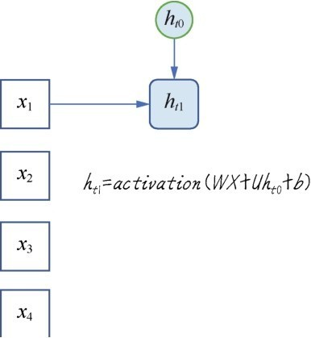

# 第7课 循环神经网络——鉴定留言及探索系外行星

应用卷积网络处理图形图像效果很好。无论是普通的深度神经网络，还是卷积网络对样本特征的处理都是整体进行的，是**次序无关**的。在卷积网络中，虽然有一个通过滑动窗口抠取图块与卷积核进行卷积操作的过程，但对于每张图像来说仍然是一个整体操作。也就是说先处理左侧的特征图，还是先处理右侧的特征图，神经网络所得到的结果是完全相同的，预测值与操作特征的次序无关。

然而，在面对语言文字的时候特征之间的“次序”突然变得重要起来。本课中要讲的另一个重要神经网络模型——**循环神经网络**，就是专门用于处理语言、文字、时序这类特征之间存在“次序”的问题。这是一种循环的、带“记忆”功能的神经网络，这种网络针对序列性问题有其优势。

## 7.1 问题定义——鉴定评论文本的情感属性

文件中的Rating字段可视为评论文字属性的标签，即针对所购商品和本次采购行为的情感属性如下所示。

- Rating  5评价非常正面非常满意。

- Rating  4评价正面较为满意。

- Rating  3评价一般。

- Rating  2评价负面较不满意。

- Rating  1评价非常负面很不满意。

显而易见，如果机器习得了鉴别文字情感属性的能力，那么可以过滤垃圾留言和不文明的评论。有的时候针对某些网络留言可进行相关的预警工作，通过采取预防措施甚至能避免极端事件的发生。

## 7.2 循环神经网络的原理和结构

### 7.2.1 什么是序列数据

序列数据是其特征的先后顺序对于数据的解释和处理十分重要的数据。语音数据、文本数据都是序列数据。

文本数据集的形状为3D张量：**(样本,序号,字编码)**。

时间序列数据也有这种特点。这类数据是按时间顺序收集的，用于描述现象随时间变化的情况。如果不记录时戳，这些数字本身就没有意义。

时序数据集的形状为3D张量，(样本,时戳,标签)。

这些序列数据具体包括以下应用场景。

- 文档分类：比如识别新闻的主题或书的类型、作者。

- 文档或时间序列对比：比如估测两个文档或两支股票的相关程度。

- 文字情感分析比：如将评论、留言的情感划分为正面或负面。

- 时间序列预测：比如根据某地天气的历史数据来预测未来天气。

- 序列到序列的学习：比如两种语言之间的翻译。

### 7.2.2 前馈神经网络处理序列数据的局限性

普通人工神经网络和卷积神经网络可以称为**前馈神经网络（feedforward  neural  network）**，各神经元分层排列。每个神经元只与前一层的神经元相连，接收前一层的输出并输出给下一层，各层间没有反馈。每一层内部的神经元之间也没有任何反馈机制。

前馈神经网络也可以处理序列数据，但它是对数据整体读取、整体处理。比如一段文本需要整体输入神经网络，然后一次性地进行解释。每个单词处理过程中的权重是无差别的。网络并没有对相临近的两个单词进行特别的对待。

### 7.2.3 循环神经网络处理序列问题的策略

循环神经网络是一种具有**记忆功能**的神经网络，其特点是能够把刚刚处理过的信息放进神经网络的内存中。这样离目标近的特征单词的影响会比较大。

### 7.2.4 循环神经网络的结构

循环神经网络的结构与普通的前馈神经网络差异不大，其实最关键的地方有以下两处。

1. 以一段文字的处理为例，如果是普通的神经网络一段文字是整体读入网络处理——只处理一次，而循环神经网络则是每一个神经节点随着序列的发展处理N次，第一次处理一个字、第二次处理两个字直到处理完为止。

2. 循环神经网络的每个神经节点增加了一个对当前状态的记忆功能，也就是除了权重w和偏置b之外，循环神经网络的神经元中还多出一个当前状态的权重w。这个记录当前状态的w在网络学习的过程中就全权负责了对刚才所读的文字记忆的功能。


普通的神经网络中的神经元一次性读入全部特征作为其输入。

而循环神经网络的神经元需要沿着时间轴线，也就是向量X的“时戳”或“序号”特征维循环很多遍，因此也称RNN是带环的网络。这个“带环”指的是神经元，也就是网络节点自身带环，如下图所示。


多个循环神经网络的神经元在循环神经网络中组合的示意如下图所示。


如果把这个循环过程按序列进行展开，假设时间轴上有4个点，也就是4个序列特征，那么对于一个网络节点就要循环4次。这里引入隐状态h，并且需要多一个参数向量U用于实现网络的记忆功能。第一次读入特征时间点1时的状态如下图所示。



下一个时间点继续读入特征$x_2$，此时的状态已经变为$h_{t1}$，这个状态记忆着刚才读入$x_1$时的一些信息如下图所示。把这个状态与U进行点积运算。


持续进行时间轴上其他序列数据的处理，反复更新状态更新输出值。这里要强调的是，目前进行的只是一个神经元的操作，此处的W和U分别是一个向量。


时间轴上的节点遍历完成之后，循环就结束了。循环神经元向下一层网络输出$x'$。不难发现$x'$受最近的状态和最新的特征$x_4$的影响最大。

## 7.3 原始文本如何转换成向量数据

### 7.3.1 文本的向量化——分词

文本的向量化是机器学习进行进一步数据分析、理解、处理的基础。它的作用是令文本的内容尽可能地结构化。

不同类型的文本需要用到不同的处理方式。具体来说分为以下几种处理方式。

- 单字符的向量表达。

- 词语的向量表达。

- 短文本：如评论、留言等的向量表达。

- 长文本：如莎士比亚戏剧集的向量表达

最常见的情况是以“词语”为单位把文本进行向量化的表达。向量化这个过程也可以叫作**分词或切词（tokenization）**。

 ### 7.3.2 通过One-hot编码分词

 分词的最常见的方式是One-hot编码。One-hot编码很简单，就是是弄一个长长的单词表，也就是词典。每一个单词或字符、词组通过唯一整数索引i对应着词典里面的一个条目，然后将这个整数索引i转换为长度为N的二进制向量，N是词表大小。这个向量中只有第i个元素是1其余元素都为0。

下图给出了5部影片所形成的词典索引，当然就是1~5再转换为机器可读的One-hot编码，就是10000、01000等。在Keras中使用Tokenizer类就可以轻松完成文本分词的功能。


```python
    from keras.preprocessing.text import Tokenizer # 导入Tokenizer工具
    words = ['Lao Wang has a Wechat account.', 'He is not a nice person.', 'Be careful.']
    tokenizer = Tokenizer(num_words=30) # 词典大小只设定30个词(因为句子数量少)
    tokenizer.fit_on_texts(words) # 根据3个句子编辑词典
    sequences = tokenizer.texts_to_sequences(words) # 为3个句子根据词典里面的索引进行序号编码
    one_hot_matrix = tokenizer.texts_to_matrix(words, mode='binary') # 进行ont-hot编码
    word_index = tokenizer.word_index   # 词典中的单词索引总数
    print('找到了%s个词'%len(word_index))
    print('这3句话(单词)的序号编码' , sequences)
    print('这3句话单词的One-hot编码', one_hot_matrix)

    >>>
    找到了13个词
    这3句话(单词)的序号编码 [[2, 3, 4, 1, 5, 6], [7, 8, 9, 1, 10, 11], [12, 13]]
    这3句话单词的One-hot编码 [[0. 1. 1. 1. 1. 1. 1. 0. 0. 0. 0. 0. 0. 0. 0. 0. 0. 0. 0. 0. 0. 0. 0. 0. 0. 0. 0. 0. 0. 0.]
    [0. 1. 0. 0. 0. 0. 0. 1. 1. 1. 1. 1. 0. 0. 0. 0. 0. 0. 0. 0. 0. 0. 0. 0. 0. 0. 0. 0. 0. 0.]
    [0. 0. 0. 0. 0. 0. 0. 0. 0. 0. 0. 0. 1. 1. 0. 0. 0. 0. 0. 0. 0. 0. 0. 0. 0. 0. 0. 0. 0. 0.]]
```

上述代码段的操作流程如下。

1. 根据文本生成词典——一共14个单词的文本，其中有1个重复的词“a”，所以经过训练词典总共收集13个词。

2. 词典的大小需要预先设定——本例中设为30个词，在实际情况中当然不可能这么小了。

3. 然后就可以把原始文本转换成词典索引编码和One-hot编码。

这种One-hot编码所带来的问题主要有两个：一个是**维度灾难**。字典中有多少个词，就必须预先创建多少维的向量——实际字典中词的个数成千上万甚至几十万，这个向量空间太大了。

降低One-hot编码数量的一种方法是**One-hot散列技巧（one-hot hashing  trick**。为了降低维度，并没有为每个单词预分配一个固定的字典编码，而是在程序中通过散列函数动态编码。这种方法中编码表的长度也就是散列空间大小是预先设定的。但是这种方法也有缺点就是可能出现**散列冲突（hash  collision）**，即如果预设长度不够，文本序列中两个不同的单词可能会共享相同的散列值，那么机器学习模型就无法区分它们所对应的单词到底是什么。

如何解决散列冲突的问题呢？如果我们把散列空间的维度设定得远远大于所需要标记的个数散列冲突的可能性当然就会减小。可是这样就又回到维度灾难。

### 7.3.3 词嵌入

**词嵌入（word  embedding**的方法通过把One-hot编码压缩成密集矩阵来降低其维度。而且每一个维度上的值不再是二维的0-1值，而是一个有意义的数字如59、68、0.73等这样的值，包含的信息量大。同时在词嵌入的各个维度的组合过程中，还会包含词和词之间的语义关系信息，也可以视为特征向量空间的关系。

词嵌入张量需要机器在对很多文本的处理过程中学习而得，是机器学习的产物。学习过程中一开始产生的都是随机的词向量，然后通过对这些词向量进行学习，词嵌入张量被不断地完善。这个学习方式与学习神经网络的权重相同，因此词嵌入过程本身就可以视为一个深度学习项目。


在实践中有以下两种词嵌入方案。

- 可以在完成主任务，比如文档分类或情感预测的同时，学习词嵌入，生成属于自己这批训练文档的词嵌入张量。

- 也可以直接使用别人已经训练好的词嵌入张量。

下图可更直观地理解训练好的词嵌入张量：


将上述5部影片进行词嵌入在一个二维空间内展示，可推断出《绝命海拔》和《垂直极限》这两部影片的距离是非常接近的，而《建国大业》和《我和我的祖国》是非常接近的。《攀登者》的位置在向量空间中的位置离上述两组词向量都比较接近。因此还可以大胆推测这个向量空间的两个轴可能一个是“探险轴”，另一个是“爱国轴”。而《攀登者》这部影片则的确兼有两个特点——既有爱国情怀又有探险精神。

## 7.4 用SimpleRNN鉴定评论文本

先把文本向量化，然后用Keras中最简单的循环网络神经结构——SimpleRNN层构建循环神经网络，鉴定一下哪些客户的留言是好评哪些是差评。

### 7.4.1 用Tokenizer给文本分词

读入这个评论文本数据集：

```python
    # 读入这个评论文本数据集：
    import numpy as np
    import pandas as pd
    dir = 'dataset/'
    dir_train = dir + 'Clothing Reviews.csv'
    df_train = pd.read_csv(dir_train)
    df_train.head()
```


然后对数据集进行分词工作。词典的大小设定为2万。

```python
    from keras.preprocessing import Tokenizer
    X_train_lst = df_train["Review Text"].values # 将评论读入张量(训练集)
    y_train = df_train["Rating"].values # 构建标签集
    dictionary_size = 20000 # 设定词典的大小
    tokenizer = Tokenizer(num_words=dictionary_size) # 初始化词典
    tokenizer.fit_on_texts(X_train_lst) # 使用训练集创建词典索引
    # 为所有的单词分配索引值，完成分词工作
    X_train_tokenized_lst = tokenizer.texts_to_sequences(X_train_lst)
```

分词之后随机显示X_train_tokenized_lst的几个数据，会看到完成了以下两个目标。

- 评论句子已经被分解为单词。

- 每个单词已经被分配一个唯一的词典索引。

X_train_tokenized_lst目前是列表类型的数据。

再通过直方图显示各条评论中单词个数的分布情况，为词嵌入做准备：

```python
    import matplotlib.pyplot as plt # 导入matplotlib
    word_per_comment = [len(comment) for comment in X_train_tokenized_lst]
    plt.hist(word_per_comment, bins = np.arange(0, 500, 10)) # 显示评论长度分布
    plt.show()
```


上图中的评论长度分布情况表明多数评论的词数在100以内，所以只需要处理前100个词就能够判定绝大多数评论的类型。如果这个数目太大，那么将来构造出的词嵌入张量就达不到密集矩阵的效果。而且词数太长的序列，SimpleRNN处理起来效果也不好。

再通过pad_sequences方法把数据截取成相同的长度。如果长度大于120将被截断，如果长度小于120将填充无意义的0值。

```python
    from keras.preprocessing.sequence import pad_sequences
    max_comment_length = 100 # 设定评论输入长度为100，并填充默认值(如字数少于100)
    X_train = pad_sequences(X_train_tokenized_lst, maxlen=max_comment_length)
```

至此分词工作就完成了。此时尚未做词嵌入的工作，因为词嵌入是要和神经网络的训练过程中一并进行的。

### 7.4.2 构建包含词嵌入的SimpleRNN

现在通过Keras来构建一个含有词嵌入的Simple RNN

```python
    from keras.models import Sequential # 导入贯序模型
    from keras.layers.embeddings import Embedding #导入词嵌入层
    from keras.layers import Dense #导入全连接层
    from keras.layers import SimpleRNN #导入SimpleRNN层
    embedding_vecor_length = 60 # 设定词嵌入向量长度为60
    rnn = Sequential() # 贯序模型
    rnn.add(Embedding(dictionary_size, embedding_vecor_length, 
            input_length=max_comment_length)) # 加入词嵌入层
    rnn.add(SimpleRNN(100)) # 加入SimpleRNN层
    rnn.add(Dense(10, activation='relu')) # 加入全连接层
    rnn.add(Dense(6, activation='softmax')) # 加入分类输出层
    rnn.compile(loss='sparse_categorical_crossentropy', #损失函数
                optimizer='adam', # 优化器
                metrics=['acc']) # 评估指标
    print(rnn.summary()) #打印网络模型   
```

构建流程如下：

- 先通过Embedding层进行词嵌入的工作，词嵌入之后学到的向量长度为60(密集矩阵)，其维度远远小于词典的大小20000(稀疏矩阵)。

- 加一个含有100个神经元的SimpleRNN层。

- 再加一个含有10个神经元的全连接层。

- 最后一个全连接层负责输出分类结果。使用Softmax函数激活的原因是，试图实现的是一个从0到5的多元分类。

- 编译网络时损失函数选择的是sparse_categorical_crossentropy，第一次使用这个损失函数，因为这个训练集的标签是1、2、3、4、5这样的整数，而不是one-hot编码。优化器的选择是adam评估指标还是选择acc。

网络结构如下：

