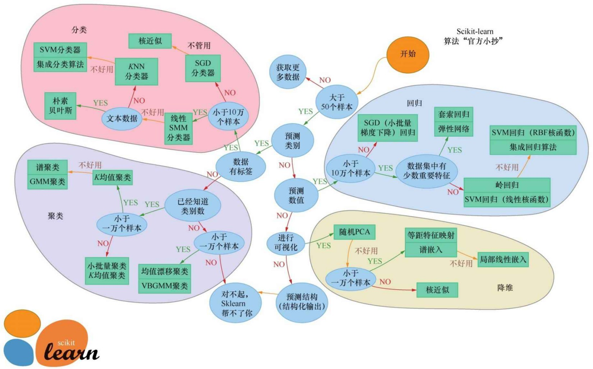

# 第8课 经典算法

## 8.1 K最邻近

K最近邻算法简称KNN，英文是K-Nearest Neighbor，意思是K个最近的邻居。K最近邻算法的思路特别简单，就是随大流。对于需要贴标签的数据样本，它总是会找几个和自己离得最近的样本，也就是邻居，看看邻居的标签是什么。如果它的邻居中的大多数样本都是某一类样本，它就认为自己也是这一类样本。参数K是邻居的个数，通常是3、5、7等不超过20的数字。

例如：下图为某高中选班长的选举地图，两个主要候选人一个是小冰，另一个是咖哥。他们的支持者都已经确定了，A是小冰的支持者，B则是咖哥的支持者。从这些支持者的座位分布上并不难看出，根据KNN算法来确定支持者可靠率还是蛮高的。因为每个人都有其固定的势力范围。


通常通过特征向量在**特征空间中的距离**来衡量距离的远近。

在KNN和其他机器学习算法中常用的距离计算公式包括：**欧氏距离**和**曼哈顿距离**。两个向量之间用不同的距离计算公式得出来的结果是不一样的。

欧氏距离是欧几里得空间中两点间的“普通”即直线距离。在欧几里得空间中点$x=x_1...x_n$和点$y=y_1...y_n$之间的欧氏距离为：

$d(x, y) = \sqrt{(x_1-y_1)^2 +(x_2-y_2)^2 + ...+(x_n-y_n)^2}$

曼哈顿距离也叫方格线距离或城市区块距离，是两个点在标准坐标系上的绝对轴距的总和。在欧几里得空间的固定直角坐标系上曼哈顿距离的意义为：两点所形成的线段对轴产生的投影的距离总和。在平面上点$x=x_1...x_n$点$y=y_1...y_n$之间的曼哈顿距离为：

$d(x, y) = |x_1-y_1| +|x_2-y_2| + ...+|x_n-y_n|$

这两种距离的区别与MSE和MAE误差计算公式之间的区别很类似，其实这两种距离也就是向量的L1范数曼哈顿和L2范数欧氏的定义。

下图的两个点之间1、2与3线表示的各种曼哈顿距离长度都相同，而4线表示的则是欧氏距离。


下图中的两个特征就形成了二维空间，图中心的问号代表一个未知类别的样本。如何归类呢？它是圆圈，还是叉号？如果K=3，叉号所占比例大，问号样本将被判定为叉号类；如果K=7则圆圈所占比例大，问号样本将被判定为圆圈类。


因此KNN算法的结果和K的取值有关系。要注意的是KNN要找的邻居都是已经“站好队的人”，也就是已经正确分类的对象。

以第4课中的案例根据调查问卷中的数据推断客户是否有心脏病。

```python
    import numpy as np # 导入NumPy数学工具箱
    import pandas as pd # 导入Pandas数据处理工具箱
    df_heart = pd.read_csv("./dataset/heart.csv")  # 读取文件
    df_heart.head() # 显示前5行数据
```

通过KNN算法进行预测：

```python
    from sklearn.neighbors import KNeighborsClassifier # 导入kNN算法
    k = 5 # 设定初始K值为5
    kNN = KNeighborsClassifier(n_neighbors = k)  # kNN模型
    kNN.fit(X_train, y_train) # 拟合kNN模型
    y_pred = kNN.predict(X_test) # 预测心脏病结果
    from sklearn.metrics import (accuracy_score, f1_score, average_precision_score, confusion_matrix) # 导入评估标准
    print("{}NN 预测准确率: {:.2f}%".format(k, kNN.score(X_test, y_test)*100))
    print("{}NN 预测F1分数: {:.2f}%".format(k, f1_score(y_test, y_pred)*100))
    print('kNN 混淆矩阵:\n', confusion_matrix(y_pred, y_test))

    >>> 
    5NN 预测准确率: 85.25%
    5NN 预测F1分数: 86.15%
    kNN 混淆矩阵:
    [[24  6]
    [ 3 28]]
```

为了寻找最优K值：

```python
    # 寻找最佳K值
    f1_score_list = []
    acc_score_list = []
    for i in range(1,15):
        kNN = KNeighborsClassifier(n_neighbors = i)  # n_neighbors means k
        kNN.fit(X_train, y_train)
        acc_score_list.append(kNN.score(X_test, y_test))
        y_pred = kNN.predict(X_test) # 预测心脏病结果
        f1_score_list.append(f1_score(y_test, y_pred))
    index = np.arange(1,15,1)
    plt.plot(index,acc_score_list,c='blue',linestyle='solid')
    plt.plot(index,f1_score_list,c='red',linestyle='dashed')
    plt.legend(["Accuracy", "F1 Score"])
    plt.xlabel("K value")
    plt.ylabel("Score")
    plt.grid('false')
    plt.show()
    kNN_acc = max(f1_score_list)*100
    print("Maximum kNN Score is {:.2f}%".format(kNN_acc))
```

这个代码用于绘制出112不同K值的情况下，模型所取得的测试集准确率和F1分数。通过观察这个曲线如下图所示，就能知道针对当前问题K的最佳取值。


就这个案例而言，当K=3时F1分数达到89.86%。而当K=7或K=8时，准确率虽然也达到峰值88%左右，但是此时的F1分数不如K=3时高。

KNN算法在寻找最近邻居时要将余下所有的样本都遍历一遍，以确定谁和它最近。因此如果数据量特别大它的计算成本还是比较高的。

## 8.2 支持向量机

支持向量机，Support Vector Machine SVM。 和神经网络不同，SVM有非常严谨的数学模型做支撑，因此受到学术界和工程界人士的共同喜爱。

**超平面（hyperplane）**：就是用于特征空间，根据数据的类别切分出来的分界平面。如下图所示的两个特征的二分类问题，就可以用一条线来表示超平面。如果特征再多一维，可以想象切割线会延展成一个平面，以此类推。

而**支持向量（support vector）**：就是离当前超平面最近的数据点，也就是下图中被分界线的两条平行线所切割的数据点，这些点对于超平面的进一步确定和优化最为重要。

如下图所示，在一个数据集的特征空间中存在很多种可能的类分割超平面。比如图中的$H_0$实线和两条虚线，都可以把数据集成功地分成两类。但是看一看是实线分割较好还是虚线分割较好？


答案是实线分割较好。为什么呢？

因为这样的分界线离两个类中的支持向量都比较远。SVM算法就是要在支持向量的帮助之下，通过类似于梯度下降的优化方法，**找到最优的分类超平面**。具体的目标就是令支持向量到超平面之间的垂直距离最宽，称为**最宽街道**。

那么目前的特征空间中有以下3条线。

- $H_0$就是目前的超平面。

- 与之平行的$H_1/H_2$线上的特征点就是支持向量。

这3条线由线性函数和其权重、偏置的值所确定：

$H_0 = w·x+b = 0; H_1 = w·x+b = 1; H_2 = w·x+b = −1$

然后计算支持向量到超平面的垂直距离，并通过机器学习算法调整参数w和b，将距离也就是特征空间中的这条街道宽度最大化。这和线性回归寻找最优函数的斜率和截距的过程很相似。

下面用SVM算法来解决同样的问题：

```python
    from sklearn.svm import SVC # 导入SVM分类器
    svm = SVC(random_state = 1)
    svm.fit(X_train, y_train)
    y_pred = svm.predict(X_test)    # 预测心脏病结果
    svm_acc = svm.score(X_test, y_test) * 100
    print("SVM预测准确率：{:.2f}%".format(svm.score(X_test, y_test) * 100))
    print("SVM预测F1分数：{:.2f}%".format(f1_score(y_test, y_pred) * 100))
    print('SVM混淆矩阵：\n', confusion_matrix(y_pred, y_test))

    >>>
    SVM预测准确率：88.52%
    SVM预测F1分数：89.86%
    SVM混淆矩阵：
    [[23  3]
    [ 4 31]]
```

普通的SVM分类超平面只能应对线性可分的情况，对于非线性的分类SVM要通过**核方法（kernel  method）**解决。核方法是机器学习中的一类算法，并非专用于SVM。它的思路是首先通过某种非线性映射核函数，对特征粒度进行细化，将原始数据的特征嵌入合适的更高维特征空间；然后利用通用的线性模型，在这个新的空间中分析和处理模式，这样将在二维上线性不可分的问题在多维上变得线性可分，那么SVM就可以在此基础上找到最优分割超平面。

## 8.3 朴素贝叶斯

**朴素贝叶斯（Naive  Bayes）**是一个通过条件概率进行分类的算法。所谓条件概率就是在事件A发生的概率下B发生的概率。它会假设每个特征都是相互独立的，这就是一个很强的预设，然后计算每个类别下的各个特征的条件概率。条件概率的公式如下:

$P(c|x) = \frac{P(x|c)P(c)}{P(x)}$

在机器学习实践中，可以将上面的公式拆分成多个具体的特征：

$P(c_k|x) = P(x_1|c_k) * P(x_2|c_k) * ... * P(x_n|c_k) * P(c_k)$

公式解释如下：

- $c_k$代表的是分类的具体类别k。

- $P_{c|x}$条件概率，也就是所要计算的当特征为x时类别为c的概率。

- $P_{x|c}$称为似然（likelihood），就是训练集中标签分类为c的情况下，特征为x的概率。

- $P_c$是训练集中分类为C的先验概率。比如全部电子邮件中垃圾电子邮件的概率为0.1。

- $P_x$是特征的先验概率

在实践中，条件概率公式里的分母项在计算过程中会被忽略。因为这个$P_x$不管它的具体值多大，具体到一个特征向量对于所有的分类c来说，这个值其实是固定的——不随$c_k$中K值的变化而改变。因此它是否存在，并不影响一个特定数据样本的归类。机器最后所要做的只是确保所求出的所有类的后验概率之和为1。这可以通过增加一个归一化参数而实现。

下面就使用朴素贝叶斯算法来解决心脏病的预测问题：

```python
    from sklearn.naive_bayes import GaussianNB # 导入朴素贝叶斯模型
    nb = GaussianNB()
    nb.fit(X_train, y_train)
    y_pred = nb.predict(X_test)
    nb_acc = nb.score(X_test, y_test) * 100
    print("NB预测准确率：{:.2f}%".format(nb.score(X_test, y_test) * 100))
    print("NB预测F1分数：{:.2f}%".format(f1_score(y_test, y_pred) * 100))
    print('NB混淆矩阵：\n', confusion_matrix(y_pred, y_test))
```

效果还不错。基本上朴素贝叶斯是基于现有特征的概率，对输入进行分类的，它的速度相当快，当没有太多数据并且需要快速得到结果时，朴素贝叶斯算法可以说是解决分类问题的良好选择。

## 8.4 决策树

决策树（Decision Trees, DT）常应用于回归或者分类问题，所以有时候也叫分类与回归树（Classification And Regression Tree, CART）。决策树算法简单直观，有点像是将一大堆的if...else语句进行连接，直到最后得到想要的结果。算法中的各个节点是根据训练数据集中的特征形成的。但是需要注意特征节点的选择不同时，可以生成很多不一样的决策树。

下图所示是一个相亲数据集和根据该数据集而形成的决策树。此处设定一个根节点作为决策的起点，从该点出发根据数据集中的特征和标签值给树分叉。


### 8.4.1 熵和特征节点的选择

信息学中，**熵（entropy）**度量着信息的不确定性，信息的不确定性越大，熵越大。信息熵和事件发生的概率成反比。

- 信息熵代表随机变量的复杂度，也就是不确定性。

- 条件熵代表在某一个条件下随机变量的复杂度。

- **信息增益**等于信息熵减去条件熵，它代表了在某个条件下信息复杂度、不确定性减少的程度。

因此**如果一个特征从不确定到确定这个过程，对结果影响比较大的话，就可以认为这个特征的分类能力比较强**。那么先根据这个特征进行决策之后，对于整个数据集而言，熵不确定性减少得最多，**也就是信息增益最大**。

### 8.4.2 决策树的深度和剪枝

决策树算法有以下两个特点。

1. 由于if...else可以无限制地写下去，因此针对任何训练集只要树的深度足够，决策树肯定能够达到100%的准确率。这听起来像是个好消息。

2. 决策树非常容易过拟合。也就是说在训练集上只要分得足够细就能得到100%的正确结果，然而在测试集上准确率会显著下降。

这种过拟合的现象在下图的这个二分类问题中就可以体现出来。决策树算法将每一个样本都根据标签值成功分类，图中的两种颜色就显示出决策树算法生成的分类边界。


而实际上当分类边界精确地绕过了每一个点时，过拟合已经发生了。根据直觉，那个被圆圈包围着的叉号并不需要被考虑，它只是一个特例。因此树的最后几个分叉，也就是找到虚线框内叉号的决策过程都应该省略，才能够提高模型的泛化功能。

解决的方法是为决策树进行**剪枝（pruning）**，有以下两种形式。

- **先剪枝**：分支的过程中，熵减少的量小于某一个阈值时就停止分支的创建。

- **后剪枝**：先创建出完整的决策树，然后尝试消除多余的节点。

整理而言，决策树算法很直观，易于理解，而且模型可以通过树的形式可视化展现。此外决策树还可以直接处理非数值型数据，不需要进行哑变量的转换，甚至可以直接处理含缺失值的数据。因此，决策树算法是应用较为广泛的算法。

但是决策树缺点也非常明显，首先对于多特征的复杂分类问题，效率很一般，而且容易过拟合。节点很深的树容易学习到高度不规则的模式，造成较大的方差，泛化能力弱。此外决策树算法在处理连续变量问题时，效果也不太好。

因为这些缺点，决策树很少独立作为一种算法被应用于实际问题。然而一个非常微妙的事是决策树经过集成的各种升级版的算法——随机森林、梯度提升树算法等都是非常优秀的常用算法。

下面用决策树算法解决心脏病的预测问题：

```python
    from sklearn.tree import DecisionTreeClassifier # 导入决策树模型
    dtc = DecisionTreeClassifier()
    dtc.fit(X_train, y_train)
    y_pred = dtc.predict(X_test)
    dtc_acc = dtc.score(X_test, y_test) * 100
    print("Decision Tree Test Accuracy {:.2f}%".format(dtc_acc))
    print("决策树预测准确率：{:.2f}%".format(dtc.score(X_test, y_test) * 100))
    print("决策树预测F1分数：{:.2f}%".format(f1_score(y_test, y_pred) * 100))
    print('决策树混淆矩阵：\n', confusion_matrix(y_pred, y_test))
```

## 8.5 随机森林

**随机森林（random forest）**是一种健壮且实用的机器学习算法，是在决策树的基础上衍生而成的。决策树和随机森林的关系，就是树和森林的关系。通过对原始训练样本的抽样，以及对特征节点的选择，可以得到很多棵不同的树。

**随机森林的思路是把很多棵决策树的结果集成起来，以避免过拟合同时提高准确率**。其中每一棵决策树都是在原始数据集中抽取不同子集进行训练的，尽管这种做法会小幅度地增加每棵树的预测偏差，但是最终对各棵树的预测结果进行综合平均之后的模型性能通常会大大提高。

假设我们有一个包含N个训练样本的数据集，特征的维度为M随机森林，通过下面算法构造树。

1. 从N个训练样本中以**有放回抽样（replacement  sampling）**的方式取样N次，形成一个新训练集，这种方法也叫bootstrap取样，可用未抽到的样本进行预测评估其误差。

2. 对于树的每一个节点都随机选择m个特征，m是M的一个子集，数目远小于M，决策树上每个节点的决定都只是基于这些特征确定的，即根据这m个特征计算最佳的分裂方式。

3. 默认情况下每棵树都会完整成长而不会剪枝。

上述算法有两个关键点：一个是有放回抽样；二是节点生成时不总是考量全部特征。这两个关键点都增加了树生成过程中的随机性，从而降低了过拟合。

在Sklearn的随机森林分类器中可以设定的一些的参数项如下。

- n_estimators：要生成的树的数量。

- criterion：信息增益指标，可选择giniGini不纯度或者entropy熵。

- bootstrap：可选择是否使用bootstrap方法取样，True或者False。如果选择False，则所有树都基于原始数据集生成。

- max_features：通常由算法默认确定。对于分类问题，默认值是总特征数的平方根，即如果一共有9个特征，分类器会随机选取其中3个。

下面用随机森林算法解决心脏病的预测问题：

```python
    from sklearn.ensemble import RandomForestClassifier # 导入随机森林分类器
    rf = RandomForestClassifier()
    rf.fit(X_train, y_train)
    y_pred = rf.predict(X_test)
    dtc_acc = rf.score(X_test, y_test) * 100
    print("随机森林预测准确率：{:.2f}%".format(rf.score(X_test, y_test) * 100))
    print("随机森林预测F1分数：{:.2f}%".format(f1_score(y_test, y_pred) * 100))
    print('随机森林混淆矩阵：\n', confusion_matrix(y_pred, y_test))
```

随机森林算法广泛适用于各种问题，尤其是针对浅层的机器学习任务，随机森林算法很受欢迎。即使在目前的深度学习时代，要找到效率能够超过随机森林的算法也不是一件很容易的事。

## 8.6 如何选择最佳机器学习算法

通常拿到一个具体的数据集后，会根据一系列的考量因素进行评估。这些因素包括要解决的问题的性质、数据集大小、数据集特征、有无标签等。有了这些信息后再来寻找适宜的算法。



if 机器学习问题 = 感知类问题(也就是图像、语言、文本等非结构化问题)
    then 深度学习算法(例如使用Keras深度学习库)

因为适合深度学习的问题通常不用Sklearn库来解决，而对于浅层的机器学习问题Sklearn就可以大显身手了。

Sklearn库中的算法选择流程如下：

```python
    if 数据量< 50:
        数据样本太少，先获取更多数据
    else 数据量 > 50:
        if 是分类问题:
            if 数据有标签:
                if 数据量小于10万个:
                    选择SGD分类器
                else 数据量大于10万:
                    先尝试线性SVM分类器, 如果不好用, 再继续尝试其他
                    if 特征为文本数:
                        选择朴素贝叶斯
                    else:
                        先尝试KNN分类器，如果不好用, 再尝试SVM分类器加集成分类算法
            else 数据没有标签:
                选择各种聚类算法
        else 不是分类问题:
            if 需要预测数值, 就是回归问题:
                if 数据量大于10万:
                    选择SGD回归
                else 数据量小于10万个:
                    根据数据集特征的特点，有套索回归和岭回归、集成回归算法、SVM回归等几种选择
            else 进行可视化，则考虑几种降维算法
            else 预测结构
                sklearn无法起到作用
```

用逻辑回归算法解决心脏病的预测问题的示例代码：

```python
    from sklearn.linear_model import LogisticRegression # 导入逻辑回归模型
    lr = LogisticRegression()
    lr.fit(X_train,y_train) 
    y_pred = lr.predict(X_test) # 预测心脏病结果
    lr_acc = lr.score(X_test,y_test)*100 
    lr_f1 = f1_score(y_test, y_pred)*100 
    print("逻辑回归测试集准确率： {:.2f}%".format(lr_acc))
    print("逻辑回归测试集F1分数: {:.2f}%".format(lr_f1))
    print('逻辑回归测试集混淆矩阵:\n', confusion_matrix(y_test,y_pred))
```

下面就输出所有这些算法针对心脏病预测的准确率直方图：

```python
    methods = ["Logistic Regression", "kNN", "SVM", 
            "Naive Bayes", "Decision Tree", "Random Forest"]
    accuracy = [lr_acc, kNN_acc, svm_acc, nb_acc, dtc_acc, rf_acc]
    colors = ["orange","red","purple", "magenta", "green","blue"]
    sns.set_style("whitegrid")
    plt.figure(figsize=(16,5))
    plt.yticks(np.arange(0,100,10))
    plt.ylabel("Accuracy %")
    plt.xlabel("Algorithms")
    sns.barplot(x=methods, y=accuracy, palette=colors)
    plt.grid(b=None)
    plt.show()
```

各种算法的准确率比较如下图所示：


从结果上看，KNN和随机森林等算法对于这个问题来说是较好的算法。

再绘制出各种算法的混淆矩阵：

```python
    # 绘制各算法的混淆矩阵
    from sklearn.metrics import confusion_matrix
    y_pred_lr = lr.predict(X_test)
    kNN3 = KNeighborsClassifier(n_neighbors = 3)
    kNN3.fit(X_train, y_train)
    y_pred_kNN = kNN3.predict(X_test)
    y_pred_svm = svm.predict(X_test)
    y_pred_nb = nb.predict(X_test)
    y_pred_dtc = dtc.predict(X_test)
    y_pred_rf = rf.predict(X_test)
    cm_lr = confusion_matrix(y_test,y_pred_lr)
    cm_kNN = confusion_matrix(y_test,y_pred_kNN)
    cm_svm = confusion_matrix(y_test,y_pred_svm)
    cm_nb = confusion_matrix(y_test,y_pred_nb)
    cm_dtc = confusion_matrix(y_test,y_pred_dtc)
    cm_rf = confusion_matrix(y_test,y_pred_rf)
    plt.figure(figsize=(24,12))
    plt.suptitle("Confusion Matrixes",fontsize=24)
    plt.subplots_adjust(wspace = 0.4, hspace= 0.4)
    plt.subplot(2,3,1)
    plt.title("Logistic Regression Confusion Matrix")
    sns.heatmap(cm_lr,annot=True,cmap="Blues",fmt="d",cbar=False)
    plt.subplot(2,3,2)
    plt.title("K Nearest Neighbors Confusion Matrix")
    sns.heatmap(cm_kNN,annot=True,cmap="Blues",fmt="d",cbar=False)
    plt.subplot(2,3,3)
    plt.title("Support Vector Machine Confusion Matrix")
    sns.heatmap(cm_svm,annot=True,cmap="Blues",fmt="d",cbar=False)
    plt.subplot(2,3,4)
    plt.title("Naive Bayes Confusion Matrix")
    sns.heatmap(cm_nb,annot=True,cmap="Blues",fmt="d",cbar=False)
    plt.subplot(2,3,5)
    plt.title("Decision Tree Classifier Confusion Matrix")
    sns.heatmap(cm_dtc,annot=True,cmap="Blues",fmt="d",cbar=False)
    plt.subplot(2,3,6)
    plt.title("Random Forest Confusion Matrix")
    sns.heatmap(cm_rf,annot=True,cmap="Blues",fmt="d",cbar=False)
    plt.show()
```

各种算法的混淆矩阵如下图所示：


从图中可以看出，KNN和随机森林这两种算法中“假负”的数目为3，也就是说本来没有心脏病却判定为有心脏病的客户有3人，而“假正”的数目为4，也就是说本来有心脏病判定为没有心脏病的客户有4人。

## 8.7 用网格搜索超参数调优

内容参数是算法内部的权重和偏置，而**超参数是算法的参数**，例如逻辑回归中的C值、神经网络的层数和优化器、KNN中的K值都是超参数。

算法的内部参数是算法通过梯度下降自行优化，而超参数通常依据经验手工调整。

利用Sklearn的**网格搜索（Grid  Search）**功能，可以为特定机器学习算法找到每一个超参数指定范围内的最佳值。

指定范围就是列举出一组组可选超参数值。网格搜索会遍历其中所有的可能组合，并根据指定的评估指标比较每一个超参数组合的性能。

下面用网格搜索功能进一步优化随机森林算法的超参数，看看预测准确率还有没有能进一步提升的空间：


```python
    from sklearn.model_selection import StratifiedKFold # 导入K折验证工具
    from sklearn.model_selection import GridSearchCV # 导入网格搜索工具
    kfold = StratifiedKFold(n_splits=10) # 10折验证
    rf = RandomForestClassifier() # 随机森林
    # 对随机森林算法进行参数优化
    rf_param_grid = {"max_depth": [None],
                                    "max_features": [3, 5, 12],
                                    "min_samples_split": [2, 5, 10],
                                    "min_samples_leaf": [3, 5, 10],
                                    "bootstrap": [False],
                                    "n_estimators": [100, 300],
                                    "criterion": ["gini"]}
    rf_gs = GridSearchCV(rf, param_grid = rf_param_grid, cv = kfold,
                                            scoring = "accuracy", n_jobs = 10, verbose = 1)
    rf_gs.fit(X_train, y_train)# 用优化后的参数拟合训练数据集
```

此处选择了准确率作为各个参数组合的评估指标，并且应用10折验证以提高准确率。程序开始运行之后10个“后台工作者”开始分批同步对54种参数组合中的每一组参数用10折验证的方式对训练集进行训练，因为是10折验证所以共需训练540次并比较试图找到最佳参数。

下面使用找到的最佳参数进行预测：

```python
    from sklearn.metrics import (accuracy_score, confusion_matrix)
    y_hat_rfgs = rf_gs.predict(X_test) # 用随机森林算法的最佳参数进行预测
    print("参数优化后随机森林测试准确率:", accuracy_score(y_test.T, y_hat_rfgs))
    >>>
    参数优化后随机森林测试准确率: 0.8852459016393442
```

显示一下混淆矩阵：


```python
    cm_rfgs = confusion_matrix(y_test,y_hat_rfgs) # 显示混淆矩阵
    plt.figure(figsize=(4,4))
    plt.title("Random Forest (Best Score) Confusion Matrix")
    sns.heatmap(cm_rfgs,annot=True,cmap="Blues",fmt="d",cbar=False)
```


输出最优模型的best_params_属性：

```python
    print("最佳参数组合:",rf_gs.best_params_)
    >>>
    最佳参数组合: {'bootstrap': False, 'criterion': 'gini', 'max_depth': None, 'max_features': 3, 'min_samples_leaf': 3, 'min_samples_split': 10, 'n_estimators': 100}
```