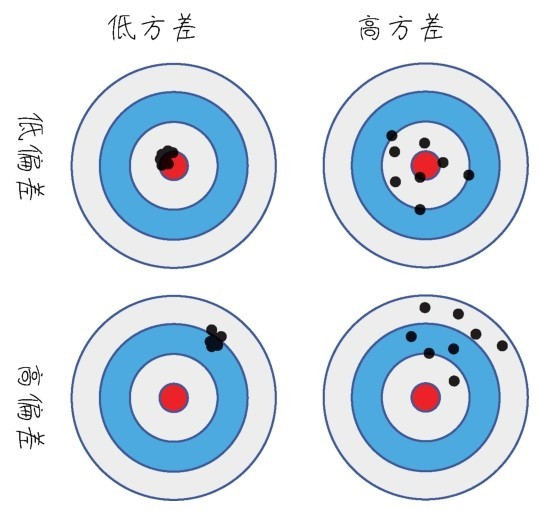
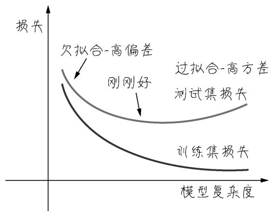
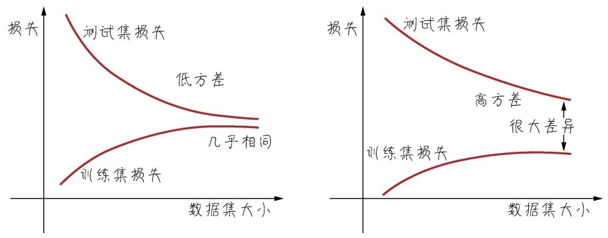
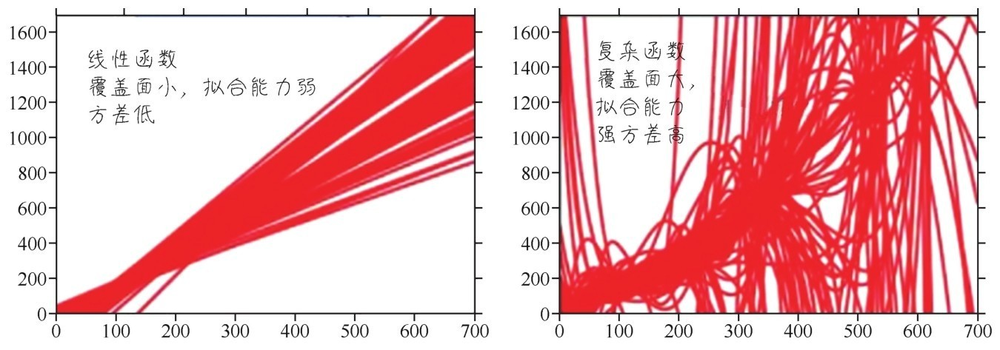
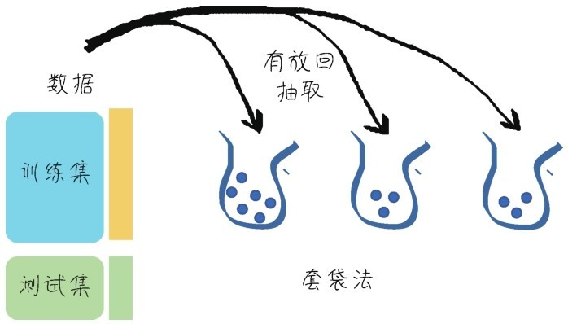
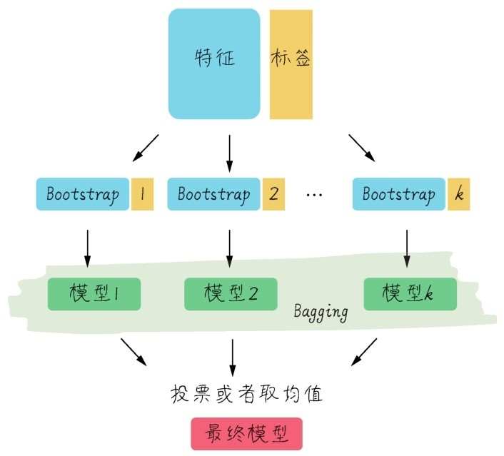
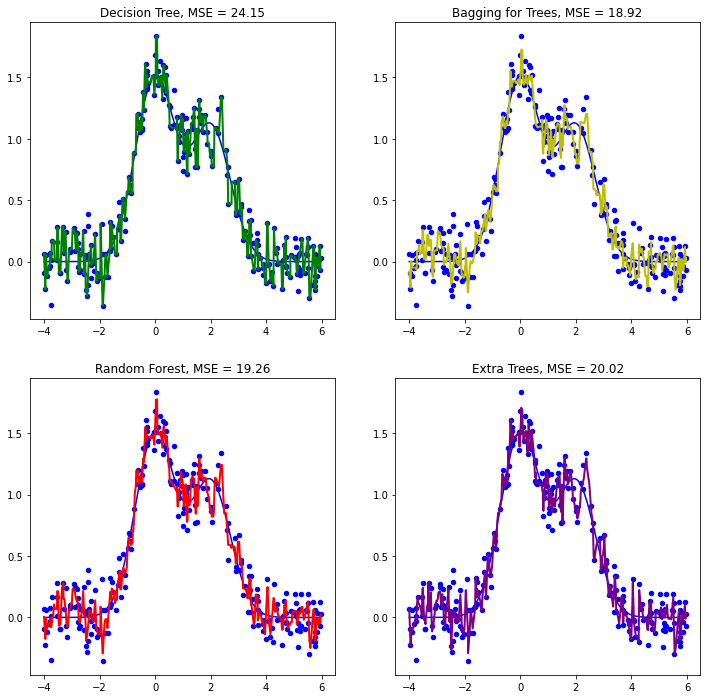

# 第9课 集成学习

**集成学习就是机器学习里面的协同作战**，如果训练出一个模型比较弱，又训练出一个模型还是比较弱，但是几个不大一样的模型组合起来很可能其效率会好过一个单独的模型。这个思路导出的随机森林、梯度提升决策树以及XGBoost等算法都是常用的、有效的算法。

集成学习的核心策略是通过模型的集成，减少机器学习中的**偏差（bias）**和**方差（variance）**。

## 9.1 偏差和方差——机器学习性能优化的风向标

方差是从统计学中引入的概念，方差定义的是一组数据距离其均值的离散程度。而机器学习里面的偏差**用于衡量模型的准确程度**。

机器学习内部参数w和b中的参数b，英文也是bias，它是线性模型内部的偏置。而这里的bias是模型准确率的偏差。两者英文相同但不是同一个概念。



偏差评判的是机器学习模型的**准确度**，偏差越小模型越准确。它度量了算法的预测与真实结果的离散程度，刻画了学习算法本身的拟合能力  。也就是每次打靶都比较靠近靶心。

方差评判的是机器学习模型的**稳定性**或称**精度**，方差越小模型越稳定。它**度量了训练集变动所导致的学习性能变化**，**刻画了数据扰动所造成的影响**。也就是每次打靶不管打得准不准，击中点都比较集中。

其实机器学习中的预测误差还包含另一个部分叫作**噪声**。噪声表达的是在当前任务上任何学习算法所能达到的泛化误差的下界，也可以说**刻画了学习问题本身的难度**，属于**不可约减的误差（irreducible error）**，因此就不在我们关注的范围内。

### 9.1.1 目标——降低偏差与方差

低偏差和低方差都是期望的效果，然而一般来说偏差与方差是不可兼得的,这被称作**偏差-方差窘境（bias-variance dilemma）**。

- 给定一个学习任务，在训练的初期，模型对训练集的拟合还未完善，能力不够强，偏差也就比较大。正是由于拟合能力不强，数据集的扰动是无法使模型的效率产生显著变化的——此时模型处于欠拟合的状态，把模型应用于训练集数据会出现高偏差。

- 随着训练的次数增多，模型的调整优化其拟合能力越来越强，此时训练数据的扰动也会对模型产生影响。

- 当充分训练之后，模型已经完全拟合了训练集数据，此时数据的轻微扰动都会导致模型发生显著变化。当训练好的模型应用于测试集，并不一定得到好的效果——此时模型应用于不同的数据集会出现高方差，也就是过拟合的状态。

机器学习性能优化领域的最核心问题就是：不断地探求欠拟合-过拟合之间，也就是偏差-方差之间的**最佳平衡点**，也是**训练集优化和测试集泛化的平衡点**。

如下图所示，如果同时为训练集和测试集绘制损失曲线，大概可以看出以下内容。



- 在训练初期，当模型很弱的时候，测试集和训练集上损失都大。这时候需要调试的是机器学习的模型，或者甚至选择更好算法。这是在降低偏差。

- 在模型或者算法被优化之后，损失曲线逐渐收敛。但是过了一段时间之后发现损失在训练集上越来越小，然而在测试集上逐渐变大。此时要集中精力降低方差。

因此机器学习的性能优化是有顺序的，一般是**先降低偏差再聚焦于降低方差**。

### 9.1.2 数据及大小对偏差和方差的影响

还可以通过调整数据集的大小，来观测损失的情况，进而判定是偏差还是方差影响着机器学习效率。

高方差意味着数据扰动对模型的影响大。如下图中，左图中的模型方差较低，而右图中的模型方差较高。

这是因为数据集越大越能够降低过拟合的风险。数据集越大训练集和测试集上的损失差异理论上应该越小，因为更大的数据集会导致训练集上的损失值上升，测试集上的损失值下降。



- 如果随着数据集逐渐增大，训练集和测试集的误差逐渐减小，然后都稳定在一个值附近。这说明此时模型的方差较小。如果这个模型准确率仍然不高，需要从模型性能优化上调整，减小偏差。

- 如果随着数据集逐渐增大，训练集和测试集的差异仍然很大，此时说明模型的方差大。也就是模型受数据的影响大，此时需要增加模型的泛化能力。

### 9.1.3 预测空间的变化带来的偏差和方差的变化

通过确定模型是方差大，还是偏差大，有利于对模型的调整，以及选择什么算法优化模型。

不同的模型有不同的复杂度，其预测空间大小不同、维度也不同。一个简单的线性函数它所能够覆盖的预测空间是比较有限的，其实也可以说简单的函数模型方差都比较低。



面对复杂问题，简单的线性函数虽然方差低，但是偏差高，对于稍微复杂的问题根本不能解决。而利用复杂的神经网络又会面临偏差-方差窘境。

不过集成学习可以通过组合一些比较简单的算法来保留这些算法低方差的优势。在此基础之上，又能引入复杂的模型来扩展简单算法的预测空间。

## 9.2 Bagging算法——多个基模型的聚合

Bagging（Bootstrap  Aggregating）算法，又称为套袋法、装袋法或者自助聚合。其算法的基本思想是从原始的数据集中抽取数据形成K个随机的新训练集，然后训练出K个不同的模型。具体过程如下：

1. 从原始样本集中通过**有放回的**随机抽取形式，形成K个训练集，如下图所示。这K个训练集是彼此独立的，这个过程也叫作bootstrap，称为自举或自助采样。

    

2. 每次使用一个训练集，通过相同的机器学习算法，如决策树、神经网络等，得到一个模型。K个训练集共得到K个模型。将这些模型称为**基模型（base estimator）**或者基学习器。

基模型的集成有以下两种情况：

- 对于分类问题，K个模型采用投票的方式得到分类结果。

- 对于回归问题，计算K个模型的均值作为最后的结果。



多数情况下的Bagging都是基于决策树的，构造随机森林的第一个步骤其实就是对多棵决策树进行Bagging，将它称为**树的聚合（Bagging of Tree）**。

树模型具有显著的低偏差、高方差的特点。也就是受数据的影响特别大，一不小心训练集准确率就接近100%了。但是这种效果不能够移植到其他的数据集。这是很明显的过拟合现象。集成学习的Bagging算法就从树模型开始着手解决它太过于精准又不易泛化的问题。

Bagging的原理并不仅限于决策树，还可以扩展到其他机器学习算法。因为通过随机抽取数据的方法减少了可能的数据干扰，所以经过Bagging的模型将会具有低方差。

在Sklearn的集成学习库中有Bagging Classifier和Bagging Regressor这两种Bagging模型分别适用于分类问题和回归问题。

针对预测银行客户是否会流失的案例：

```python
    # 对多棵决策树进行Bagging，即树的聚合
    from sklearn.ensemble import BaggingClassifier # 导入Bagging分类器
    from sklearn.tree import DecisionTreeClassifier # 导入决策树分类器
    from sklearn.metrics import (f1_score, confusion_matrix) # 导入评估标准
    dt = BaggingClassifier(DecisionTreeClassifier()) # 只使用一棵决策树
    dt.fit(X_train, y_train) # 拟合模型
    y_pred = dt.predict(X_test) # 进行预测
    print("决策树测试准确率: {:.2f}%".format(dt.score(X_test, y_test)*100))
    print("决策树测试F1分数: {:.2f}%".format(f1_score(y_test, y_pred)*100))
    bdt = BaggingClassifier(DecisionTreeClassifier()) #树的Bagging
    bdt.fit(X_train, y_train) # 拟合模型
    y_pred = bdt.predict(X_test) # 进行预测
    print("决策树Bagging测试准确率: {:.2f}%".format(bdt.score(X_test, y_test)*100))
    print("决策树Bagging测试F1分数: {:.2f}%".format(f1_score(y_test, y_pred)*100))
    >>>
    决策树测试准确率: 84.65%
    决策树测试F1分数: 55.05%
    决策树Bagging测试准确率: 85.05%
    决策树Bagging测试F1分数: 55.96%
```

上述代码中的Bagging Classifier指定了DecisionTreeClassifier决策树分类器作为基模型的类型，默认的基模型的数量是10，也就是在Bagging过程中会用Bootstrap算法生成10棵树。

通过对比，可以看到决策树Bagging的准确率及F1分数略占优势。

如果用网格搜索再进行参数优化：

```python
    from sklearn.model_selection import GridSearchCV # 导入网格搜索工具
    dbt_param_grid = {
        'base_estimator__max_depth': [5, 10, 20, 50, 100],
        'n_estimators': [1, 5, 10, 50]
    }
    dbt_gs = GridSearchCV(BaggingClassifier(DecisionTreeClassifier()),
                param_grid = dbt_param_grid, scoring='f1',
                n_jobs=10, verbose=1)
    dbt_gs.fit(X_train, y_train)
    dbt_gs = dbt_gs.best_estimator_
    y_pred = dbt_gs.predict(X_test)
    print("决策树Bagging测试准确率: {:.2f}%".format(dbt_gs.score(X_test, y_test)*100))
    print("决策树Bagging测试F1分数: {:.2f}%".format(f1_score(y_test, y_pred)*100))
    >>>
    决策树Bagging测试准确率: 85.80%
    决策树Bagging测试F1分数: 57.74%
```

其中`base_estimator__max_depth`中的base_estimator表示Bagging的基模型，即决策树分类器（DecisionTreeClassifier）。因此两个下划线后面的`max_depth`参数隶属于决策树分类器，指的是树的深度。而`n_estimators`参数隶属于BaggingClassifier，指的是Bagging过程中树的个数。

准确率为何会提升其中的关键正是降低了模型的方差，增加了泛化能力。因为每一棵树都是在原始数据集的不同子集上进行训练的，这是以偏差的小幅增加为代价的，但是最终的模型应用于测试集后性能会大幅提升。

### 9.2.2 从树的聚合到随机森林

集成学习最关键的是各个基模型的相关度要小，差异性要大。异质性越强集成的效果越好。那么对树的集成关键在于这些树里面每棵树的差异性是否够大。

在树的聚合中，每一次树分叉时都会遍历所有的特征找到最佳的分支方案。而随机森林在此算法基础上的改善，就是在树分叉时增加了对特征选择的随机性，而并不总是考量全部的特征。这个小小的改进就在较大程度上进一步提高了各棵树的差异。

假设树分叉时选取的特征数为m，则m这个参数值通常遵循下面的规则：

- 对于分类问题，m可以设置为特征数的平方根，即如果特征数36，那么m大概是6；

- 对于回归问题，m可以设置为特征数的三分之一，即如果特征数36，那么m大概是12。

在Sklearn的集成学习库中也有RandomForestClassifier和RandomForestRegressor两种随机森林模型，分别适用于分类问题和回归问题。

用随机森林算法解决同样的问题看一下预测效率：

```python
    from sklearn.ensemble import RandomForestClassifier # 导入随机森林分类器
    rf = RandomForestClassifier()
    # 使用网格搜索优化参数
    rf_param_grids = {"max_depth": [None],
                            "max_features": [1, 3, 10],
                            "min_samples_split":[2, 3, 10],
                            "min_samples_leaf": [1, 3, 10],
                            "bootstrap": [True, False],
                            "n_estimators": [100, 300],
                            "criterion": ["gini"]}
    rf_gs = GridSearchCV(rf, param_grid = rf_param_grids,
                                            scoring = "f1", n_jobs=10, verbose=1)
    rf_gs.fit(X_train, y_train)
    rf_gs = rf_gs.best_estimator_
    y_pred = rf_gs.predict(X_test)
    print("随机森林测试准确率: {:.2f}%".format(rf_gs.score(X_test, y_test)*100))
    print("随机森林测试F1分数: {:.2f}%".format(f1_score(y_test, y_pred)*100)) 
    >>>
    Fitting 5 folds for each of 108 candidates, totalling 540 fits
    随机森林测试准确率: 86.50%
    随机森林测试F1分数: 60.53%
```

这个结果显示出随机森林的预测效率比起树的聚合更好。

### 9.2.3 从随机森林到极端随机森林

从树的聚合到随机森林，增加了树生成过程中的随机性降低了方差。顺着这个思路更进一步，就形成了另一个算法叫作**极端随机森林**，也叫**更多树（extra tree）**。

前面提到，随机森林算法在树分叉时，会随机选取m个特征作为考量，对于每一次分叉它还是会遍历所有的分支，然后选择基于这些特征的最优分支。这本质上仍属于**贪心算法greedy  algorithm**，即在每一步选择中都采取在当前状态下最优的选择。而极端随机森林算法甚至不去考量所有的分支，而是随机选择一些分支从中拿到一个最优解。

下面用极端随机森林算法来解决同样的问题：

```python
    from sklearn.ensemble import ExtraTreesClassifier # 导入极端随机森林分类器
    ext = ExtraTreesClassifier()
    # 使用网格搜索优化参数
    ext_param_grids = {"max_depth": [None],
                            "max_features": [1, 3, 10],
                            "min_samples_split":[2, 3, 10],
                            "min_samples_leaf": [1, 3, 10],
                            "bootstrap": [True, False],
                            "n_estimators": [100, 300],
                            "criterion": ["gini"]}
    ext_gs = GridSearchCV(ext, param_grid = ext_param_grids,
                                            scoring = "f1", n_jobs=4, verbose=1)
    ext_gs.fit(X_train, y_train)
    ext_gs = ext_gs.best_estimator_
    y_pred = ext_gs.predict(X_test)
    print("更多树测试准确率: {:.2f}%".format(ext_gs.score(X_test, y_test)*100))
    print("更多树测试F1分数: {:.2f}%".format(f1_score(y_test, y_pred)*100)) 
    >>>
    Fitting 5 folds for each of 108 candidates, totalling 540 fits
    更多树测试准确率: 86.25%
    更多树测试F1分数: 58.40%
```

关于随机森林和极端随机森林算法的性能有以下几点需要注意：

1. 随机森林算法在绝大多数情况下是优于极端随机森林算法的。

2. 极端随机森林算法不需要考虑所有分支的可能性，所以它的运算效率往往要高于随机森林算法也就是说速度比较快。

3. 对于某些数据集极端随机森林算法可能拥有更强的泛化功能。但是很难知道具体什么情况下会出现这样的结果，因此不妨各种算法都试试。

### 9.2.4 比较决策树、树的聚合、随机森林、极端随机森林的效率

处理回归问题要选择各种工具的Regressor回归器版本而不是Classifier分类器。

再引用一个实例来比较决策树、树的聚合、随机森林以及极端随机森林在处理回归问题上的优劣。下列示例展示了4种树模型拟合一个随机函数曲线含有噪声的情况，其目的是比较4种算法中哪一种对原始函数曲线的拟合效果最好。

```python
    # 导入所需的库
    import numpy as np
    import pandas as pd
    from matplotlib import pyplot as plt
    from sklearn.ensemble import (RandomForestRegressor, 
                                BaggingRegressor, 
                                ExtraTreesRegressor)
    from sklearn.tree import DecisionTreeRegressor
    # 生成需要拟合的数据点——多次函数曲线
    def compute(x):
        return 1.5 * np.exp(-x ** 2) + 1.1 * np.exp(-(x - 2) ** 2)
    def f(x):
        x = x.ravel()
        return compute(x)
    def generate(n_samples, noise):
        X = np.random.rand(n_samples) * 10 - 4
        X = np.sort(X).ravel()
        y = compute(X) + np.random.normal(0.0, noise, n_samples)
        X = X.reshape((n_samples, 1))
        return X, y
    X_train, y_train = generate(250, 0.15)
    X_test, y_test = generate(500, 0.15)

    # 用决策树回归模型拟合
    dtree = DecisionTreeRegressor().fit(X_train, y_train)
    d_predict = dtree.predict(X_test)
    plt.figure(figsize=(20, 12))
    # ax.add_gridspec(b=False)
    plt.grid(b=None)
    plt.subplot(2,2,1)
    plt.plot(X_test, f(X_test), "b")
    plt.scatter(X_train, y_train, c="b", s=20)
    plt.plot(X_test, d_predict, "g", lw=2)
    plt.title("Decision Tree, MSE = %.2f" % np.sum((y_test - d_predict) ** 2))

    # 用树的Bagging拟合
    bdt = BaggingRegressor(DecisionTreeRegressor()).fit(X_train, y_train)
    bdt_predict = bdt.predict(X_test)
    # plt.figure(figsize=(10, 6))
    plt.subplot(2,2,2)
    plt.plot(X_test, f(X_test), "b")
    plt.scatter(X_train, y_train, c="b", s=20)
    plt.plot(X_test, bdt_predict, "y", lw=2)
    plt.title("Bagging for Trees, MSE = %.2f" % np.sum((y_test - bdt_predict) ** 2));

    # 用随机森林回归模型
    rf = RandomForestRegressor(n_estimators=10).fit(X_train, y_train)
    rf_predict = rf.predict(X_test)
    # plt.figure(figsize=(10, 6))
    plt.subplot(2,2,3)
    plt.plot(X_test, f(X_test), "b")
    plt.scatter(X_train, y_train, c="b", s=20)
    plt.plot(X_test, rf_predict, "r", lw=2)
    plt.title("Random Forest, MSE = %.2f" % np.sum((y_test - rf_predict) ** 2));

    # 用计算随机森林模型
    et = ExtraTreesRegressor(n_estimators=10).fit(X_train, y_train)
    et_predict = et.predict(X_test)
    # plt.figure(figsize=(10, 6))
    plt.subplot(2,2,4)
    plt.plot(X_test, f(X_test), "b")
    plt.scatter(X_train, y_train, c="b", s=20)
    plt.plot(X_test, et_predict, "purple", lw=2)
    plt.title("Extra Trees, MSE = %.2f" % np.sum((y_test - et_predict) ** 2));
```

从下图的输出中不难看出，曲线越平滑，过拟合越小，机器学习算法也就越接近原始函数曲线本身，损失也就越小。



对于后3种集成学习算法，每次训练得到的均方误差都是不同的。因为算法内部均含有随机成分。经过集成学习后，较之单棵决策树3种集成学习算法都显著地降低了在测试集上的均方误差。总结一下，Bagging是并行地生成多个基模型，利用基模型的独立性然后通过平均或者投票来降低模型的方差。

## 9.3 Boosting算法

Boosting的意思就是提升，这是一种通过训练弱学习模型，将其提升为强学习模型的算法。其基本思路是逐步优化模型。

与Bagging不同，Bagging是独立地生成很多不同的模型，并对预测结果进行集成。Boosting则是持续地通过新模型来优化同一个基模型，每一个新的弱模型加入进来的时候，就在原有模型的基础上整合新模型，从而形成新的基模型。而对新的基模型的训练将一直聚集于之前模型的误差点，也就是原模型预测出错的样本，而不是像Bagging那样随机选择样本，目标是不断减小模型的预测误差。

下面的Boosting示意图展示了这样的过程：一个拟合效果很弱的模型（左上图）的水平红线，通过梯度提升逐步形成了较接近理想拟合曲线的模型（右下图）的红线。


Boosting模型逐渐优化自我更新的过程，也就是借鉴梯度下降的思路，从更新模型内部参数扩展到更新模型本身。因此，**Boosting就是模型通过梯度下降自我优化的过程**。

Bagging非常精准地拟合每一个数据点，如很深的决策树，并逐渐找到更粗放的算法，如随机森林，以**削弱对数据的过拟合**，目的是**降低方差**。而现在的Boosting则是把一个拟合很差的**模型逐渐提升**得比较好，目的是**降低偏差**。

Boosting实现自我优化有以下两个关键步骤：

1. **数据集的拆分过程**——与Bagging随机抽取的思路不同，*Boosting是在每一轮中有针对性的改变训练数据*。具体方法包括：增大在前一轮被弱分类器分错的样本的权重或被选取的概率，或者减小前一轮被弱分类器分对的样本的权重或被选取的概率。通过这样的方法确保被误分类的样本在后续训练中受到更多的关注。

2. **集成弱模型的方法**——可通过加法模型将弱分类器进行线性组合比如：Ada Boost的加权多数表决，即增大错误率较小的分类器的权重，同时减小错误率较大的分类器的权重。而梯度提升决策树不是直接组合弱模型，而是通过类似梯度下降的方式逐步减小损失，将每一步生成的模型叠加得到最终模型。

实战中的Boosting算法有Ada Boost、梯度提升决策树（GBDT）以及XGBoost等。

### 9.3.1 Ada Boost算法

Ada即adaptive，自适应。Ada Boost是给不同的样本分配不同的权重，被分错的样本的权重在Boosting过程中会增大，新模型会因此更加关注这些被分错的样本，反之样本的权重会减小。然后将修改过权重的新数据集输入下层模型进行训练，最后将每次得到的基模型组合起来，也根据其分类错误率对模型赋予权重集成为最终的模型。

下面应用Ada Boost算法来重新解决银行客户流失问题：

```python
    from sklearn.ensemble import AdaBoostClassifier # 导入AdaBoost模型
    dt = DecisionTreeClassifier()  # 选择决策树分类器作为AdaBoost的基准算法
    ada = AdaBoostClassifier(dt)
    # 使用网格化搜索优化参数
    ada_param_grid = {"base_estimator__criterion" : ["gini", "entropy"],
                    "base_estimator__splitter" :   ["best", "random"],
                    "base_estimator__random_state" :   [7,9,10,12,15],
                    "algorithm" : ["SAMME","SAMME.R"],
                    "n_estimators" :[1,2,5,10],
                    "learning_rate":  [0.0001, 0.001, 0.01, 0.1, 0.2, 0.3,1.5]}
    ada_gs = GridSearchCV(ada,param_grid = ada_param_grid, 
                            scoring="f1", n_jobs= 10, verbose = 1)
    ada_gs.fit(X_train,y_train) # 拟合模型
    ada_gs = ada_gs.best_estimator_ # 最佳模型
    y_pred = ada_gs.predict(X_test) # 进行预测
    print("Adaboost测试准确率: {:.2f}%".format(ada_gs.score(X_test, y_test)*100))
    print("Adaboost测试F1分数: {:.2f}%".format(f1_score(y_test, y_pred)*100))
```

### 9.3.2 梯度提升算法

梯度提升（Granding  Boosting）算法是梯度下降和Boosting这两种算法结合的产物。因为常见的梯度提升都是基于决策树的，有时就直接叫作GBDT，即梯度提升决策树（Granding  Boosting  Decision  Tree）。

不同于Ada Boost只是对样本进行加权，GBDT算法中还会定义一个损失函数并对损失和机器学习模型所形成的函数进行求导，每次生成的模型都是沿着前面模型的负梯度方向一阶导数进行优化，直到发现全局最优解。也就是说GBDT的每一次迭代中新的树所学习的内容是之前所有树的结论和损失对其拟合得到一个当前的树，这棵新的树就相当于是之前每一棵树效果的累加。

梯度提升算法对于回归问题目前被认为是最优算法之一。下面用梯度提升算法来解决银行客户流失问题：

```python
    from sklearn.ensemble import GradientBoostingClassifier # 导入梯度提升分类器
    gb = GradientBoostingClassifier() # 梯度提升分类器
    # 使用网格搜索优化参数
    gb_param_grid = {'loss' : ["deviance"],
                    'n_estimators' : [100,200,300],
                    'learning_rate': [0.1, 0.05, 0.01],
                    'max_depth': [4, 8],
                    'min_samples_leaf': [100,150],
                    'max_features': [0.3, 0.1]}
    gb_gs = GridSearchCV(gb,param_grid = gb_param_grid,
                        scoring="f1", n_jobs= 10, verbose = 1)
    gb_gs.fit(X_train,y_train) # 拟合模型
    gb_gs = gb_gs.best_estimator_ # 最佳模型
    y_pred = gb_gs.predict(X_test) # 进行预测
    print("梯度提升测试准确率: {:.2f}%".format(gb_gs.score(X_test, y_test)*100))
    print("梯度提升测试F1分数: {:.2f}%".format(f1_score(y_test, y_pred)*100))
```

### 9.3.3 XGBoost算法

极端梯度提升(eXtreme  Gradient  Boosting, XGBoost）有时候也直接叫作XGB，和GBDT类似也会定义一个损失函数。不同于GBDT只用到一阶导数信息，XGBoost会利用泰勒展开式把损失函数展开到二阶后求导利用了二阶导数信息，这样在训练集上的收敛会更快。

下面用XGBoost来解决银行客户流失问题

```python
    from xgboost import XGBClassifier # 导入XGB分类器
    xgb = XGBClassifier() # XGB分类器
    # 使用网格搜索优化参数
    xgb_param_grid = {'min_child_weight': [1, 5, 10],
                    'gamma': [0.5, 1, 1.5, 2, 5],
                    'subsample': [0.6, 0.8, 1.0],
                    'colsample_bytree': [0.6, 0.8, 1.0],
                    'max_depth': [3, 4, 5]}
    xgb_gs = GridSearchCV(xgb,param_grid = xgb_param_grid,  
                        scoring="f1", n_jobs= 10, verbose = 1)
    xgb_gs.fit(X_train,y_train) # 拟合模型
    xgb_gs = xgb_gs.best_estimator_ # 最佳模型
    y_pred = xgb_gs.predict(X_test) # 进行预测
    print("XGB测试准确率: {:.2f}%".format(xgb_gs.score(X_test, y_test)*100))
    print("XGB测试F1分数: {:.2f}%".format(f1_score(y_test, y_pred)*100))
```

### 9.3.4 Bagging算法与Boosting算法的不同之处

**Bagging是削弱过于精准的基模型避免过拟合，Boosting是提升比较弱的基模型可提高精度**。

Bagging是降低方差利用基模型的独立性而Boosting是降低偏差基于同一个基模型通过增加被错分的样本的权重和梯度下降来提升模型性能

## 9.4 Stacking/Blending算法——以预测结果作为新特征

集成学习分为两大类：

- 如果基模型都是通过一个基础算法生成的同类型的学习器，叫**同质集成**。

- **异质集成**就是把不同类型的算法集成在一起。那么为了集成后的结果有好的表现，异质集成中的基模型要有足够大的差异性。

### 9.4.1 Stacking算法

